# LeetCode 题解 (算法思想篇)

## 双指针

1. 有序数组的Two Sum
2. 两数平方和
3. 反转字符串中的元音字符
4. 回文字符串
5. 归并两个有序数组
6. 判断链表是否存在环
7. 最长子序列

双指针主要用于遍历数组，两个指针指向不同的元素，从而协同完成任务

### 1. 有序数组的Two Sum

167. Two Sum || - Input array is sorted (Easy)

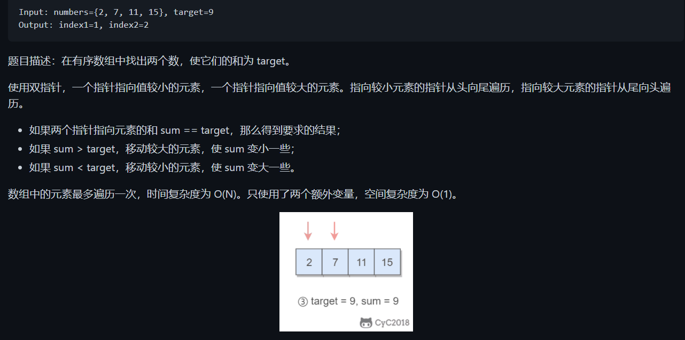

```java
public int[] twoSum(int[] numbers, int target){
    if(numbers == null) return null;
    int i = 0;
    int j = numbers.length - 1;
    while(i < j){
        int sum = numbers[i] + numbers[j];
        if (sum == target){
            return new int[]{i+1,j+1};
        }
        else if(sum < target){
            i++;
        }
        else{
            j--;
        }
    }
    retrun null;
}
```

### 2. 两数平方和

633. Sum of Square Numbers (easy)

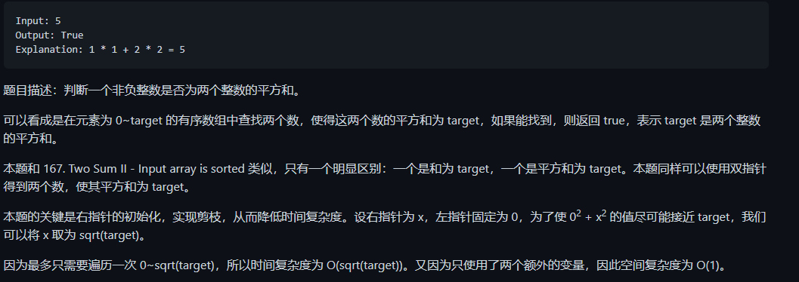

```java
public boolean judgeSquareSum(int target){
    if (target < 0 ) return false;
    int i = 0, j = (int) Math.sqrt(target);
    while(i <= j){
        int powsum = i*i+j*j;
        if(powsum == target){
            return true;
        }
        else if(powsum > target || powsum < 0){ //这里必须时powsum > target，因为当int溢出时，powsum将会变成负数，小于target。而这种情况时，应该是powsum过大。
            j--;
        }
        else{
            i++;
        }
    }
    return false;
}
```

### 3. 反转字符串中的元音字符

345. Reverse Vowels of a String (Easy)

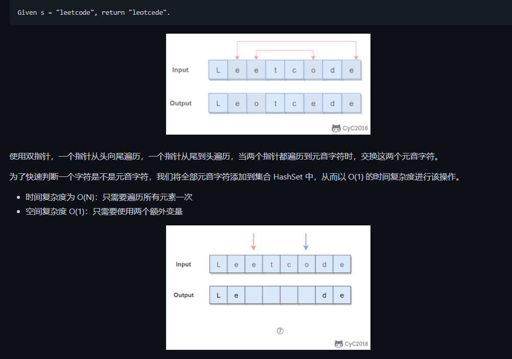

```java
private final static HashSet<Character> vowels = new HashSet<>(
    Arrays.asList('a','e','i','o','u','A','E','I','O','U'));
public String reverseVowels(String s){
    if(s == null) return null;
    int i = 0, j = s.length() - 1;
    char[] result = new char[s.length()];
    while(i <= j){
        char ci = s.charAt(i);
        char cj = s.charAt(j);
        if(！vowel.contains(ci)){
            result[i] = ci;
            i++;
        }
        else if(！vowel.contains(cj)){
            result[j] = cj;
            j++;
        }
        else{
            result[i] = cj;
            result[j] = ci;
            i++;
            j--;
        }
    }
    return new String(result);
}
```

### 4. 回文字符串

680. Vaild Palindrome || (Easy)

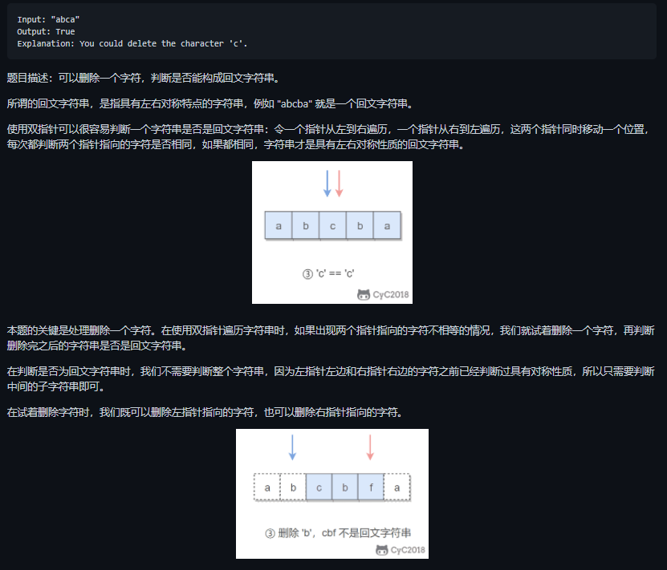

```java
public boolean validPalindrome(String s){
    for (int i = 0, j = s.length()-1; i < j ; i++, j--){
        if (s.charAt(i) != s.charAt(j)){
            return isPalindrome(s, i, j-1) || isPalindrome(s, i++, j);
        }
    }
    return true;
}
private boolean isPalindrome(String s, int i, int j){
    while(i <= j){
        if (s.charAt(i++) != s.charAt(j--)){
            return fasle;
        }
    }
    return true;
}
```

### 5. 归并两个有序数组*

88. Merge Sorted Array (Easy)

    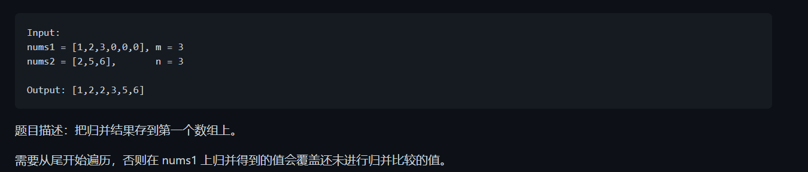

```java
public void merge(int[] nums1, int m, int[] nums2, int n) {
    int index1 = m - 1, index2 = n - 1;
    int indexMerge = m + n - 1;
    while (index2 >= 0) {
        if (index1 < 0) {
            nums1[indexMerge--] = nums2[index2--];
        } 
        else if (index2 < 0) {
            nums1[indexMerge--] = nums1[index1--];
        } 
        else if (nums1[index1] > nums2[index2]) {
            nums1[indexMerge--] = nums1[index1--];
        } 
        else {
            nums1[indexMerge--] = nums2[index2--];
        }
    }
}
```

```java
public void merge(int[] nums1, int m, int[] nums2, int n){
    int p1 = m-1, p2 = n-1;
    int total = m + n - 1;
    while(p1 >=0 && p2 >= 0){
        if(nums1[p1] <= nums2[p2]){
            num1[total--] = num2[p2--];
        }
        else{
            num1[total--] = num1[p1--];
        }
    }
    while(p2 >= 0 && total >= 0){
        num1[total--] = num2[p2--];
    }
    return;
}
```

这是我尝试过最快的方法，上面的几个都有一些问题：

```java
public void merge(int[] nums1, int m, int[] nums2, int n){
    int i = m - 1, j = n - 1, k = m + n + 1;
    while(i >= 0 || j >= 0){
        if(i >= 0 && j >= 0){
            if(nums1[i] <= nums2[j]){
                nums1[k--] = nums2[j--];
            }
            else{
                nums1[k--] = nums1[i--];
            }
        }
        else if(i >= 0){
            nums1[k--] = nums1[i--];
        }
        else if(j >= 0){
            nums1[k--] = nums2[j--];
        }
    }
}
```

### 6. 判断链表是否存在环//这个我对链表不是很熟悉，先留着

141. Linked List Cycle (Easy)

```
public boolean hasCycle(ListNode head){

}
```

### 7. 最长子序列

524. Longest Word in Dictionary through Deleting (Medium)

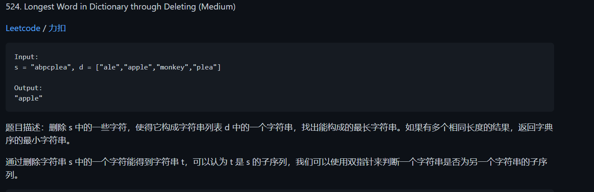

```java
public String findLongestWord(Sting s, List<String> d){
    String longestWord = "";
    for (String target : d){
        int l1 = longestWord.length(), l2 = target.length();
        if(l1 > l2 || (l1 == l2 && longestWord.compareTo(target) < 0)){
            continue;
        }
        if(isSubstr(s, target)){
            longestWord = target;
        }
    }
    return longestWord;
}

private boolean isSubstr(String s, String target){//判断一个字符串是否为另一个字符串的子序列
    int i = 0, j = 0;
    while(i < s.length() && j < target.length()){
        if(s.charAt(i) == target.charAt(j)){
            j++;
        }
        i++;
    }
    return j == target.length();
}
```

## 排序

## 贪心算法

## 二分查找

## 分治

## 搜索

## 动态规划

## 数学

# LeetCode 题解（数据结构篇）

## 链表


## 树

## 栈和队列

1. 用栈实现队列
2. 用队列实现栈
3. 最小值栈
4. 用栈实现括号匹配
5. 数组中元素和下一个比它的元素之间的距离
6. 循环数组中比当前元素大的下一个元素

### 1. 用栈实现队列

232. Implement Queue using Stacks (Easy)

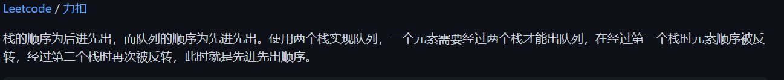

```java
class MyQueue{
    private Stack<Integer> in = new Stack<>();
    private Stack<Integer> out = new Stack<>();
    
    public void push(int x){
        in.push(x);
    }
    public int pop(){
        in2out();
        return out.pop();
    }
    public int peek(){
        in2out.out();
        return out.peek();
    }
    
    public boolean empty(){
        return in.isEmpty() && out.iSEmpty();
    }
    
    private void in2out(){
        if(out.isEmpty()){
            while(!in.isEmpty()){
                out.push(in.pop());
            }
        }
    }
}
```

### 2. 用队列实现栈

225. Implement Stack using Queues (Easy)

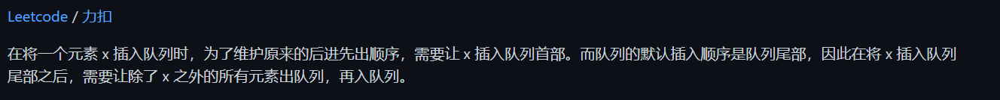

```java
class MyStack{
    private Queue<Integer> queue = new LinkedList<>();
    
    public void push(int x){
        queue.add(x);
        int sz = queue.size();
        while(sz > 1){
            queue.add(queue.remove());
            sz--;
        }
    }
    
    public int pop(){
        return queue.pop;
    }
    
    public int top(){
        return queue.peek();
    }
    
    public boolean empty(){
        return queue.isEmpty();
    }
}
```

### 3. 最小值栈

155. Min Stack (Easy)

```java
class MinStack{
    private Stack<Integer> dataStack;
    private Stack<Integer> minStack;
    private int min;
    
    public MinStack(){
        dataStack = new Stack<>();
        minStack = new Stack<>();
        min = Integer.MAX_VALUE;
    }
    
    public void push(int x){
        dataStack.add(x);
        min = Math.min(min, x);
        minStack.add(min);
    }
    
    public void pop(){
        dataSatck.pop();
        minStack.pop();
        min = minStack.isEmpty() ? Integer.Max_VALUE : minStack.peek();
    }
    
    public int top(){
        return dataStack.peek();
    }
    
    public int getMin(){
        return minStack.peek();
    }
}
```

### 4. 用栈实现括号匹配

20. Vaild Parentheses (Easy)

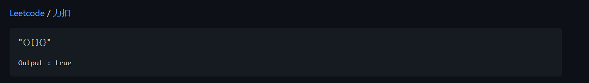

```java
public boolean isVaild(String s){ //要说对，得全部满足，但是错只要错一个就是错的
    Stack<Character> stack = new Stack<>();
    for(char c : s.toCharArray()){
        if(c == '(' || c == '{' || c == '['){
            stack.push(c);
        }
        else{
            if(stack.isEmpty()){
                return false;
            }
            char cStack = stack.pop();
            boolean b1 = c == ')' && cStack ！= '(';
            boolean b2 = c == '}' && cStack ！= '{';
            boolean b3 = c == ']' && cStack ！= '[';
            if(b1 || b2 || b3){
                return false;
            }
        }
    }
    return stack.isEmpty();
}
```

### 5. 数组中元素与下一个比它大的元素之间的距离

793. Daily Temperatures (Medium)

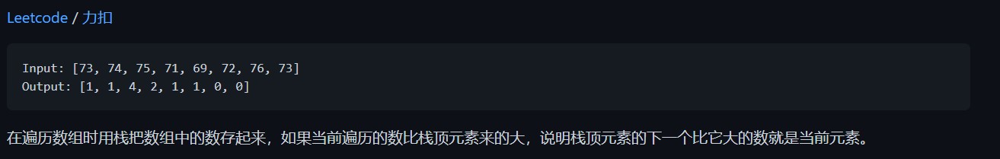

```java
public int[] dailyTemperatures(int[] temperatures){
    int n = temperatures.length;
    int[] dist = new int[n];
    Stack<Integer> indexs = new Stack<>();
    for (int curIndex =0; curIndex < n; curIndex++){
        while(!indexs.isEmpty() && temperatures[curIndex] > temperatures[indexs.peek()]){
            int preIndex = indexs.pop();
            dist[preIndex] = curIndex - preIndex;
        }
        indexs.add(curIndex);
    }
    return dist;
}
```

### 6. 循环数组中比当前元素大的下一个元素

503. Next Greater Element 2 (Medium)

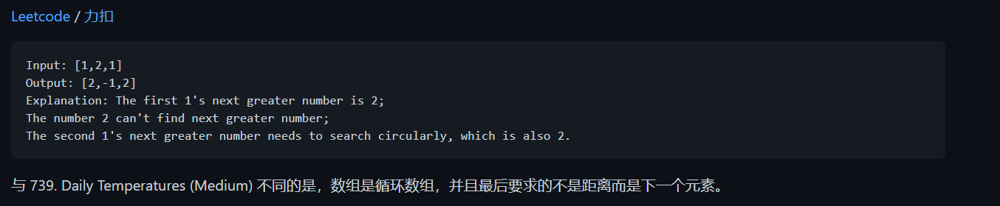


## 哈希表

1. 数组中两个数的和为给定值
2. 判断数组是否含有重复元素
3. 最长和谐序列
4. 最长连续序列

哈希表使用O（N）空间复杂度存储数据，并且以O（1）时间复杂度求解问题

- Java中的HashSet用于存储一个集合，可以查找元素是否在集合中。如果元素有穷，并且范围不大，那么可以用一个布尔数组来存储一个元素是否存在。

Java中的HashMap主要用于映射关系，从而把两个元素联系起来。HashMap也可以用来对元素进行技术统计，此时键为元素，值为计数。和HashSet类似，如果元素有穷并且范围不大，可以用整数数组来进行统计。

### 1. 数组中两个数的和为给定值

1. Two Sum (Easy)

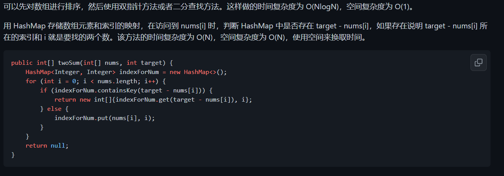

```java
public int[] twoSum(int[] nums, int target){
    HashMap<Integer, Integer> indexForNum = new HashMap<>();
    for(int i = 0; i < nums.length; i++){
        if(indexForNum.containsKey(target - nums[i])){
            return new int[]{indexForNum.get(target - nums[i]), i};
        }
        else{
            indexForNUm.put(nums[i], i);
        }
    }
    return null;
}
```

### 2. 判断数组是否含有重复元素

217. Contains Duplicate (Easy)

```java
public boolean containsDuplicate(int[] nums){
    Set<Integer> set = new HashSet<>();
    for (int num : nums){
        set.add(num);
    }
    return set.size() < nums.length;
}
```

### 3. 最长和谐序列

594. Longest Harmonious Subsequence (Easy)

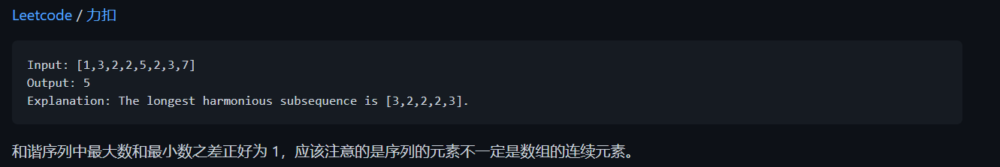

```java
public int findLHS(int[] nums){
    Map<Integer, Integer> countfornum = new HashMap<>();
    for (int num : nums){
        countfornum.put(nums, countfornum.getOrDefault(num,0)+1);//注意getOrDefault函数的用法
    }
    int longest = 0;
    for(int num : countfornum.keySet()){
        if(countfornum.containsKey(num+1)){
            longest = Math.max(longest, counfornum.get(num+1)+counfornum.get(num));
        }
    }
    return longest;
}
```

### 4. 最长连续序列

128. Longest Consecutive Sequence (Hard)

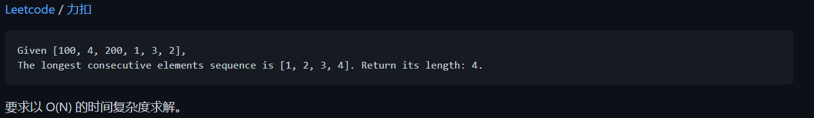

```java
public int longestConsecutive(int[] nums){
    Set<Integer> num_set = new HashSet<Integet>();
    for(int num : nums){
        num_set.add(num);
    }
    int longestStreak = 0;
    for(int num : num_set){
        if(!num_set.contains(num-1)){
            int currentNum = num;
            int currentStreak = 1;
            while(num_set.contain(num+1)){
                currentNum += 1;
                currentStreak +=1;
            }
            longestStreak = Maht.max(longestStreak, currentStreak);
        }
    }
    return longestStreak;
}
```


## 字符串

## 数组与矩阵

## 图

## 位运算


