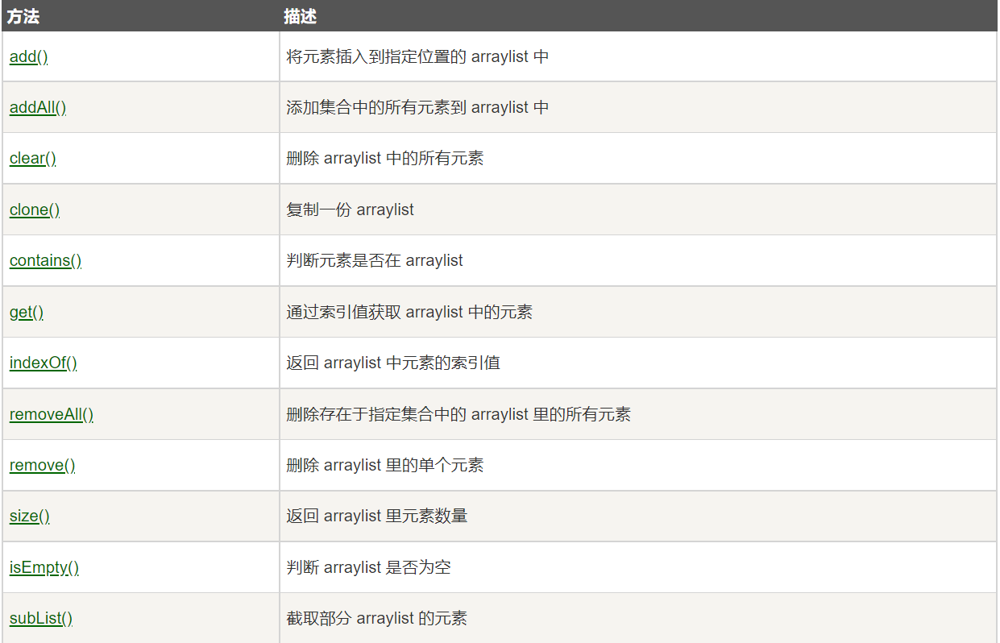
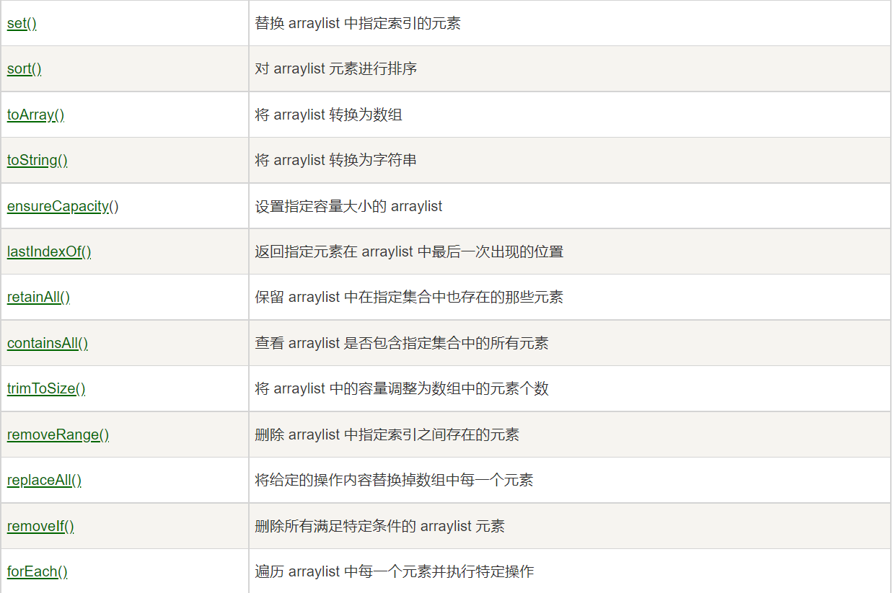
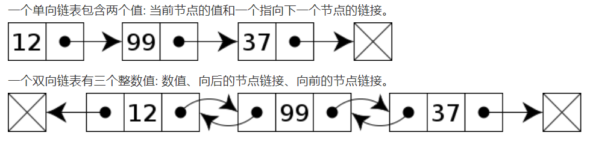
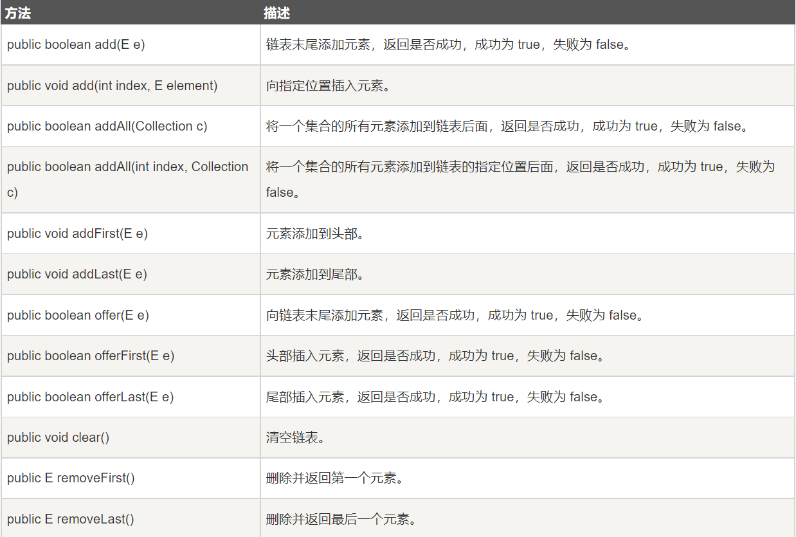
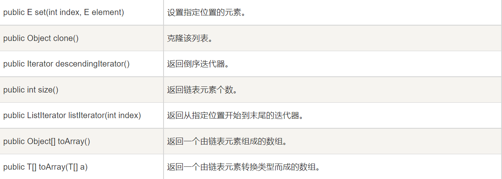

# Java 集合框架

## Java ArrayList

ArrayList类是一个可以动态修改的数组，与普通数组的区别就是它没有固定大小的限制，我们可以添加或者删除元素。

ArrayList继承了AbstractList，并实现列List接口。

ArrayList是一个数组队列，提供了相关的添加，删除，修改，遍历等功能。

### 添加元素

ArrayList类提供了很多有用的方法，添加元素到ArrayList可以使用add()方法：

```java
import java.util.ArrayList;

public class RunoobTest {
    public static void main(String[] args) {
        ArrayList<String> sites = new ArrayList<String>();
        sites.add("Google");
        sites.add("Runoob");
        sites.add("Taobao");
        sites.add("Weibo");
        System.out.println(sites);
    }
}
```

以上的实例，执行输出结果为：

> ```java
> [Google, Runoob, Taobao, Weibo]
> ```

### 访问元素

访问ArrayList中的元素可以使用get()方法：

```java
import java.util.ArrayList;

public class RunoobTest {
    public static void main(String[] args) {
        ArrayList<String> sites = new ArrayList<String>();
        sites.add("Google");
        sites.add("Runoob");
        sites.add("Taobao");
        sites.add("Weibo");
        System.out.println(sites.get(1));  // 访问第二个元素
    }
}
```

**注意：**数组的索引值从0开始。

以上实例，执行输出结果为：

> ```java
> Runoob
> ```

### 修改元素

如果要修改ArrayList中的元素可以使用set()方法：

```java
import java.util.ArrayList;

public class RunoobTest {
    public static void main(String[] args) {
        ArrayList<String> sites = new ArrayList<String>();
        sites.add("Google");
        sites.add("Runoob");
        sites.add("Taobao");
        sites.add("Weibo");
        sites.set(2, "Wiki"); // 第一个参数为索引位置，第二个为要修改的值
        System.out.println(sites);
    }
}
```

以上实例，输出结果为：

> ```java
> [Google, Runoob, Wiki, Weibo]
> ```

### 删除元素

如果要删除ArrayList中的元素可以使用remove()方法：

```java
import java.util.ArrayList;

public class RunoobTest {
    public static void main(String[] args) {
        ArrayList<String> sites = new ArrayList<String>();
        sites.add("Google");
        sites.add("Runoob");
        sites.add("Taobao");
        sites.add("Weibo");
        sites.remove(3); // 删除第四个元素
        System.out.println(sites);
    }
}
```

以上实例，输出结果为：

> ```java
> [Google, Runoob, Taobao]
> ```

### 计算大小

如果要计算ArrayList中的元素数量可以使用size()方法：

```java
import java.util.ArrayList;

public class RunoobTest {
    public static void main(String[] args) {
        ArrayList<String> sites = new ArrayList<String>();
        sites.add("Google");
        sites.add("Runoob");
        sites.add("Taobao");
        sites.add("Weibo");
        System.out.println(sites.size());
    }
}
```

以上实例，输出结果为：

> 4

### 迭代数组列表

我们可以使用for来迭代数组列表中的元素：

```java
import java.util.ArrayList;

public class RunoobTest {
    public static void main(String[] args) {
        ArrayList<String> sites = new ArrayList<String>();
        sites.add("Google");
        sites.add("Runoob");
        sites.add("Taobao");
        sites.add("Weibo");
        for (int i = 0; i < sites.size(); i++) {
            System.out.println(sites.get(i));
        }
    }
}
```

以上实例，输出结果为：

> ```java
> Google
> Runoob
> Taobao
> Weibo
> ```

我们也可以使用for-each来迭代元素：

```java
import java.util.ArrayList;

public class RunoobTest {
    public static void main(String[] args) {
        ArrayList<String> sites = new ArrayList<String>();
        sites.add("Google");
        sites.add("Runoob");
        sites.add("Taobao");
        sites.add("Weibo");
        for (String i : sites) {
            System.out.println(i);
        }
    }
}
```

输出结果为：

```
Google
Runoob
Taobao
Weibo
```

### ArrayList排序

Collections类是一个非常有用的类，位于java.util包中，提供的sort()方法可以对字符或者数组列表进行排序。

```java
import java.util.ArrayList;
import java.util.Collections;  // 引入 Collections 类

public class RunoobTest {
    public static void main(String[] args) {
        ArrayList<String> sites = new ArrayList<String>();
        sites.add("Taobao");
        sites.add("Wiki");
        sites.add("Runoob");
        sites.add("Weibo");
        sites.add("Google");
        Collections.sort(sites);  // 字母排序
        for (String i : sites) {
            System.out.println(i);
        }
    }
}
```

输出结果为：

> ```java
> Google
> Runoob
> Taobao
> Weibo
> Wiki
> ```

### ArrayList方法常用列表





## Java LinkedList

链表（Linked List）是一种常见的基础数据结构，是一种线性表，但是并不会按照线性的顺序存储结构，而是再每一个节点里存到下一个节点的地址。

链表可分为单项链表和双向链表。



与ArrayList相比，LinkedList的增加和删除的操作效率更高，而查找和修改的操作效率较低。

**以下情况使用ArrayList：**

- 频繁访问列表中的某一个元素
- 只需要在列表末尾进行添加和删除元素操作

**以下情况使用LinkedList：**

- 你需要通过循环迭代来访问列表中的某些元素
- 需要频繁的在列表开头，中间，末尾等位置进行添加和删除元素操作

LinkedList 继承了 AbstractSequentialList 类。

LinkedList 实现了 Queue 接口，可作为队列使用。

LinkedList 实现了 List 接口，可进行列表的相关操作。

LinkedList 实现了 Deque 接口，可作为队列使用。

LinkedList 实现了 Cloneable 接口，可实现克隆。

LinkedList 实现了 java.io.Serializable 接口，即可支持序列化，能通过序列化去传输。

### 增删改

| add()         | 添加于是怒     |
| ------------- | -------------- |
| addFirst()    | 在头部添加元素 |
| addLast()     | 在尾部添加元素 |
| removeFirst() | 移除头部元素   |
| removeLast()  | 移除尾部元素   |
| getFirst()    | 获取头部元素   |
| getLast()     | 获取尾部元素   |

### 迭代元素

我们可以使用for配合size()方法来迭代列表中的元素：

```java
// 引入 LinkedList 类
import java.util.LinkedList;

public class RunoobTest {
    public static void main(String[] args) {
        LinkedList<String> sites = new LinkedList<String>();
        sites.add("Google");
        sites.add("Runoob");
        sites.add("Taobao");
        sites.add("Weibo");
        for (int size = sites.size(), i = 0; i < size; i++) {
            System.out.println(sites.get(i));
        }
    }
}
```

size()方法用于计算链表的大小

输出结果为：

> ```java
> Google
> Runoob
> Taobao
> Weibo
> ```

也可以使用for-each来迭代元素

```java
// 引入 LinkedList 类
import java.util.LinkedList;

public class RunoobTest {
    public static void main(String[] args) {
        LinkedList<String> sites = new LinkedList<String>();
        sites.add("Google");
        sites.add("Runoob");
        sites.add("Taobao");
        sites.add("Weibo");
        for (String i : sites) {
            System.out.println(i);
        }
    }
}
```

### LinkedList方法常用列表






## Java HashSet

## Java HashMap


