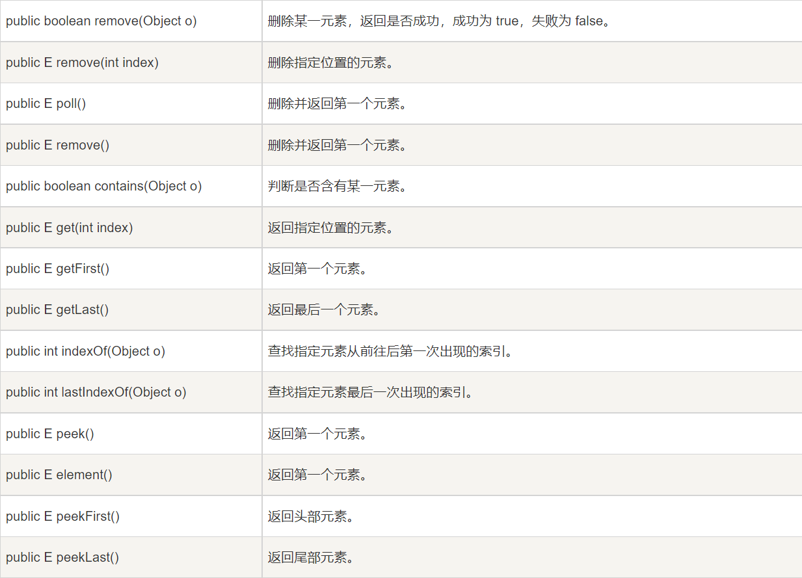
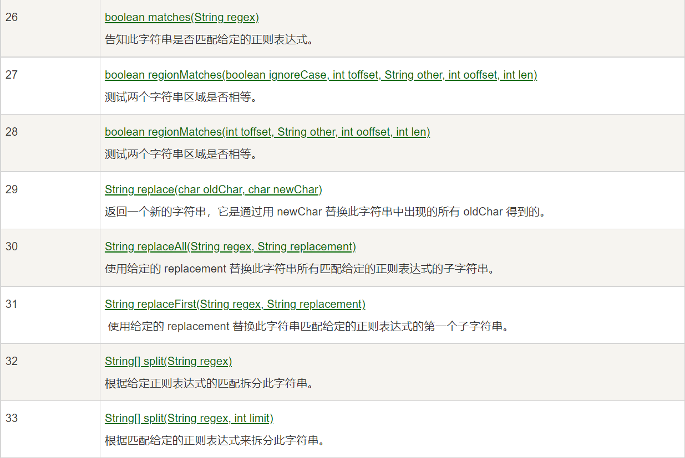
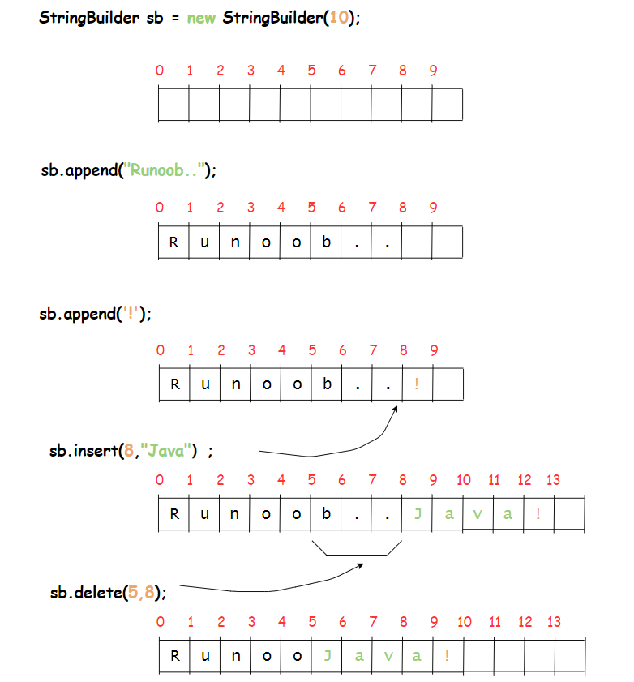

# Java 集合框架

## Java ArrayList

ArrayList类是一个可以动态修改的数组，与普通数组的区别就是它没有固定大小的限制，我们可以添加或者删除元素。

ArrayList继承了AbstractList，并实现列List接口。

ArrayList是一个数组队列，提供了相关的添加，删除，修改，遍历等功能。

### 添加元素

ArrayList类提供了很多有用的方法，添加元素到ArrayList可以使用add()方法：

```java
import java.util.ArrayList;

public class RunoobTest {
    public static void main(String[] args) {
        ArrayList<String> sites = new ArrayList<String>();
        sites.add("Google");
        sites.add("Runoob");
        sites.add("Taobao");
        sites.add("Weibo");
        System.out.println(sites);
    }
}
```

以上的实例，执行输出结果为：

> ```java
> [Google, Runoob, Taobao, Weibo]
> ```

### 访问元素

访问ArrayList中的元素可以使用get()方法：

```java
import java.util.ArrayList;

public class RunoobTest {
    public static void main(String[] args) {
        ArrayList<String> sites = new ArrayList<String>();
        sites.add("Google");
        sites.add("Runoob");
        sites.add("Taobao");
        sites.add("Weibo");
        System.out.println(sites.get(1));  // 访问第二个元素
    }
}
```

**注意：**数组的索引值从0开始。

以上实例，执行输出结果为：

> ```java
> Runoob
> ```

### 修改元素

如果要修改ArrayList中的元素可以使用set()方法：

```java
import java.util.ArrayList;

public class RunoobTest {
    public static void main(String[] args) {
        ArrayList<String> sites = new ArrayList<String>();
        sites.add("Google");
        sites.add("Runoob");
        sites.add("Taobao");
        sites.add("Weibo");
        sites.set(2, "Wiki"); // 第一个参数为索引位置，第二个为要修改的值
        System.out.println(sites);
    }
}
```

以上实例，输出结果为：

> ```java
> [Google, Runoob, Wiki, Weibo]
> ```

### 删除元素

如果要删除ArrayList中的元素可以使用remove()方法：

```java
import java.util.ArrayList;

public class RunoobTest {
    public static void main(String[] args) {
        ArrayList<String> sites = new ArrayList<String>();
        sites.add("Google");
        sites.add("Runoob");
        sites.add("Taobao");
        sites.add("Weibo");
        sites.remove(3); // 删除第四个元素
        System.out.println(sites);
    }
}
```

以上实例，输出结果为：

> ```java
> [Google, Runoob, Taobao]
> ```

### 计算大小

如果要计算ArrayList中的元素数量可以使用size()方法：

```java
import java.util.ArrayList;

public class RunoobTest {
    public static void main(String[] args) {
        ArrayList<String> sites = new ArrayList<String>();
        sites.add("Google");
        sites.add("Runoob");
        sites.add("Taobao");
        sites.add("Weibo");
        System.out.println(sites.size());
    }
}
```

以上实例，输出结果为：

> 4

### 迭代数组列表

我们可以使用for来迭代数组列表中的元素：

```java
import java.util.ArrayList;

public class RunoobTest {
    public static void main(String[] args) {
        ArrayList<String> sites = new ArrayList<String>();
        sites.add("Google");
        sites.add("Runoob");
        sites.add("Taobao");
        sites.add("Weibo");
        for (int i = 0; i < sites.size(); i++) {
            System.out.println(sites.get(i));
        }
    }
}
```

以上实例，输出结果为：

> ```java
> Google
> Runoob
> Taobao
> Weibo
> ```

我们也可以使用for-each来迭代元素：

```java
import java.util.ArrayList;

public class RunoobTest {
    public static void main(String[] args) {
        ArrayList<String> sites = new ArrayList<String>();
        sites.add("Google");
        sites.add("Runoob");
        sites.add("Taobao");
        sites.add("Weibo");
        for (String i : sites) {
            System.out.println(i);
        }
    }
}
```

输出结果为：

```
Google
Runoob
Taobao
Weibo
```

### ArrayList排序

Collections类是一个非常有用的类，位于java.util包中，提供的sort()方法可以对字符或者数组列表进行排序。

```java
import java.util.ArrayList;
import java.util.Collections;  // 引入 Collections 类

public class RunoobTest {
    public static void main(String[] args) {
        ArrayList<String> sites = new ArrayList<String>();
        sites.add("Taobao");
        sites.add("Wiki");
        sites.add("Runoob");
        sites.add("Weibo");
        sites.add("Google");
        Collections.sort(sites);  // 字母排序
        for (String i : sites) {
            System.out.println(i);
        }
    }
}
```

输出结果为：

> ```java
> Google
> Runoob
> Taobao
> Weibo
> Wiki
> ```

### ArrayList方法常用列表


## Java LinkedList

链表（Linked List）是一种常见的基础数据结构，是一种线性表，但是并不会按照线性的顺序存储结构，而是再每一个节点里存到下一个节点的地址。

链表可分为单项链表和双向链表。


与ArrayList相比，LinkedList的增加和删除的操作效率更高，而查找和修改的操作效率较低。

**以下情况使用ArrayList：**

- 频繁访问列表中的某一个元素
- 只需要在列表末尾进行添加和删除元素操作

**以下情况使用LinkedList：**

- 你需要通过循环迭代来访问列表中的某些元素
- 需要频繁的在列表开头，中间，末尾等位置进行添加和删除元素操作

LinkedList 继承了 AbstractSequentialList 类。

LinkedList 实现了 Queue 接口，可作为队列使用。

LinkedList 实现了 List 接口，可进行列表的相关操作。

LinkedList 实现了 Deque 接口，可作为队列使用。

LinkedList 实现了 Cloneable 接口，可实现克隆。

LinkedList 实现了 java.io.Serializable 接口，即可支持序列化，能通过序列化去传输。

### 增删改

| add()         | 添加于是怒     |
| ------------- | -------------- |
| addFirst()    | 在头部添加元素 |
| addLast()     | 在尾部添加元素 |
| removeFirst() | 移除头部元素   |
| removeLast()  | 移除尾部元素   |
| getFirst()    | 获取头部元素   |
| getLast()     | 获取尾部元素   |

### 迭代元素

我们可以使用for配合size()方法来迭代列表中的元素：

```java
// 引入 LinkedList 类
import java.util.LinkedList;

public class RunoobTest {
    public static void main(String[] args) {
        LinkedList<String> sites = new LinkedList<String>();
        sites.add("Google");
        sites.add("Runoob");
        sites.add("Taobao");
        sites.add("Weibo");
        for (int size = sites.size(), i = 0; i < size; i++) {
            System.out.println(sites.get(i));
        }
    }
}
```

size()方法用于计算链表的大小

输出结果为：

> ```java
> Google
> Runoob
> Taobao
> Weibo
> ```

也可以使用for-each来迭代元素

```java
// 引入 LinkedList 类
import java.util.LinkedList;

public class RunoobTest {
    public static void main(String[] args) {
        LinkedList<String> sites = new LinkedList<String>();
        sites.add("Google");
        sites.add("Runoob");
        sites.add("Taobao");
        sites.add("Weibo");
        for (String i : sites) {
            System.out.println(i);
        }
    }
}
```

### LinkedList方法常用列表





## Java HashSet

HashSet基于HashMap来实现的，是一个不允许有重复元素的集合。

HashSet允许有null值。

HashSet是无序的，即不会记录插入的顺序

HashSet不是线程安全的，如果多个线程尝试同时修改HashSet，则最终结果是不确定的。您必须在多线程访问时显式同步对HashSet的并发访问。

HashSet实现列Set接口。

### 添加元素

HashSet类提供类很多有用的方法，添加元素可以使用add()方法：

```java
// 引入 HashSet 类      
import java.util.HashSet;

public class RunoobTest {
    public static void main(String[] args) {
    HashSet<String> sites = new HashSet<String>();
        sites.add("Google");
        sites.add("Runoob");
        sites.add("Taobao");
        sites.add("Zhihu");
        sites.add("Runoob");  // 重复的元素不会被添加
        System.out.println(sites);
    }
}
```

以上代码输出结果为：

> ```java
> [Google, Runoob, Zhihu, Taobao]
> ```

上面的实例中，Runoob被添加了两次，它在集合中也只会出现一次，因为集合中的每个元素都必须是唯一的。

### 判断元素是否存在

我们可以使用contains()方法来判断元素是否存在于集合当中：

```java
// 引入 HashSet 类      
import java.util.HashSet;

public class RunoobTest {
    public static void main(String[] args) {
    HashSet<String> sites = new HashSet<String>();
        sites.add("Google");
        sites.add("Runoob");
        sites.add("Taobao");
        sites.add("Zhihu");
        sites.add("Runoob");  // 重复的元素不会被添加
        System.out.println(sites.contains("Taobao"));
    }
}
```

输出结果为：

> true

### 删除元素

我们可以使用remove()方法来删除集合中的元素

```java
// 引入 HashSet 类      
import java.util.HashSet;

public class RunoobTest {
    public static void main(String[] args) {
    HashSet<String> sites = new HashSet<String>();
        sites.add("Google");
        sites.add("Runoob");
        sites.add("Taobao");
        sites.add("Zhihu");
        sites.add("Runoob");     // 重复的元素不会被添加
        sites.remove("Taobao");  // 删除元素，删除成功返回 true，否则为 false
        System.out.println(sites);
    }
}
```

输出结果为：

> ```java
> [Google, Runoob, Zhihu]
> ```

删除集合中所有元素可以使用clear方法：

```java
// 引入 HashSet 类      
import java.util.HashSet;

public class RunoobTest {
    public static void main(String[] args) {
    HashSet<String> sites = new HashSet<String>();
        sites.add("Google");
        sites.add("Runoob");
        sites.add("Taobao");
        sites.add("Zhihu");
        sites.add("Runoob");     // 重复的元素不会被添加
        sites.clear();  
        System.out.println(sites);
    }
}
```

输出结果为：

> []

### 计算大小

如果要计算HashSet的元素数量可以使用size()方法

```java
// 引入 HashSet 类      
import java.util.HashSet;

public class RunoobTest {
    public static void main(String[] args) {
    HashSet<String> sites = new HashSet<String>();
        sites.add("Google");
        sites.add("Runoob");
        sites.add("Taobao");
        sites.add("Zhihu");
        sites.add("Runoob");     // 重复的元素不会被添加
        System.out.println(sites.size());  
    }
}
```

输出结果为：

> 4

### 迭代HashSet

可以使用for-each来迭代HashSet中的元素

```java
// 引入 HashSet 类      
import java.util.HashSet;

public class RunoobTest {
    public static void main(String[] args) {
    HashSet<String> sites = new HashSet<String>();
        sites.add("Google");
        sites.add("Runoob");
        sites.add("Taobao");
        sites.add("Zhihu");
        sites.add("Runoob");     // 重复的元素不会被添加
        for (String i : sites) {
            System.out.println(i);
        }
    }
}
```

输出结果为：

> ```java
> Google
> Runoob
> Zhihu
> Taobao
> ```

## Java HashMap

HashMap 是一个散列表，它存储的内容是键值对(key-value)映射。

HashMap 实现了 Map 接口，根据键的 HashCode 值存储数据，具有很快的访问速度，最多允许一条记录的键为 null，不支持线程同步。

HashMap 是无序的，即不会记录插入的顺序。

HashMap 继承于AbstractMap，实现了 Map、Cloneable、java.io.Serializable 接口。

### 添加元素

HashMap类提供了很多有用的方法，添加键值对(key - value)可以使用put()方法：

```java
// 引入 HashMap 类      
import java.util.HashMap;

public class RunoobTest {
    public static void main(String[] args) {
        // 创建 HashMap 对象 Sites
        HashMap<Integer, String> Sites = new HashMap<Integer, String>();
        // 添加键值对
        Sites.put(1, "Google");
        Sites.put(2, "Runoob");
        Sites.put(3, "Taobao");
        Sites.put(4, "Zhihu");
        System.out.println(Sites);
    }
}
```

以上输出结果为：

> ```java
> {1=Google, 2=Runoob, 3=Taobao, 4=Zhihu}
> ```

### 访问元素

我们可以使用get(key)方法来获得key对应的value：

```java
// 引入 HashMap 类      
import java.util.HashMap;

public class RunoobTest {
    public static void main(String[] args) {
        // 创建 HashMap 对象 Sites
        HashMap<Integer, String> Sites = new HashMap<Integer, String>();
        // 添加键值对
        Sites.put(1, "Google");
        Sites.put(2, "Runoob");
        Sites.put(3, "Taobao");
        Sites.put(4, "Zhihu");
        System.out.println(Sites.get(3));
    }
}
```

输出结果为：

> Taobao

### 删除元素

我们可以使用remove(key)方法来删除key对应的键值对(key - value):

```java
// 引入 HashMap 类      
import java.util.HashMap;

public class RunoobTest {
    public static void main(String[] args) {
        // 创建 HashMap 对象 Sites
        HashMap<Integer, String> Sites = new HashMap<Integer, String>();
        // 添加键值对
        Sites.put(1, "Google");
        Sites.put(2, "Runoob");
        Sites.put(3, "Taobao");
        Sites.put(4, "Zhihu");
        Sites.remove(4);
        System.out.println(Sites);
    }
}
```

以上输出结果为：

> ```java
> {1=Google, 2=Runoob, 3=Taobao}
> ```

删除所有键值对(key-value)可以使用clear方法：

```java
// 引入 HashMap 类      
import java.util.HashMap;

public class RunoobTest {
    public static void main(String[] args) {
        // 创建 HashMap 对象 Sites
        HashMap<Integer, String> Sites = new HashMap<Integer, String>();
        // 添加键值对
        Sites.put(1, "Google");
        Sites.put(2, "Runoob");
        Sites.put(3, "Taobao");
        Sites.put(4, "Zhihu");
        Sites.clear();
        System.out.println(Sites);
    }
}
```

输出结果为：

> ```java
> {}
> ```

### 计算大小

使用size()方法

### 迭代HashMap

可以使用for-each来迭代HashMap中的元素

如果只想获取key，可以使用keySet()方法，然后通过get(key)获取对应的value，如果你只想获取value，可以使用value()方法。

```java
// 引入 HashMap 类      
import java.util.HashMap;

public class RunoobTest {
    public static void main(String[] args) {
        // 创建 HashMap 对象 Sites
        HashMap<Integer, String> Sites = new HashMap<Integer, String>();
        // 添加键值对
        Sites.put(1, "Google");
        Sites.put(2, "Runoob");
        Sites.put(3, "Taobao");
        Sites.put(4, "Zhihu");
        // 输出 key 和 value
        for (Integer i : Sites.keySet()) {
            System.out.println("key: " + i + " value: " + Sites.get(i));
        }
        // 返回所有 value 值
        for(String value: Sites.values()) {
          // 输出每一个value
          System.out.print(value + ", ");
        }
    }
}
```

输出结果为：

> ```
> key: 1 value: Google
> key: 2 value: Runoob
> key: 3 value: Taobao
> key: 4 value: Zhihu
> Google, Runoob, Taobao, Zhihu,
> ```

### HashMap方法


# Java String 类

字符串广泛应用在Java编程中，在Java中字符串属于对象，Java提供了String类来创建和操作字符串

## 创建字符串


String类有11中构造方法，这些方法提供不同的参数来初始化字符串，比如提供一个字符数组参数：

```java
public class StringDemo{
   public static void main(String args[]){
      char[] helloArray = { 'r', 'u', 'n', 'o', 'o', 'b'};
      String helloString = new String(helloArray);  
      System.out.println( helloString );
   }
}
```

**注意：**String类是不可改变的，所以如果你一旦创建了String类，那它的值就无法改变了。如果需要对字符串做很多修改，那么应该选择使用StringBuffer&StringBuilder类。

## 字符串长度

使用length()方法，返回字符串对象包含的字符数。

```java
public class StringDemo {
    public static void main(String args[]) {
        String site = "www.runoob.com";
        int len = site.length();
        System.out.println( "菜鸟教程网址长度 : " + len );
   }
}
```

运行结果为：

> 菜鸟教程网址长度 : 14

## 连接字符串


## 创建格式化字符串

我们知道输出格式化数字可以使用 printf() 和 format() 方法。

String 类使用静态方法 format() 返回一个String 对象而不是 PrintStream 对象。

String 类的静态方法 format() 能用来创建可复用的格式化字符串，而不仅仅是用于一次打印输出。

```java
System.out.printf("浮点型变量的值为 " +
                  "%f, 整型变量的值为 " +
                  " %d, 字符串变量的值为 " +
                  "is %s", floatVar, intVar, stringVar);
```

```java
String fs;
fs = String.format("浮点型变量的值为 " +
                   "%f, 整型变量的值为 " +
                   " %d, 字符串变量的值为 " +
                   " %s", floatVar, intVar, stringVar);
```

## String方法





# Java StringBuffer 和StringBuilder类

当对字符串进行修改的时候，需要使用StringBuffer和StringBuilder类。

和String类不同的是，StringBuffer和StringBuilder类的对象能够被多次的修改，并且不产生新的未使用对象。


在使用 StringBuffer 类时，每次都会对 StringBuffer 对象本身进行操作，而不是生成新的对象，所以如果需要对字符串进行修改推荐使用 StringBuffer。

StringBuilder 类在 Java 5 中被提出，它和 StringBuffer 之间的最大不同在于 StringBuilder 的方法**不是线程安全**的（不能同步访问）。

由于 StringBuilder 相较于 StringBuffer 有速度优势，所以多数情况下建议使用 StringBuilder 类。

```java
public class RunoobTest{
    public static void main(String args[]){
        StringBuilder sb = new StringBuilder(10);
        sb.append("Runoob..");
        System.out.println(sb);  
        sb.append("!");
        System.out.println(sb); 
        sb.insert(8, "Java");
        System.out.println(sb); 
        sb.delete(5,8);
        System.out.println(sb);  
    }
}
```




以上结果为：

> Runoob..
> Runoob..!
> Runoob..Java!
> RunooJava!


## StringBuilder 方法


# Java 数组

java.util.Arrays 类能方便地操作数组，它提供的所有方法都是静态的。

具有以下功能：

- 给数组赋值：通过 fill 方法。
- 对数组排序：通过 sort 方法,按升序。
- 比较数组：通过 equals 方法比较数组中元素值是否相等。
- 查找数组元素：通过 binarySearch 方法能对排序好的数组进行二分查找法操作。


# Java 正则表达式***

正则表达式定义了字符串的模式。

正则表达式可以用来搜索、编辑或处理文本。

正则表达式并不仅限于某一种语言，但是在每种语言中有细微的差别。

## 正则表达式实例

一个字符串其实就是一个简单的正则表达式，例如 **Hello World** 正则表达式匹配 "Hello World" 字符串。

**.**（点号）也是一个正则表达式，它匹配任何一个字符如："a" 或 "1"。


# Java Scanner类

java.util.Scanner 是 Java5 的新特征，我们可以通过 Scanner 类来获取用户的输入。

下面是创建 Scanner 对象的基本语法：

```java
Scanner s = new Scanner(System.in);
```

接下来我们演示一个最简单的数据输入，并通过 Scanner 类的 next() 与 nextLine() 方法获取输入的字符串，在读取前我们一般需要 使用 hasNext 与 hasNextLine 判断是否还有输入的数据：

## 使用next方法：

```java
import java.util.Scanner; 
 
public class ScannerDemo {
    public static void main(String[] args) {
        Scanner scan = new Scanner(System.in);
        // 从键盘接收数据
 
        // next方式接收字符串
        System.out.println("next方式接收：");
        // 判断是否还有输入
        if (scan.hasNext()) {
            String str1 = scan.next();
            System.out.println("输入的数据为：" + str1);
        }
        scan.close();
    }
}
```

以上输出结果为：

```java
$ javac ScannerDemo.java
$ java ScannerDemo
next方式接收：
runoob com
输入的数据为：runoob
```

可以看到com字符串并没有输出，接下来我们看nextLine。

## 使用nextLine方法：

```java
import java.util.Scanner;
 
public class ScannerDemo {
    public static void main(String[] args) {
        Scanner scan = new Scanner(System.in);
        // 从键盘接收数据
 
        // nextLine方式接收字符串
        System.out.println("nextLine方式接收：");
        // 判断是否还有输入
        if (scan.hasNextLine()) {
            String str2 = scan.nextLine();
            System.out.println("输入的数据为：" + str2);
        }
        scan.close();
    }
}
```

以上输出结果为：

```
$ javac ScannerDemo.java
$ java ScannerDemo
nextLine方式接收：
runoob com
输入的数据为：runoob com
```

可以看到com字符串输出

## next() 和 nextLine() 区别

next():

- 1、一定要读取到有效字符后才可以结束输入。
- 2、对输入有效字符之前遇到的空白，next() 方法会自动将其去掉。
- 3、只有输入有效字符后才将其后面输入的空白作为分隔符或者结束符。
- next() 不能得到带有空格的字符串。

nextLine()：

- 1、以Enter为结束符,也就是说 nextLine()方法返回的是输入回车之前的所有字符。
- 2、可以获得空白。

**如果要输入 int 或 float 类型的数据，在 Scanner 类中也有支持，但是在输入之前最好先使用 hasNextXxx() 方法进行验证，再使用 nextXxx() 来读取：**

```java
import java.util.Scanner;
 
public class ScannerDemo {
    public static void main(String[] args) {
        Scanner scan = new Scanner(System.in);
        // 从键盘接收数据
        int i = 0;
        float f = 0.0f;
        System.out.print("输入整数：");
        if (scan.hasNextInt()) {
            // 判断输入的是否是整数
            i = scan.nextInt();
            // 接收整数
            System.out.println("整数数据：" + i);
        } else {
            // 输入错误的信息
            System.out.println("输入的不是整数！");
        }
        System.out.print("输入小数：");
        if (scan.hasNextFloat()) {
            // 判断输入的是否是小数
            f = scan.nextFloat();
            // 接收小数
            System.out.println("小数数据：" + f);
        } else {
            // 输入错误的信息
            System.out.println("输入的不是小数！");
        }
        scan.close();
    }
}
```

以上输出结果为：

> $ javac ScannerDemo.java
> $ java ScannerDemo
> 输入整数：12
> 整数数据：12
> 输入小数：1.2
> 小数数据：1.2


