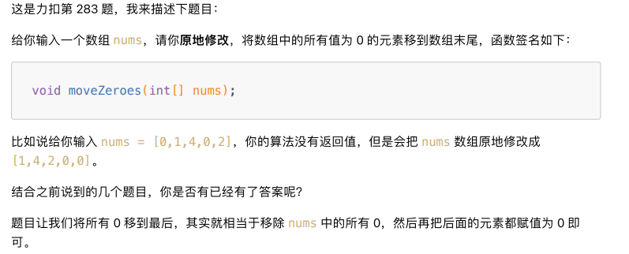
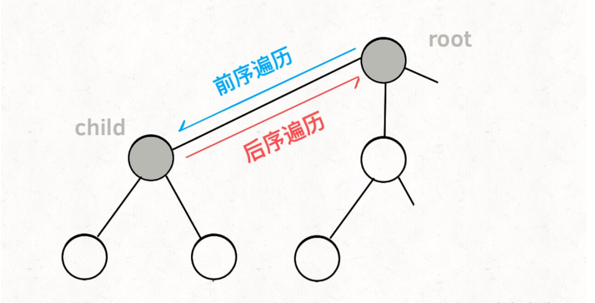

[TOC]


# 基础数据结构

## 1.1 数组/链表

### 前缀和数组

前缀和 主要适用的场景是原始数组不会被修改的情况下，频繁查询某个区间的累加和。其核心代码为：

```java
class PrefixSum{
    //前缀和数组
    private int[] prefix;
    
    /*输入一个数组，构造前缀和*/
    public PrefixSum(int[] nums){
        prefix = new int[nums.length + 1];
        //计算nums的累加和
        for(int i = 1; i < prefix.length; i++){
            prefix[i] = prefix[i - 1] + nums[i - 1];
        }
    }
    
    /*查询闭区间[i, j]的累加和*/
    public int query(int i, int j){
        return prefix[j + 1] - prefix[i];
    }
}
```


#### 303. 区域和检索-数组不可变


```java
class NumArray {
    private int[] prenums;
    public NumArray(int[] nums) {
        int n = nums.length;
        prenums = new int[n + 1];
        for(int i = 0; i < n; i++){
            prenums[i+1] = prenums[i] + nums[i];
        }
    }
    
    public int sumRange(int left, int right) {
        return prenums[right + 1] - prenums[left];
    }
}
```

#### 304. 二维区域和检索 - 矩阵不可变


```java
class NumMatrix {
    private int[][] presum;

    public NumMatrix(int[][] matrix) {
        int m = matrix.length, n = matrix[0].length;
        if(m == 0 || n == 0) return;
        
        presum = new int[m+1][n+1];
        for(int i = 1; i <= m; i++){
            for(int j = 1; j <= n; j++){
                presum[i][j] = presum[i-1][j] + presum[i][j-1] + matrix[i-1][j-1] - presum[i-1][j-1];
            }
        }
    }
    
    public int sumRegion(int row1, int col1, int row2, int col2) {
        return presum[row2+1][col2+1] - presum[row1][col2+1] - presum[row2+1][col1] + presum[row1][col1];
    }
}
```

#### 560. 和为K的子数组


```java
class Solution {
    public int subarraySum(int[] nums, int k) {
        int n = nums.length;
        HashMap<Integer, Integer> map = new HashMap<>();
        map.put(0,1);
        int res = 0, sum_i = 0;
        for(int i = 0; i < n; i++){
            sum_i += nums[i];
            int sum_j = sum_i - k;
            if(map.containsKey(sum_j)){
                res += map.get(sum_j);
            }
            map.put(sum_i, map.getOrDefault(sum_i,0) + 1);
        }
        return res;
    }
}
```

### 差分数组技巧

差分数组的主要使用场景是频繁对原始数组的某个区间的元素进行增减。通过这个diff差分数组是可以反推出原始数组nums的。

```java
int[] diff = new int[nums.length];
//构造差分数组
diff[0] = nums[0];
for (int i = 1; i < nums.length; i++){
    diff[i] = nums[i] - nums[i - 1];
}
```

#### 370. 区间加法


```java
????这道题需要会员
```

#### 1109. 航班预定统计


```java
class Solution {
    public int[] corpFlightBookings(int[][] bookings, int n) {
        int[] nums = new int[n];
        for(int[] booking : bookings){
            int i = booking[0];
            int j = booking[1];
            int val = booking[2];
            nums[i-1] += val;
            if(j < nums.length){
                nums[j] -=val;
            }
        }
        int[] res = new int[nums.length];
        res[0] = nums[0];
        for(int i = 1; i < nums.length; i++){
            res[i] = res[i - 1] + nums[i];
        }
        return res;
    }
}
```

### 滑动窗口算法

### 二分搜索

零，二分查找框架

```java
int binarySerach(int[] nums, int target){
    int left = 0, right = ...;
    while(...) {
        int mid = left + (right - left)/2;
        if(nums[mid] == target){
            ...
        }else if(nums[mid] < target){
            left = ...
        }else if(nums[mid] > target){
            right = ...
        }
    }
    return ...;
}
```

**分析二分查找的一个技巧是： 不要出现else，而是把所有情况都用else if写清楚，这样可以清楚地展现所有细节。**

*PS： 计算mid时要防止溢出，代码中 left + (right - left) / 2 就和（left + right）/ 2的计算结果相同，但是有效防止了 left 和 right 太大直接相加导致溢出。*

一、寻找一个数（基本的二分搜索）

最简单的场景，搜索一个数，如果存在，返回其索引，否则返回-1.

```java
int binarySeearch(int[] nums, int target){
    int left = 0;
    int right = nums.length - 1;
    
    while(left <= right){ //终止条件是 left = right + 1 例如[3,2)
        int mid = left + (right - left)/2;
        if(nums[mid] == target){
            return mid;
        }
        else if(nums[mid] < target){
            left = mid + 1;
        }
        else if(nums[mid] > target)
            right = mid - 1;
    }
    return -1;
}
```

1. 如果使用while(left < right)，其终止条件是 left == right，写成区间的形式为[right，right]，或者是[2,2]，这个时候区间非空还有一个2，但是这个时候while循环终止了，缺少了索引2。

2. **为什么使用left = mid + 1, right = mid - 1?**

   要明确什么是搜索区间，一开始的搜索区间是[left, right]。当索引mid不是要找的target时，接下来应该去搜索[left, mid-1]或者[mid+1,right]。因为mid已经搜索过，应该从搜索区间中去除

3. 这个算法难以找到索引的左右边界，例如数组[1,2,2,2,3],target为2，返回的索引为2，但是若要得到左右边界，此算法就无法处理。

二、寻找左侧边界的二分搜索

```java
int left_bound(int[] nums, int target){
    if(nums.length == 0) return -1;
    int left = 0;
    int right = nums.length;
    
    while(left < right){ //终止条件是 left = right
        int mid = left + (right - left)/2;
        if(nums[int] == target){
            right = mid;
        }
        else if(nums[mid] < target){
            left = mid + 1;
        }
        else if(nums[mid] > target){
            right = mid;
        }
    }
    return left;
    //还要检查出界情况
}
```

或者使用这个形式：

```java
int left_bound(int[] nums, int target) {
    int left = 0, right = nums.length - 1;
     // 搜索区间为 [left, right]
    while (left <= right) {
        int mid = left + (right - left) / 2;
        if (nums[mid] < target) {
            // 搜索区间变为 [mid+1, right]
            left = mid + 1;
        } else if (nums[mid] > target) {
            // 搜索区间变为 [left, mid-1]
            right = mid - 1;
        } else if (nums[mid] == target) {
            // 收缩右侧边界
            right = mid - 1;
        }
     }
     // 检查出界情况
     if (left >= nums.length || nums[left] != target)
         return -1;
     return left;
}
```

三、寻找右侧边界的二分查找

```java
int right_bound(int[] nums, int target){
    if(nums.length == 0) return -1;
    int left = 0, right = nums.length;
    
    while(left < right){
        int mid = left + (right - left)/2;
        if(nums[mid] == target){
            left = mid + 1;
        }
        else if(nums[mid] < target){
            left = mid + 1;
        }
        else if(nums[mid] > target){
            right = mid;
        }
    }
    return left - 1;//!!!!注意！！！
}
```


#### 704. 二分查找

#### 34. 在排序数组中查找元素的第一个和最后一个位置

### 二分搜索题型套路分析

二分搜索的套路框架

```java
//函数f是关于自变量的x的单调函数
int f(int x){
    //...
}

//主函数，在f(x) == target的约束下求x的值
int soluation(int[] nums, int target){
    if(nums.length == 0) return -1;
    //问自己：自变量的x的最小值是多少？
    int left = ...;
    //问自己：自变量x的最大是多少？
    int right = ... + 1;
    
    while(left < right){
        int mid = left + (right - left) / 2;
        if(f(mid) == target){ //mid 相当于是被除去的！！！！！！！！！！！！！
            //问自己：题目是求左边界还是右边界
            //...
        }
        else if(f(mid) < target){
            //问自己：怎么让f(x)大一点？
            ///...
        }
        else if(f(mid) > target){
            //问自己：怎么让f(x)小一点？
            //...
        }
    }
    return left;
}
```

具体来说，想要用二分搜索算法解决问题，分为以下几步：

1. 确定x, f(x), target分别是什么，并且写出函数f的代码
2. 找到x的取值范围作为二分搜索的搜索区间，初始化left和right变量
3. 根据题目的要求，确定应该使用左侧还是右侧的二分搜索算法，写出解法代码

#### 875. 爱吃香蕉的珂珂


```java
class Solution {
    public int minEatingSpeed(int[] piles, int H){
        int left = 1;
    }
}
```


#### 1011. 在D天内送达包裹的能力

### 田忌赛马背后的算法决策

```java
int[] advantageCount(int[] sums1, int[] nums2){
    int n = nums1.length;
    //给nums2降序排序
    PriorityQueue<int[]> maxpq = new PriorityQueue<>(
        (int[] pair1, int[] pair2)->{
            return pair2[1] - pair1[2];
        }
    );
    for(int i = 0; i < n; i++){
        maxpq.offer()
    }
}
```

#### 870.优势洗牌


### 一文秒杀四道原地修改数组的算法题

#### 26. 删除有序数组中的重复项


```java
//使用快慢指针
int removeDuplicates(int[] nums){
    if(nums.length == 0){
        return 0;
    }
    int slow = 0, fast = 0;
    while(fast < nums.length){
        if(nums[fast] != nums[slow]){
            slow++;
            nums[slow] = nums[fast];
        }
        fast++;
    }
    return slow+1;
}
```

#### 83. 删除排序链表中的重复元素

```java
ListNode deleteDuplicates(ListNode head){
    if(head == null) return null;
    ListNode slow = head, fast = head;
    while(fast != null){
        if(fast.val != slow.val){
            //nums[slow] = nums[fast];
            slow.next = fast;
            //slow++
            slow = slow.next;
        }
        //fast++
        fast = fast.next;
    }
    //断开与后面重复元素的连接
    slow.next = null;
    return head;s
}
```

#### 27. 移除元素


```java
int removeElement(int[] nums, int val){
    int fast = 0, slow = 0;
    while(fast < nums.length){
        if(nums[fast] != val){
            nums[slow] = nums[fast];
            slow++;
        }
        fast++;
    }
    return slow;
}
```


#### 283. 移动零



```java
void moveZeroes(int[] nums){
    int slow = 0, fast = 0;
    while(fast < nums.length){
        if(nums[fast] != 0){
            nums[slow] = nums[fast];
            slow++;
        }
        fast++;
    }
    while(slow < nums.length){
        nums[slow] = 0;
        slow++;
    }
}
```

### 一文搞懂单链表的六大解题套路

#### 21. 合并两个有序链表


```java
ListNode mergeTwoLists(ListNode l1, ListNode l2){
    //虚拟头节点
    ListNode dummy = new ListNode(-1), p = dummy;
    ListNode p1 = l1, p2 = l2;
    while(p1 != null && p2 != null){
        //比较p1和p2两个指针
        //将值较小的节点接到p指针
        if(p1.val > p2.val){
            p.next = p2;
            p2 = p2.next;
        }
        else{
            p.next = p1;
            p1 = p1.next;
        }
        p = p.next;
    }
    
    if(p1 != null){
        p.next = p1;
    }
    
    if(p2 != null){
        p.next = p2;
    }
    
    return dummy.next;
}
```


#### 23. 合并K个升序链表

要使用到优先级队列

#### 19. 删除链表的倒数第N个节点

```java
public ListNode removeNthFromEnd(ListNode head, int n){
    ListNode dummy = new ListNode(-1);
    dummy.next = head;
    
    ListNode slow = dummy;
    ListNode fast = dummy;
    while(n > 0){
        fast = head.next;
        n--;
    }
    ListNode prev = null;
    while(fast != null){
        prev = slow;
        slow = slow.next;
        fast = fast.next;
    }
    //上一个节点的next指针绕过，删除slow后，直接指向slow的下一个节点
    prev.next = slow.next;
    //释放 待删除节点slow的next指针，这决删掉也能ac
    slow.next = null;
    return dummy.next;
}
```


#### 141. 环形链表

```java
boolean hasCycle(ListNode head){
    //快慢指针初始化指向 head
    ListNode slow = head, fast = head;
    //快指针走到末尾时停止
    while(fast != null && fast.next != null){
        //慢指针走一步，快指针走两步
        slow = slow.next;
        fast = fast.next.next;
        //快慢指针相遇，说明含有环
        if(slow == fast){
            return true;
        }
    }
    //不包含环
    return false;
}
```


#### 142. 环形链表||

```java
public class Solution {
    public ListNode detectCycle(ListNode head) {
        ListNode fast = head, slow = head;
        
        while(fast != null && fast.next != null){//这条件限制了是环形链表的情况
            slow = slow.next;
            fast = fast.next.next;
            if(fast == slow){
                break;
            }
        }
        
        if(fast == null || fast.next == null){//注意，这里这个函数必须写在while()后面
            return null;                      //这是 不是环形链表的 情况
        }
        
        slow = head;
        while(slow != fast){
            slow = slow.next;
            fast = fast.next;
        }
        return slow;
    }
}
```


#### 876. 链表的中间节点

可以使用快慢指针的技巧，**每当慢指针slow前进一步，快指针fast就前进两步，这样，当fast走到链表末尾的时候，slow就指向了链表中点。**

```java
ListNode middleNode(ListNode head){
    //快慢指针初始化指向head
    ListNode slow = head, fast = head;
    //快指针走到末尾时停止
    while(fast !=null && fast.next != null){
        //慢指针走一步，快指针走两步
        slow = slow.next;
        fast = fast.next.next;
    }
    //慢指针指向中点
    return slow;
}
```

这个方法，如果链表长度为偶数，也就是中点有两个的时候，我们这个解法返回的节点是靠后的那个节点。这个代码稍加修改就可以直接用到判断链表成环的算法题目上。

#### 160. 相交链表


```java
ListNode getIntersectionNode(ListNode headA, ListNode headB){
    //p1指向A链表头节点，p2指向B链表头节点
    ListNode p1 = headA, p2 = headB;
    while(p1 != p2){
        if(p1 == null){
            p1.next = headB;
        }
        else{
            p1 = p1.next;
        }
        if(p2 == null){
            p2.next = headA;
        }
        else{
            p2 = p2.next;
        }
    }
    return p1;
}
```

### 链表操作的递归思维一览

```java
//单链表节点的结构
public class ListNode{
    int val;
    ListNode next;
    ListNode(int x){val = x;}
}
```

#### 206. 反转链表

```java
ListNode reverse(ListNode head){
    if(head == null || head.next == null){//这两个判断的顺序不能换，它先判断前面，在判断后面
        return head;                      //防止出现null.next情况的出现
    }
    LiseNode last = reverse(head.next);
    head.next.next = head;
    head.next = null;
    return last;
}
```

对于reverse函数定义是这样的：

输入一个节点head，将【以head为起点】的链表反转，并返回反转之后的头节点


那么输入reverse(head)后，会在这里进行递归：

```java
ListNode last = reverse(head.next);
```


这个reverse(head.next)执行完成之后，整个链表就成了这样：


并且根据函数定义，reverse函数会返回反转之后的头节点，我们用变量last接收了

```java
head.next.next = head;
```


接下来：

```java
head.next = null;
return last;
```


**注意：**

1. 递归函数要有base case, 也就是这句：

   ```java
   if(head.next == null) return head;
   ```

   意思是如果链表只有一个节点的时候反转也是它自己，直接返回就可以了

2. 当链表递归反转之后，新的头结点是last，而之前的head变成了最后一个节点，别忘了链表的末尾要指向null：

   ```java
   head.next = null;
   ```

二、反转链表前N个节点

```java
ListNode successor = null;//后驱节点

//反转以 head 为起点的 n 个节点，返回新的头节点
ListNode reverseN(ListNode head, int n){
    if(n == 1){
        successor = head.next;
        return head;
    }
    //以head.next为起点，需要反转前n-1个节点
    ListNode last = reverseN(head.next, n-1);
    head.next.next = head;
    head.next = successor;
    return last;
}
```

具体的区别：

1. base case 变为 n==1，反转一个元素，就是它本身，同时要记录后驱节点
2. 刚才我们直接把head.next设置为null，因为整个链表反转后原来的head变成了整个链表的最后一个节点 ，所以要记录后驱successor（第n+1个节点），反转之后将head连接上。


三、反转链表的一部分

```java
LisNode reverseBetween(ListNode head, int m, int n){
    if(m == 1){
        return reverseN(head, n);
    }
    head.next = reverseBetween(m-1, n-1);
    return head;
}
```

#### 92. 反转链表||


## 1.3 队列/栈(比较简单，先放着)

## 1.4 数据结构设计

### 算法就像搭乐高：带你手撸LRU算法

# 进阶数据结构

## 2.1 二叉树

### 东哥带你刷二叉树（第一期）

```java
/*二叉树遍历框架*/
void traverse(TreeNode root){
    //前序遍历
    traverse(root.left);
    //中序遍历
    traverse(toot.right);
    //后续遍历
}
```

**二叉树题目的一个难点就在于把题目的要求细化为每个节点需要做的事情**

#### 226. 翻转二叉数

```java
TreeNode invertTree(TreeNode root){
    if(root == null){
        return;
    }
    TreeNode tmp = root.left;
    root.left = root.right;
    root.right = temp;
    
    invertTree(root.right);
    invertTree(root.left);
    
    return root;
}
```

#### 114. 二叉树展开为链表

```java
void flatten(TreeNode root){
    if(root == null) return;
    flatten(root.left);
    flatten(root.right);
    
    TreeNode left = root.left;
    TreeNode right = root.right;
    
    root.left = null;
    root.right = left;
    
    TreeNode p = root;
    while(p.right != null){  //退出时p.right == null
        p = p.right;
    }
    p.right = right;
}
```


#### 116. 填充每个节点的下一个右侧节点指针

```java
Node connect(Node root){
    if(root == null) return null;
    connectTwoNode(root.left, root.right);
    return root;
}
void connectTwoNode(Node node1, Node node2){
    if(node1 == null || node2 == null){
        return;
    }
    node1.next = node2;
    connectTwonode(node1.left, node1.right);
    conncetTownode(node2.left, node2.right);
    
    connectTwonode(node1.right, node2.left);
}
```

### 东哥带你刷二叉树（第二期）

#### 654. 最大二叉树


#### 105. 从前序与中序遍历序列构造二叉树

#### 106. 从前序与后序列遍历构造二叉树

## 2.2 二叉树搜索树

## 2.3 图论

# 暴力搜索算法

## 3.1 DFS算法/回溯算法

回溯算法的效率一般，但却是最好用的算法。因为回溯算法就是典型的暴力穷举算法。

```java
resutl = [];
def backtrack(路径，选择列表)：
    if 满足结束条件：
        result.add(路径)
        return
    for 选择 in 选择列表：
        做选择
        backtrack(路径，选择列表)
        撤销选择
```

解决一个回溯问题，实际上就是一个决策树的遍历过程。只需要思考三个问题;

1. 路径：也就是已经做出的选择
2. 选择列表：也就是你当前可以做的选择
3. 结束条件：也就是到达决策树底层，无法在做选择的条件

回溯法所所解决的问题

- 组合问题：N个数里面按照一定规则找出k个数的集合
- 切割问题：一个字符串按照一定规则有几种切割方式
- 子集问题：一个N个数的集合里有多少符合条件的子集
- 排列问题：N个数按照一定规则全排列，有几种排列方式
- 棋牌问题：N皇后问题，解数独等等


一、全排列问题


多叉树的遍历框架：

```java
void traverse(TreeNode root){
    for(TreeNode child : root.childern)
        //前序遍历需要的操作
        traverse(child);
        //后续遍历需要的操作
}
```



回溯算法的核心框架：

```java
for 选择 in 选择列表:
    #做选择
    将该选择从选择列表移除
    路径.add(选择)
    backtrack(路径，选择列表)
    #撤销选择
    路径.remove(选择)
    将该选择再加入选择列表
```

### 回溯算法解题套路框架

#### 46. 全排列

```java
List<List<Integer>> res = new LinkedList<>();
    public List<List<Integer>> permute(int[] nums) {
        LinkedList<Integer> track = new LinkedList<>();
        backtrack(nums, track);
        return res;
    }
    
    void backtrack(int[] nums, LinkedList<Integer> track){
        if(track.size() == nums.length){
            res.add(new LinkedList(track));
            return;
        }
        
        for(int i = 0; i < nums.length; i++){
            //排除不合法的选择
            if(track.contains(nums[i]))
                continue;
            //做选择
            track.add(nums[i]);
            //进入下一层决策树
            backtrack(nums, track);
            //取消选择
            track.removeLast();
        }
    }
```

#### 51. N皇后

#### 77. 组合问题

```java
class Solution {
    List<List<Integer>> result = new ArrayList<>();
    LinkedList<Integer> path = new LinkedList<>();
    public List<List<Integer>> combine(int n, int k) {
        backtrack(n,k,1);
        return result;
    }
    
    void backtrack(int n, int k,int start){
        if(path.size() == k){
            result.add(new ArrayList<>(path));
            return;
        }
        
        for(int i = start; i <= n; i++){
            path.add(i);
            backtrack(n,k,i+1);
            path.removeLast();
        }
    }
}
```


#### 216. 组合问题|||

```java
class Solution {
    List<List<Integer>> result = new ArrayList<>();
    LinkedList<Integer> path = new LinkedList<>();
    public List<List<Integer>> combinationSum3(int k, int n) {
        backtrack(k,n,1,0);
        return result;
    }
    
    void backtrack(int k, int n, int start, int sum){
        
        if(path.size() == k && sum == n){
            result.add(new ArrayList<>(path));
            return;
        }
        
        if(sum > n){
            return;
        }
        
        for(int i = start; i <= 9; i++){
            if(path.contains(i)){
                continue;
            }
            path.add(i);
            sum = sum + i;
            backtrack(k,n,i+1,sum);
            path.removeLast();
            sum = sum - i;
        }
    }
}
```


#### 17. 电话号码的字母组合

```java
class Solution {
    List<String> list = new ArrayList<>();
    public List<String> letterCombinations(String digits) {
        if(digits == null || digits.length() == 0){
            return list;
        }
        String[] numString = {"abc", "def", "ghi", "jkl", "mno", "pqrs", "tuv", "wxyz"};
        backtrack(digits, numString, 0);
        return list;
    }
    StringBuilder temp = new StringBuilder();
    void backtrack(String digits, String[] numString, int num){
        if(num == digits.length()){
            list.add(temp.toString());
            return;
        }
        String str = numString[digits.charAt(num) - '0' -2]; 
        for(int i = 0; i < str.length(); i++){
            temp.append(str.charAt(i));
            backtrack(digits, numString, num+1);
            temp.deleteCharAt(temp.length() - 1);
        }
    }
}
```


#### 39.组合总和

```java
class Solution {
    List<List<Integer>> list = new ArrayList<>();
    ArrayList<Integer> res = new ArrayList<>(); 
    public List<List<Integer>> combinationSum(int[] candidates, int target) {
        Arrays.sort(candidates);
        backtrack(candidates, target, 0, 0);
        return list;
    }
    
    void backtrack(int[] candidates, int target,int sum, int index){

        if(sum == target){
            list.add(new ArrayList<>(res));
            return;
        }

        for(int i = index; i < candidates.length; i++){
            if(sum + candidates[i] > target) break;

            res.add(candidates[i]);
            backtrack(candidates, target,sum+candidates[i], i);
            res.remove(res.size() - 1);
            
        }
    }
}
```

#### 40. 组合总和|||

```java

```

#### 131. 分割回文串

```java
class Solution {
    List<List<String>> result = new ArrayList<>();
    List<String> path = new ArrayList<>();
    public List<List<String>> partition(String s) {
        backtrack(s, 0);
        return result;
    }

    void backtrack(String s, int start){
        if(start == s.length()){
            result.add(new ArrayList<>(path));
            return;
        }
        for(int i = start; i < s.length(); i++){
            if(isPalind(s, start, i)){
                String str = s.substring(start, i+1);
                path.add(str);
            }
            else{
                continue;
            }
            backtrack(s, i+1);
            path.remove(path.size()-1);
        }
    }

    boolean isPalind(String s, int start, int end){
        int left = start, right = end;
        while(left <= right){
            if(s.length() == 1){
                return true;
            }
            if(s.charAt(left) == s.charAt(right)){
                left++;
                right--;
            }
            else{
                return false;
            }
        }
        return true;
    }
}
```

#### 93. 复原IP地址

```java
class Solution {
    List<String> result = new ArrayList<>();
    public List<String> restoreIpAddresses(String s) {
        backtrack(s, 0, 0);
        return result;
    }
    StringBuilder sb = new StringBuilder();

    void backtrack(String s, int start, int count){
        if(count == 3){
            if(isVaild(s, start, s.length()-1)){
                result.add(s);
            }
            return;
        }
        for(int i = start; i < s.length(); i++){
            if(isVaild(s, start, i)){
                s = s.substring(0,i+1)+'.'+s.substring(i+1);
                backtrack(s, i+2, count+1);
                s = s.substring(0,i+1)+s.substring(i+2);
            }
            else{
                break;
            }
        }
    }

    boolean isVaild(String s, int left, int right){
        //int left = 0, j = s.length()-1;
        if(left > right){
            return false;
        }
        if(s.charAt(left) == '0' && left != right){
            return false;
        }
        int sum = 0;
        for(int i = left; i <= right; i++){
            if(s.charAt(i) > '9' || s.charAt(i) < '0'){
                return false;
            }
            else{
                sum = sum*10 + (s.charAt(i) - '0');
                if(sum > 255){
                    return false;
                }
            }
        }
        return true;
    }
}
```

### 回溯法牛逼：集合划分问题

#### 698. 划分为k个相等的子集


```java
class Solution {
    public boolean canPartitionKSubsets(int[] nums, int k) {
        int sum = 0;
        boolean[] used = new boolean[nums.length];
        for(int i = 0; i < nums.length; i++){
            sum += nums[i];
        }
        if(sum % k != 0){
            return false;
        }
        
        
        return backtrack(nums, sum / k, 0, 0, used, k);
    }
    
    boolean backtrack(int[] nums, int target, int start, int number, boolean[] used, int bucket){
        if(bucket == 0){
            return true;
        }
        
        if(number == target){
            return backtrack(nums, target, 0, 0, used, bucket-1);
        }
        
        
        for(int i = start; i < nums.length; i++){
            if(number + nums[i] > target || used[i]) continue;
            
            used[i] = true;
            number += nums[i];
            if(backtrack(nums, target, i+1, number, used, bucket)){
                return true;
            }
            used[i] = false;
            number -= nums[i];
        }
        return false;
    }
}
```

### 回溯算法团灭子集，排列，组合问题

一、子集

问题很简单，输入一个不包含重复数字的数组，要求算法输出这些数字的所有子集。

比如输入 nums = [1,2,3], 你的算法应输出8个子集，包含空集和本身，顺序可以不同。


二、组合

输入两个数字 n，k，算法输出[1...n]中k个数字的所有组合 

这就是典型的回溯算法，k限制了数的高度，n限制了数的宽度。


三、排列

输入一个不包含重复数字的数组nums，返回这些数字的全部排列


#### 78. 子集

#### 46. 全排列

#### 77. 组合

### DFS算法秒杀所有岛屿问题

#### 200. 岛屿数量


```java
int numIslands(char[][] grid){
    int res = 0;
    int m = grid.length, n = grid[0].length;
    for(int i = 0; i < m; i++){
        for(inr j = 0; j < n; j++){
            if(grid[i][j] == '1'){
                res += 1;
                dfs(grid, i, j);
            }
        }
    }
    return res;
}
//记住这个函数的用途：从（i，j）开始，与之相邻的陆地都为海水。
void dfs(char[][] grid, int i, int j){
    int m = grid.length, n = grid[0].length;
    if(i < 0 || j < 0 || i >= m || j > n){
        return;
    }
    if(grid[i][j] == '0'){
        return;
    }
    
    grid[i][j] = '0';
    
    dfs(grid, i+1, j);
    dfs(grid, i, j+1);
    dfs(grid, i-1, j);
    dfs(grid, i, j-1);
}
```


#### 1254. 统计封闭的岛屿的数目


#### 1020. 飞地的数量

#### 695. 岛屿的最大面积

#### 1905. 统计子岛屿

#### 694. 不同的岛屿数量

## 3.2 BFS算法

BFS算法起源于二叉树的层序遍历，其核心是利用队列这种数据结构

且BFS算法常见于求最值得场景，因为BFS的算法逻辑保证了算法第一次到达目标的代价是最小的。

### BFS算法解题套路框架

BFS的核心思想应该不难理解的，就是把一些问题抽象成图，从一个点开始，向四周开始扩散。一般来说，我们写BFS算法都是用[队列]这种数据结构，每次将一个节点周围的所有节点加入队列。


BFS相对DFS的主要的区别是：**BFS找到的路径一定是最短的，但代价就是空间复杂度可能比DFS大很多。**


一、算法框架

```java
int BFS(Node start, Node target){
    Queue<Node> q;//核心数据结构
    Set<Node> visited;//避免走回头路
    
    q.offer(start);//将起点加入队列
    visited.add(start);
    int step = 0;//记录扩散的步数
    
    while(q not empty){
        int sz = q.size();
        //将当前队列中的所有节点向四周扩散
        for(int i = 0; i < sz; i++){
            Node cur = q.poll();
            //这里判断是否到达终点
            if(cur is target)
                return step;
            //将cur的相邻节点加入队列
            for(Node x : cur.adj()){//cur.adj()泛指cur相邻的节点
                if(x not in visited){
                    q.offer(x);
                    visited.add(x);
                }
            }
        }
        //更新步数在这里
        step++;
    }
}
```


#### 111. 二叉树的最小深度


```java
int minDepth(TreeNode root){
    if(root == null) return 0;
    Queue<TreeNode> q = new LinkedList<>();
    q.offer(root);
    
    int depth = 1;
    
    while(!q.isEmpty()){
        int sz = q.size();
        for(int i = 0; i < sz; i++){
            TreeNode cur = q.poll();
            if(cur.left == null && cur.right == null)
                return depth;
            if(cur.left != null)
                q.offer(cur.left);
            if(cur.right != null)
                q.offer(cur.right);
        }
        depth++;
    }
    return depth;
}
```


#### 752. 打开转盘锁

# 动态规划

动态规划的底层逻辑也是穷举，只不过动态规划问题具有一些特殊的性质，是的穷举的过程中存在可优化的空间。

先提醒你，学习动态规划问题格外注意这几个词：[状态]，[选择], [dp数组的定义]。你把这几个词先理解到位，就理解了动态规划的核心。

## 4.1 动态规划核心原理

### 动态规划解题核心框架

**首先，动态规划问题的一般形式就是求最值。**动态规划其实是运筹学的一种最优化方法，只不过在计算机问题上应用比较多，比如求最长增子序列，最小编辑距离等等。

既然是求最值，核心问题是什么呢？求解动态规划的核心是穷举。因为要求最值，肯定要把所有可行的答案穷举出来，然后在其中找最值。

首先，动态规划的穷举有一些特别，因为这类问题存在  【重叠子问题】，如果暴力穷举的话效率会极其低下，所以需要备忘录或者DP table来优化穷举过程，避免不必要的计算。

而且动态规划一定会具备 【最优子结构】，才能通过子问题的最值的到原问题的最值。

另外，虽然动态规划的核心思想就是穷举求最值，但是问题可以千变万化，穷举所有可行性其实不是一件容易的事，只有列出正确的【状态转移方程】，才能正确地穷举。

状态转移方程：

**base case -> 明确【状态】-> 明确【选择】->定义dp数组/函数的含义**

```java
dp[0][0][...] = base
  
for 状态1 in 状态1的所有取值：
  for 状态2 in 状态2的所有取值：
    for ...
      dp[状态1][状态2][...] = 求最值（选择1，选择2...）
```

#### 509. 斐波那契数

一，暴力递归

```java
class Solution {
    public int fib(int n) {
        if(n == 0 || n == 1) return n;
        return fib(n-1)+fib(n-2);
    }
}
```

这样的写法很简洁，但是效率很低，因为若要计算fib(20)，要计算两次fib(17)。

二， 带备忘录的递归解法

```java
int fib(int n){
  int[] memo = new int[n+1];
  return helper(memo, n);
}

int helper(int[] memo, int n){
  //base case
  if(n == 0 || n == 1) return n;
  //已经计算过了，不用再计算了
  if(memo[n] != 0) return memo[n];
  memo[n] = helper(memo, n-1) + helper(memo, n-2);
  return memo[n];
}
```

实际上，带【备忘录】的递归算法，把一颗存在巨量冗余的递归树通过【剪枝】，改成了一幅不存在冗余的递归图，极大减少了子问题的个数。

三，dp数组的迭代解法

```java
int fib(int n){
  if(n == 0) return 0;
  int[] dp = new int[n+1];
  //base case
  dp[0] = 0;
  dp[1] = 1;
  //状态转移
  for(int i = 2; i <= n; i++){
    dp[i] = dp[i-1]+dp[i-2];
  }
  return dp[n];
}
```

这里，引出【状态转移方程】这个名词，实际上就是描述问题结构的数学形式：


为啥叫【状态转移方程】？其实就是为了听起来高端。把f(n)想做一个状态n， 这个状态是由状态n-1和状态n-2相加转移而来，这就叫状态转移，仅此而已。

**千万不哟啊看不起暴力解，动态规划问题最难的机试写出这个暴力解，即状态转移方程。**只要写出暴力解，优化方法无非使用备忘录或则和DP table，再无奥妙可言。

#### 322. 零钱兑换


一、暴力递归

状态转移方程：


二、带备忘录的递归

```java
int[] memo;
int coinChange(int[] coins, int amount){
    memo = new int[amout + 1];
    //dp数组全部初始化为特殊值
    Arrays.fill(memo, -666);
    
    return dp(coins, amount);
}

int dp(int[] coins, int amount){
    if(amount == 0) return 0;
    if(amount < 0) return -1;
    //查备忘录，防止重复计算
    if(memo[amount] != -666)
        return memo[amount];
    
    int res = Integer.MAX_VALUE;
    for(int coin : coins){
        //计算子问题的结构
        int subProblem = dp(coins, amount - coin);
        //子问题无解则跳过
        if(sbulProblem == -1) continue;
        //在子问题中选择最优解，然后加一
        res = Math.min(res, subProblem + 1);
    }
    memo[amount] = (res == Integer.MAX_VALUE) ? -1 : res;
    return memo[amount];
}
```

三、dp数组的迭代解法

当然，我们也可以自底向上使用dp table来消除重叠子问题，关于【状态】【选择】和base case与之前没有区别，dp数组的定义和刚才dp函数类似，也是把【状态】，也就是目标金额作为变量。不过dp函数体现在函数参数，而dp数组体现在数组索引：

dp数组的定义：当目标金额为i时，至少需要dp[i]枚硬币凑出。

```java
int coinChange(int[] coins, int amount){
    int[] dp = new int[amount+1];
    Arrays.fill(dp, amount+1);
    
    //base case
    dp[0] = 0;
    
    for(int i = 0; i < dp.length; i++){
        for(int coin : conis){
            if(i - coin < 0){
                continue;
            }
            dp[i] = Math.min(dp[i], 1 + dp[i-coin]);
        }
    }
    return (dp[amount] = amount + 1) ? -1 : dp[amount];
}
```

### base case 和备忘录的初始值怎么定

#### 931. 下降路径最小和


```java
int minFallingPathSum(intp[][] matrix){
    int n = matrix.length;
    int res = Integer.MAX_VALUE;
    
    for(int j = 0; j < n; j++){
        res = Math.min(res, dp(matrix, n-1, j));
    }
    return res;
}

int dp(int[][] matrix, int i, int j){
    if(i < 0 || j < 0 || i >= matrix.length || j >= matrix[0].length){
        return 9999;
    }
    //base case
    if(i == 0){
        return matrix[i][j];
    }
    return matrix[i][j] + min(dp(matrix, i - 1, j),
                              dp(matrix, i - 1, j + 1),
                              dp(matrix, i - 1, j - 1));
}

int min(int a, int b, int c){
    return Math.min(a, Math.min(b, c));
}
```

### 最优子结构和dp数组的遍历方向怎么定？


## 4.2 经典动态规划


## 4.3 背包问题

## 4.4 用动态规划玩游戏
