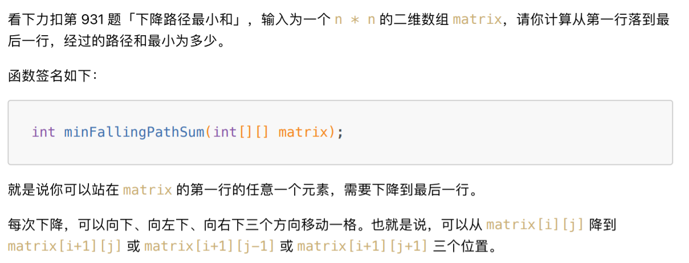
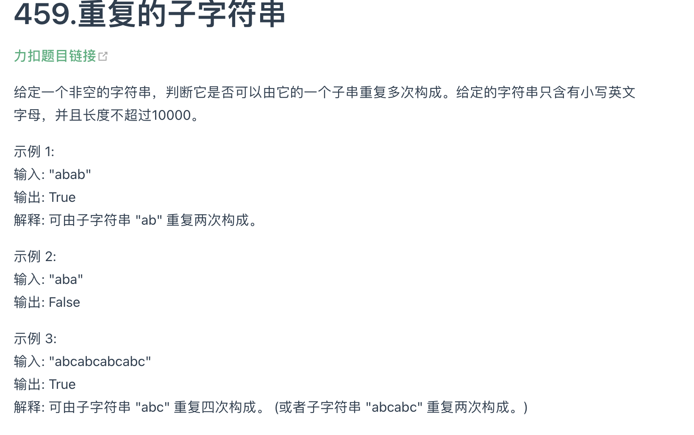

[TOC]


# 基础数据结构

## 1.1 数组/链表

### 前缀和数组

前缀和 主要适用的场景是原始数组不会被修改的情况下，频繁查询某个区间的累加和。其核心代码为：

```java
class PrefixSum{
    //前缀和数组
    private int[] prefix;
    
    /*输入一个数组，构造前缀和*/
    public PrefixSum(int[] nums){
        prefix = new int[nums.length + 1];
        //计算nums的累加和
        for(int i = 1; i < prefix.length; i++){
            prefix[i] = prefix[i - 1] + nums[i - 1];
        }
    }
    
    /*查询闭区间[i, j]的累加和*/
    public int query(int i, int j){
        return prefix[j + 1] - prefix[i];
    }
}
```


#### 303. 区域和检索-数组不可变


```java
class NumArray {
    private int[] prenums;
    public NumArray(int[] nums) {
        int n = nums.length;
        prenums = new int[n + 1];
        for(int i = 0; i < n; i++){
            prenums[i+1] = prenums[i] + nums[i];
        }
    }
    
    public int sumRange(int left, int right) {
        return prenums[right + 1] - prenums[left];
    }
}
```

#### 304. 二维区域和检索 - 矩阵不可变


```java
class NumMatrix {
    private int[][] presum;

    public NumMatrix(int[][] matrix) {
        int m = matrix.length, n = matrix[0].length;
        if(m == 0 || n == 0) return;
        
        presum = new int[m+1][n+1];
        for(int i = 1; i <= m; i++){
            for(int j = 1; j <= n; j++){
                presum[i][j] = presum[i-1][j] + presum[i][j-1] + matrix[i-1][j-1] - presum[i-1][j-1];
            }
        }
    }
    
    public int sumRegion(int row1, int col1, int row2, int col2) {
        return presum[row2+1][col2+1] - presum[row1][col2+1] - presum[row2+1][col1] + presum[row1][col1];
    }
}
```

#### 560. 和为K的子数组


```java
class Solution {
    public int subarraySum(int[] nums, int k) {
        int n = nums.length;
        HashMap<Integer, Integer> map = new HashMap<>();
        map.put(0,1);
        int res = 0, sum_i = 0;
        for(int i = 0; i < n; i++){
            sum_i += nums[i];
            int sum_j = sum_i - k;
            if(map.containsKey(sum_j)){
                res += map.get(sum_j);
            }
            map.put(sum_i, map.getOrDefault(sum_i,0) + 1);
        }
        return res;
    }
}
```

### 差分数组技巧

差分数组的主要使用场景是频繁对原始数组的某个区间的元素进行增减。通过这个diff差分数组是可以反推出原始数组nums的。

```java
int[] diff = new int[nums.length];
//构造差分数组
diff[0] = nums[0];
for (int i = 1; i < nums.length; i++){
    diff[i] = nums[i] - nums[i - 1];
}
```

#### 370. 区间加法


```java
????这道题需要会员
```

#### 1109. 航班预定统计


```java
class Solution {
    public int[] corpFlightBookings(int[][] bookings, int n) {
        int[] nums = new int[n];
        for(int[] booking : bookings){
            int i = booking[0];
            int j = booking[1];
            int val = booking[2];
            nums[i-1] += val;
            if(j < nums.length){
                nums[j] -=val;
            }
        }
        int[] res = new int[nums.length];
        res[0] = nums[0];
        for(int i = 1; i < nums.length; i++){
            res[i] = res[i - 1] + nums[i];
        }
        return res;
    }
}
```

### 滑动窗口算法


#### 76. 最小覆盖子串


```java
string minWindow(string s, string t) {
     unordered_map<char, int> need, window;
     for (char c : t) need[c]++;
     int left = 0, right = 0;
     int valid = 0;
     // 记录最⼩覆盖⼦串的起始索引及⻓度
     int start = 0, len = INT_MAX;
     while (right < s.size()) {
     // c 是将移⼊窗⼝的字符
         char c = s[right];
         // 右移窗⼝
         right++;
         // 进⾏窗⼝内数据的⼀系列更新
         if (need.count(c)) {
             window[c]++;
             if (window[c] == need[c])
                 valid++;
         }
         // 判断左侧窗⼝是否要收缩
         while (valid == need.size()) {
         // 在这⾥更新最⼩覆盖⼦串
             if (right - left < len) {
                 start = left;
                 len = right - left;
             }
              // d 是将移出窗⼝的字符
              char d = s[left];
              // 左移窗⼝
              left++;
               // 进⾏窗⼝内数据的⼀系列更新
             if (need.count(d)) {
                 if (window[d] == need[d])
                      valid--;
                  window[d]--;
             }
        }
    }
         // 返回最⼩覆盖⼦串
            return len == INT_MAX ?
                        "" : s.substr(start, len);
}
```

#### 209. 长度最小的子数组 ***写一下


```java
//这道题用了前缀和数组和二分法，也可以用滑动窗口
class Solution {
    public int minSubArrayLen(int target, int[] nums) {
        int n = nums.length;
        int[] sum = new int[n+1];
        sum[0] = 0;
        for(int i = 1; i <= n; i++){
            sum[i] = sum[i-1] + nums[i-1];
        }
        
        int res = Integer.MAX_VALUE;
        for(int i = 0; i < n; i++){
            int bin = Bin(sum[i]+target, sum, i+1);
            if(bin > 0){
                res = Math.min(res, bin-i);
            }
        }
        
        if(res != Integer.MAX_VALUE){
            return res;
        }
        
        return 0;
        
    }
    
    int Bin(int target, int[] nums, int start){
        int left = start, right = nums.length-1;
        while(left <= right){
            int mid = left + (right - left) / 2;
            if(nums[mid] < target){
                left = mid+1;
            }
            else if(nums[mid] >= target){
                while(nums[mid] >= target){
                    mid--;
                }
                return mid+1;
            }
        }
        return -1;
    }
}
```

```java
class Solution {

    // 滑动窗口
    public int minSubArrayLen(int s, int[] nums) {
        int left = 0;
        int sum = 0;
        int result = Integer.MAX_VALUE;
        for (int right = 0; right < nums.length; right++) {
            sum += nums[right];
            while (sum >= s) {
                result = Math.min(result, right - left + 1);
                sum -= nums[left++];
            }
        }
        return result == Integer.MAX_VALUE ? 0 : result;
    }
}
```


### 二分搜索

零，二分查找框架

```java
int binarySerach(int[] nums, int target){
    int left = 0, right = ...;
    while(...) {
        int mid = left + (right - left)/2;
        if(nums[mid] == target){
            ...
        }else if(nums[mid] < target){
            left = ...
        }else if(nums[mid] > target){
            right = ...
        }
    }
    return ...;
}
```

**分析二分查找的一个技巧是： 不要出现else，而是把所有情况都用else if写清楚，这样可以清楚地展现所有细节。**

*PS： 计算mid时要防止溢出，代码中 left + (right - left) / 2 就和（left + right）/ 2的计算结果相同，但是有效防止了 left 和 right 太大直接相加导致溢出。*

一、寻找一个数（基本的二分搜索）

最简单的场景，搜索一个数，如果存在，返回其索引，否则返回-1.

```java
int binarySeearch(int[] nums, int target){
    int left = 0;
    int right = nums.length - 1;
    
    while(left <= right){ //终止条件是 left = right + 1 例如[3,2)
        int mid = left + (right - left)/2;
        if(nums[mid] == target){
            return mid;
        }
        else if(nums[mid] < target){
            left = mid + 1;
        }
        else if(nums[mid] > target)
            right = mid - 1;
    }
    return -1;
}
```

1. 如果使用while(left < right)，其终止条件是 left == right，写成区间的形式为[right，right]，或者是[2,2]，这个时候区间非空还有一个2，但是这个时候while循环终止了，缺少了索引2。

2. **为什么使用left = mid + 1, right = mid - 1?**

   要明确什么是搜索区间，一开始的搜索区间是[left, right]。当索引mid不是要找的target时，接下来应该去搜索[left, mid-1]或者[mid+1,right]。因为mid已经搜索过，应该从搜索区间中去除

3. 这个算法难以找到索引的左右边界，例如数组[1,2,2,2,3],target为2，返回的索引为2，但是若要得到左右边界，此算法就无法处理。

二、寻找左侧边界的二分搜索

```java
int left_bound(int[] nums, int target){
    if(nums.length == 0) return -1;
    int left = 0;
    int right = nums.length;
    
    while(left < right){ //终止条件是 left = right
        int mid = left + (right - left)/2;
        if(nums[int] == target){
            right = mid;
        }
        else if(nums[mid] < target){
            left = mid + 1;
        }
        else if(nums[mid] > target){
            right = mid;
        }
    }
    return left;
    //还要检查出界情况
}
```

或者使用这个形式：

```java
int left_bound(int[] nums, int target) {
    int left = 0, right = nums.length - 1;
     // 搜索区间为 [left, right]
    while (left <= right) {
        int mid = left + (right - left) / 2;
        if (nums[mid] < target) {
            // 搜索区间变为 [mid+1, right]
            left = mid + 1;
        } else if (nums[mid] > target) {
            // 搜索区间变为 [left, mid-1]
            right = mid - 1;
        } else if (nums[mid] == target) {
            // 收缩右侧边界
            right = mid - 1;
        }
     }
     // 检查出界情况
     if (left >= nums.length || nums[left] != target)
         return -1;
     return left;
}
```

三、寻找右侧边界的二分查找

```java
int right_bound(int[] nums, int target){
    if(nums.length == 0) return -1;
    int left = 0, right = nums.length;
    
    while(left < right){
        int mid = left + (right - left)/2;
        if(nums[mid] == target){
            left = mid + 1;
        }
        else if(nums[mid] < target){
            left = mid + 1;
        }
        else if(nums[mid] > target){
            right = mid;
        }
    }
    return left - 1;//!!!!注意！！！
}
```


#### 704. 二分查找


```java
class Solution {
    public int search(int[] nums, int target) {
        int left = 0, right = nums.length-1;
        while(left <= right){
            int mid = left + (right - left) / 2;
            if(nums[mid] == target){
                return mid;
            }
            else if(nums[mid] < target){
                left = mid + 1; 
            }
            else if(nums[mid] > target){
                right =mid - 1;
            }
        }
        return -1;
    }
}
```


#### 34. 在排序数组中查找元素的第一个和最后一个位置


```java
class Solution {
    public int[] searchRange(int[] nums, int target) {
        int[] result =new int[2];
        result[0] = left_bound(nums,target);
        result[1] = right_bound(nums,target);
        return result;
    }
    
    int left_bound(int[] nums, int target){
        int left = 0, right = nums.length-1;
        while(left <= right){ //left = right + 1
            int mid = left + (right - left) / 2;
            if(nums[mid] == target){
                right = mid - 1;
            }
            else if(nums[mid] < target){
                left = mid + 1;
            }
            else if(nums[mid] > target){
                right = mid -1;
            }
        }
        if(left >= nums.length || nums[left] != target){
            return -1;
        }
        return left;
    }
    
    int right_bound(int[] nums, int target){
        int left = 0, right = nums.length - 1;
        while(left <= right){
            int mid = left + (right - left) / 2;
            if(nums[mid] == target){
                left = mid + 1;
            }
            else if(nums[mid] < target){
                left = mid + 1;
            }
            else if(nums[mid] > target){
                right = mid - 1;
            }
        }
        if(right < 0 || nums[right] != target){
            return -1;
        }
        return right;
    }
}
```

### 二分搜索题型套路分析

二分搜索的套路框架

```java
//函数f是关于自变量的x的单调函数
int f(int x){
    //...
}

//主函数，在f(x) == target的约束下求x的值
int soluation(int[] nums, int target){
    if(nums.length == 0) return -1;
    //问自己：自变量的x的最小值是多少？
    int left = ...;
    //问自己：自变量x的最大是多少？
    int right = ... + 1;
    
    while(left < right){
        int mid = left + (right - left) / 2;
        if(f(mid) == target){ //mid 相当于是被除去的！！！！！！！！！！！！！
            //问自己：题目是求左边界还是右边界
            //...
        }
        else if(f(mid) < target){
            //问自己：怎么让f(x)大一点？
            ///...
        }
        else if(f(mid) > target){
            //问自己：怎么让f(x)小一点？
            //...
        }
    }
    return left;
}
```

具体来说，想要用二分搜索算法解决问题，分为以下几步：

1. 确定x, f(x), target分别是什么，并且写出函数f的代码
2. 找到x的取值范围作为二分搜索的搜索区间，初始化left和right变量
3. 根据题目的要求，确定应该使用左侧还是右侧的二分搜索算法，写出解法代码

#### 875. 爱吃香蕉的珂珂


```java
class Solution {
    public int minEatingSpeed(int[] piles, int h) {
        int left = 1, right = 1000000000 + 1;
        while(left < right){
            int mid = left + (right - left) / 2;
            if(f(piles, mid) == h){
                right = mid;
            }
            else if(f(piles, mid) < h){
                right = mid;
            }
            else if(f(piles, mid) > h){//这个和一般情况有点不太一样，mid要大，f(mid)才能小
                left = mid + 1;
            }
        }
        return left;
    }
    
    int f(int[] piles, int x){
        int hours = 0;
        for(int i = 0; i < piles.length; i++){
            hours += piles[i] / x;
            if(piles[i] % x > 0){
                hours += 1;
            }
        }
        return hours;
    }
}
```


#### 1011. 在D天内送达包裹的能力


```java
class Solution {
    public int shipWithinDays(int[] weights, int days) {
        int left = Arrays.stream(weights).max().getAsInt(), right = 25000000;
        while(left < right){
            int mid = left + (right - left) / 2;
            if(f(weights,mid) == days){
                right = mid;
            }
            else if(f(weights,mid) > days){
                left = mid+1;
            }
            else if(f(weights,mid) < days){
                right = mid;
            }
        }
        return left;
    }
    int f(int[] nums, int x){
        int days = 1;
        int cur = 0;
        for(int i = 0; i < nums.length; i++){
            if(nums[i]+cur > x){
                days += 1;
                cur = 0;
            }
            cur += nums[i];
        }
        return days;
    }
}
```


#### 59. 螺旋矩阵｜｜（代码随想录）

### 田忌赛马背后的算法决策

```java
int[] advantageCount(int[] sums1, int[] nums2){
    int n = nums1.length;
    //给nums2降序排序
    PriorityQueue<int[]> maxpq = new PriorityQueue<>(
        (int[] pair1, int[] pair2)->{
            return pair2[1] - pair1[2];
        }
    );
    for(int i = 0; i < n; i++){
        maxpq.offer((new int[]{i, nums2[i]});
    }
    //给nums1 升序排序
    // nums1[left] 是最⼩值，nums1[right] 是最⼤值
    int left = 0, right = n - 1;
    int[] res = new int[n];
    while (!maxpq.isEmpty()) {
        int[] pair = maxpq.poll();
         // maxval 是 nums2 中的最⼤值，i 是对应索引
        int i = pair[0], maxval = pair[1];
        if (maxval < nums1[right]) {
          // 如果 nums1[right] 能胜过 maxval，那就⾃⼰上
          res[i] = nums1[right];
          right--;
         } else {
          // 否则⽤最⼩值混⼀下，养精蓄锐
          res[i] = nums1[left];
          left++;
          }
      }
      return res;
  }

          
}
```

#### 870.优势洗牌

#### 81. 在旋转排序数组中搜索


```java
class Solution {
    public boolean search(int[] nums, int target) {
        // ex - [6,6,6,5,5,0,0,1,1,2,2,2,3,3]
        int n= nums.length;
        int low =0;
        int high = n-1;
        while(low <= high)
        {
            //skipping reapting elements from left
            while(low<high && nums[low] == nums[low+1])
                low++;
            
            //skipping reapting elements from right
            while(low<high && nums[high] == nums[high-1])
                high--;
            
            ////[6,6, low ->  6,5,5,0,0,1,1,2,2,2,3  <- high ,3]
            
            int mid  = (low+high)/2;
            
            if(nums[mid] == target)
                return true;
            
            //checking which side is sorted
            //if left side is sorted then we try to search in left by comparing target and moving the pointer low or high
            else if(nums[mid] >= nums[low])
            {
                if(target >= nums[low] && target < nums[mid])
                {
                    high = mid-1;
                }
                else
                {
                    low = mid+1;       // if left is sorted but target doesnt lies in between left and mid so we move to left
                }
            }
            //if righ side is sorted then we try to search in right by comparing target and moving the pointer low or high
            else
            {
                if(target <= nums[high] && target > nums[mid])
                {
                    low = mid+1;
                }
                else
                {
                    high = mid - 1; // if right is sorted but target doesnt lies in between mid and right so we move to left
                }
            }
        }
        return false;
    }
}
```


### 一文秒杀四道原地修改数组的算法题

#### 26. 删除有序数组中的重复项


```java
//使用快慢指针
int removeDuplicates(int[] nums){
    if(nums.length == 0){
        return 0;
    }
    int slow = 0, fast = 0;
    while(fast < nums.length){
        if(nums[fast] != nums[slow]){
            slow++;
            nums[slow] = nums[fast];
        }
        fast++;
    }
    return slow+1;
}
```

#### 83. 删除排序链表中的重复元素


```java
ListNode deleteDuplicates(ListNode head){
    if(head == null) return null;
    ListNode slow = head, fast = head;
    while(fast != null){
        if(fast.val != slow.val){
            //nums[slow] = nums[fast];
            slow.next = fast;
            //slow++
            slow = slow.next;
        }
        //fast++
        fast = fast.next;
    }
    //断开与后面重复元素的连接
    slow.next = null;
    return head;s
}
```

#### 27. 移除元素


```java
int removeElement(int[] nums, int val){
    int fast = 0, slow = 0;
    while(fast < nums.length){
        if(nums[fast] != val){
            nums[slow] = nums[fast];
            slow++;
        }
        fast++;
    }
    return slow;
}
```


#### 283. 移动零


```java
void moveZeroes(int[] nums){
    int slow = 0, fast = 0;
    while(fast < nums.length){
        if(nums[fast] != 0){
            nums[slow] = nums[fast];
            slow++;
        }
        fast++;
    }
    while(slow < nums.length){
        nums[slow] = 0;
        slow++;
    }
}
```

### 一文搞懂单链表的六大解题套路

#### 链表的定义

```java
public class ListNode {
    // 结点的值
    int val;

    // 下一个结点
    ListNode next;

    // 节点的构造函数(无参)
    public ListNode() {
    }

    // 节点的构造函数(有一个参数)
    public ListNode(int val) {
        this.val = val;
    }

    // 节点的构造函数(有两个参数)
    public ListNode(int val, ListNode next) {
        this.val = val;
        this.next = next;
    }
}
```


#### 21. 合并两个有序链表


```java
ListNode mergeTwoLists(ListNode l1, ListNode l2){
    //虚拟头节点
    ListNode dummy = new ListNode(-1), p = dummy;
    ListNode p1 = l1, p2 = l2;
    while(p1 != null && p2 != null){
        //比较p1和p2两个指针
        //将值较小的节点接到p指针
        if(p1.val > p2.val){
            p.next = p2;
            p2 = p2.next;
        }
        else{
            p.next = p1;
            p1 = p1.next;
        }
        p = p.next;
    }
    
    if(p1 != null){
        p.next = p1;
    }
    
    if(p2 != null){
        p.next = p2;
    }
    
    return dummy.next;
}
```


#### 23. 合并K个升序链表

要使用到优先级队列

#### 19. 删除链表的倒数第N个节点

```java
public ListNode removeNthFromEnd(ListNode head, int n){
    ListNode dummy = new ListNode(-1);
    dummy.next = head;
    
    ListNode slow = dummy;
    ListNode fast = dummy;
    while(n > 0){
        fast = head.next;
        n--;
    }
    ListNode prev = null;
    while(fast != null){
        prev = slow;
        slow = slow.next;
        fast = fast.next;
    }
    //上一个节点的next指针绕过，删除slow后，直接指向slow的下一个节点
    prev.next = slow.next;
    //释放 待删除节点slow的next指针，这决删掉也能ac
    slow.next = null;
    return dummy.next;
}
```


#### 141. 环形链表

```java
boolean hasCycle(ListNode head){
    //快慢指针初始化指向 head
    ListNode slow = head, fast = head;
    //快指针走到末尾时停止
    while(fast != null && fast.next != null){
        //慢指针走一步，快指针走两步
        slow = slow.next;
        fast = fast.next.next;
        //快慢指针相遇，说明含有环
        if(slow == fast){
            return true;
        }
    }
    //不包含环
    return false;
}
```


#### 142. 环形链表||

```java
public class Solution {
    public ListNode detectCycle(ListNode head) {
        ListNode fast = head, slow = head;
        
        while(fast != null && fast.next != null){//这条件限制了是环形链表的情况
            slow = slow.next;
            fast = fast.next.next;
            if(fast == slow){
                break;
            }
        }
        
        if(fast == null || fast.next == null){//注意，这里这个函数必须写在while()后面
            return null;                      //这是 不是环形链表的 情况
        }
        
        slow = head;
        while(slow != fast){
            slow = slow.next;
            fast = fast.next;
        }
        return slow;
    }
}
```


#### 876. 链表的中间节点

可以使用快慢指针的技巧，**每当慢指针slow前进一步，快指针fast就前进两步，这样，当fast走到链表末尾的时候，slow就指向了链表中点。**

```java
ListNode middleNode(ListNode head){
    //快慢指针初始化指向head
    ListNode slow = head, fast = head;
    //快指针走到末尾时停止
    while(fast !=null && fast.next != null){
        //慢指针走一步，快指针走两步
        slow = slow.next;
        fast = fast.next.next;
    }
    //慢指针指向中点
    return slow;
}
```

这个方法，如果链表长度为偶数，也就是中点有两个的时候，我们这个解法返回的节点是靠后的那个节点。这个代码稍加修改就可以直接用到判断链表成环的算法题目上。

#### 160. 相交链表


```java
ListNode getIntersectionNode(ListNode headA, ListNode headB){
    //p1指向A链表头节点，p2指向B链表头节点
    ListNode p1 = headA, p2 = headB;
    while(p1 != p2){
        if(p1 == null){
            p1.next = headB;
        }
        else{
            p1 = p1.next;
        }
        if(p2 == null){
            p2.next = headA;
        }
        else{
            p2 = p2.next;
        }
    }
    return p1;
}
```

### 链表操作的递归思维一览

```java
//单链表节点的结构
public class ListNode{
    int val;
    ListNode next;
    ListNode(int x){val = x;}
}
```

#### 206. 反转链表

```java
ListNode reverse(ListNode head){
    if(head == null || head.next == null){//这两个判断的顺序不能换，它先判断前面，在判断后面
        return head;                      //防止出现null.next情况的出现
    }
    LiseNode last = reverse(head.next);
    head.next.next = head;
    head.next = null;
    return last;
}
```

对于reverse函数定义是这样的：

输入一个节点head，将【以head为起点】的链表反转，并返回反转之后的头节点


那么输入reverse(head)后，会在这里进行递归：

```java
ListNode last = reverse(head.next);
```


这个reverse(head.next)执行完成之后，整个链表就成了这样：


并且根据函数定义，reverse函数会返回反转之后的头节点，我们用变量last接收了

```java
head.next.next = head;
```


接下来：

```java
head.next = null;
return last;
```


**注意：**

1. 递归函数要有base case, 也就是这句：

   ```java
   if(head.next == null) return head;
   ```

   意思是如果链表只有一个节点的时候反转也是它自己，直接返回就可以了

2. 当链表递归反转之后，新的头结点是last，而之前的head变成了最后一个节点，别忘了链表的末尾要指向null：

   ```java
   head.next = null;
   ```

二、反转链表前N个节点

```java
ListNode successor = null;//后驱节点

//反转以 head 为起点的 n 个节点，返回新的头节点
ListNode reverseN(ListNode head, int n){
    if(n == 1){
        successor = head.next;
        return head;
    }
    //以head.next为起点，需要反转前n-1个节点
    ListNode last = reverseN(head.next, n-1);
    head.next.next = head;
    head.next = successor;
    return last;
}
```

具体的区别：

1. base case 变为 n==1，反转一个元素，就是它本身，同时要记录后驱节点
2. 刚才我们直接把head.next设置为null，因为整个链表反转后原来的head变成了整个链表的最后一个节点 ，所以要记录后驱successor（第n+1个节点），反转之后将head连接上。


三、反转链表的一部分

```java
LisNode reverseBetween(ListNode head, int m, int n){
    if(m == 1){
        return reverseN(head, n);
    }
    head.next = reverseBetween(m-1, n-1);
    return head;
}
```

#### 92. 反转链表||


## 1.3 队列/栈(比较简单，先放着)

一：队列的API如下：

```java
class MyQueue{
    //添加元素到队尾
    public void push(int x);
    //删除队头的元素并返回
    public int pop();
    //返回队头元素
    public int peek();
    //判断队列是否为空
    public boolean empty();
}
```

### 一文秒杀三道括号题目

#### 20. 有效的括号


```java
bool isValid(string str) {
     stack<char> left;
     for (char c : str) {
        if (c == '(' || c == '{' || c == '[')
            left.push(c);
        else { // 字符 c 是右括号
             if (!left.empty() && leftOf(c) == left.top())
                 left.pop();
             else
           // 和最近的左括号不匹配
                  return false;
          }
       }
 // 是否所有的左括号都被匹配了
         return left.empty();
}
char leftOf(char c) {
      if (c == '}') return '{';
      if (c == ')') return '(';
      return '[';
}


```


#### 921. 使括号有效的最小添加


```java
int minAddToMakeValid(string s) {
 // res 记录插⼊次数
     int res = 0;
 // need 变量记录右括号的需求量
     int need = 0;
     for (int i = 0; i < s.size(); i++) {
         if (s[i] == '(') {
         // 对右括号的需求 + 1
             need++;
         }

         if (s[i] == ')') {
          // 对右括号的需求 - 1
             need--;
             if (need == -1) {
                 need = 0;
              // 需插⼊⼀个左括号
                res++;
             }
          }
     }

     return res + need;
}

```

#### 1541. 平衡括号串的最少插入


```java
int minInsertions(string s) {
     int res = 0, need = 0;
     for (int i = 0; i < s.size(); i++) {
     if (s[i] == '(') {
     need += 2;
 if (need % 2 == 1) {
 res++;
 need--;
 }
 }

 if (s[i] == ')') {
 need--;
 if (need == -1) {
 res++;
 need = 1;
 }
 }
 }

 return res + need;
}

```

### 单调栈结构解决三道算法题

这一类问题重点是在于寻找下一个更大值。

#### 739. 每日温度

```java
class Solution {
    public int[] dailyTemperatures(int[] temperatures) {
        int n = temperatures.length;
        int[] dist = new int[n];
        Stack<Integer> indexs = new Stack<>();
        
        for(int curindex = 0; curindex < n; curindex++){
            while(!indexs.isEmpty() && temperatures[curindex] > temperatures[indexs.peek()]){
                dist[indexs.peek()] = curindex - indexs.peek();
                indexs.pop();
            }
            indexs.add(curindex);
        }
        return dist;
    }
}
```

**如何处理环形数组？**

1. 一般是通过%运算符求模（余数），来获得环形特效
2. 将数组长度翻倍

#### 503. 下一个更大的元素｜｜

```java
class Solution {//环形数组
    public int[] nextGreaterElements(int[] nums) {
        int n = nums.length;
        int[] next = new int[n];
        Arrays.fill(next, -1);
        Stack<Integer> pre = new Stack<>();
        for (int i = 0; i < n*2; i++){
            int num = nums[i % n];
            while(!pre.isEmpty() && num > nums[pre.peek()]){
                next[pre.pop()] = num;
            }
                
            if(i < n){
                pre.add(i);
            }
        }
        return next;
    }
}
```


#### 71. 简化路径


```java
class Solution {
    public String simplifyPath(String path) {
        if (path == null || path.isEmpty()) {
            return "";
        }

        Stack<String> st = new Stack<>();
        StringBuilder sb = new StringBuilder();
        String[] components = path.split("/");

        for (String s : components) {
            if (s.isEmpty() || s.equals(".")) {
                continue;
            } else if (s.equals("..")) {
               if(!st.isEmpty())
               {
                   st.pop();
               }
            } else {
                st.push(s);
            }
        }

        for (String dir : st) {
            sb.append("/").append(dir);
        }

        return sb.length() == 0 ? "/" : sb.toString();
    }
}
```


### 单调队列结构解决滑动窗口问题

### 一道数组去重的算法题把我整不会了

#### 316. 去除重复字母

#### 1081. 不同字符的最小子序列

## 1.4 数据结构设计

### 算法就像搭乐高：带你手撸LRU算法

### 算法就像搭乐高：带你手撸LFU算法

### 给我常数时间，我可以删除/查找数组中的任意元素

#### 380.  常数时间插入，删除和获取随机元素

#### 710. 黑名单中的随机数

### 一道求中位数的算法题把我整不会了

# 进阶数据结构

## 2.1 二叉树

### 东哥带你刷二叉树（第一期）

```java
/*二叉树遍历框架*/
void traverse(TreeNode root){
    //前序遍历
    traverse(root.left);
    //中序遍历
    traverse(toot.right);
    //后续遍历
}
```

**二叉树题目的一个难点就在于把题目的要求细化为每个节点需要做的事情**

#### 226. 翻转二叉数

```java
TreeNode invertTree(TreeNode root){
    if(root == null){
        return;
    }
    TreeNode tmp = root.left;
    root.left = root.right;
    root.right = temp;
    
    invertTree(root.right);
    invertTree(root.left);
    
    return root;
}
```

#### 114. 二叉树展开为链表

```java
void flatten(TreeNode root){
    if(root == null) return;
    flatten(root.left);
    flatten(root.right);
    
    TreeNode left = root.left;
    TreeNode right = root.right;
    
    root.left = null;
    root.right = left;
    
    TreeNode p = root;
    while(p.right != null){  //退出时p.right == null
        p = p.right;
    }
    p.right = right;
}
```


#### 116. 填充每个节点的下一个右侧节点指针

```java
Node connect(Node root){
    if(root == null) return null;
    connectTwoNode(root.left, root.right);
    return root;
}
void connectTwoNode(Node node1, Node node2){
    if(node1 == null || node2 == null){
        return;
    }
    node1.next = node2;
    connectTwonode(node1.left, node1.right);
    conncetTownode(node2.left, node2.right);
    
    connectTwonode(node1.right, node2.left);
}
```

### 东哥带你刷二叉树（第二期）

#### 654. 最大二叉树


```java
TreeNode constructMaximumBinaryTree(int[] nums){
    return builder(nums, 0, nums.length-1);
}


TreeNode builder(int[] nums, int i, int j){
    if(i > j){
      return null;
    }
    int index = -1, max = Integer.MIN_VALUE;
    for(int m = i; m <= j; m++){
      if(max > nums[m]){
        max = nums[m];
        index = m
      }
    }
    TreeNode node = new TreeNode(max);
    node.left = builder(nums, i, index-1);
    node.right = builder(nums, index+1, j);
    return node;
}
```

#### 105. 从前序与中序遍历序列构造二叉树

#### 106. 从前序与后序列遍历构造二叉树

### 东哥带你刷二叉树（第三期）

#### 652. 寻找重复的字串

## 2.2 二叉树搜索树

BST是一种特殊的二叉树，主要有两个主要特点：

1. 左小右大，即每个节点的左子树都比当前节点的值小，右子树都比当前节点的值大
2. 中序遍历结果是有序的

### 东哥带你刷二叉搜索树（一）

#### 230. BST第K小的元素

#### 538. 二叉搜索树转化累加树

```java
TreeNode convertBST(TreeNode root){
    traverse(root);
    reutrn root;
}
int sum = 0;
void traverse(TreeNode root){
    if(root == null){
        return;
    }
  
    traverse(root.right);
    sum += root.val;
    root.val = sum;
    traverse(root.left);
}
```


#### 1038. BST转累加树

### 东哥带你刷二叉搜索树（二）

#### 450. 删除二叉搜索树中的节点


#### 701. 二叉搜索树中的插入操作

#### 700. 二叉搜索树中的搜索

#### 98. 验证二叉搜索树

### 东哥带你刷二叉搜索树（三）

#### 96. 不同的二叉搜索树

#### 95. 不同的二叉搜索树｜｜

## 2.3 图论

### 图论基础

本质上图可以认为是多叉树的延伸。

可以通过邻接表和邻接矩阵来看出来：


### 

**有向加权图怎么实现？**

1. 如果是邻接图，我们不仅仅存储某个节点x的所有邻居节点，还存储x到每个邻居的权重
2. 如果是邻接矩阵，matrix[x] [y]不再是布尔值，而是一个int值，0表示没有连接，其他值表示权重

图和多叉树最大的区别是，图是可能包含环的，你从图的某一个节点开始遍历，有可能走了一圈又回到了这个节点

所以，如果图包含环，遍历框架就要一个visited数组来辅助

```java
boolean[] visited;
boolean[] onPath;

void traverse(Graph graph, int s){
    if(visited) return;
    visited[s] = true;
    onPath[s] = true;
    for(int neighbor : graph.neighbors(d)){
        traverse(graph, neighbor);
    }
    onPath[s] = false;
}
```

如果要处理关于路径相关的问题，这个onPath变量肯定会被用到的。

#### 797. 所有可能路径


```java
class Solution {
    List<List<Integer>> res = new LinkedList<>();
    
    public List<List<Integer>> allPathsSourceTarget(int[][] graph) {
        LinkedList<Integer> path = new LinkedList<>();
        traverse(graph, 0, path);
        return res;
    }
    
    public void traverse(int[][] graph, int s, LinkedList<Integer> path){
        path.add(s);
        
        int n = graph.length;
        if(s == n-1){
            //到达终点
            res.add(new LinkedList<>(path));
            path.remove(path.size()-1);
            return;
        }
        
        for(int v : graph[s]){
            traverse(graph, v, path);
        }
        
        path.removeLast();
    }
    
}
```

### 拓扑排序

#### 207. 课程表


```java
class Solution {
    
    boolean[] visited;
    boolean[] onPath;
    boolean hasCycle = false;
    
    public boolean canFinish(int numCourses, int[][] prerequisites) {
        visited = new boolean[numCourses];
        onPath = new boolean[numCourses];
        List<Integer>[] graph = buildGraph(numCourses, prerequisites);
        for(int i = 0; i < numCourses; i++){
            traverse(graph, i);
        }
        
        return !hasCycle;
    }
    
    void traverse(List<Integer>[] graph, int s){
        
        if(onPath[s]){
            hasCycle = true;
        }
        
        if(visited[s] || hasCycle){
            return;
        }
        visited[s] = true;
        onPath[s] = true;
        for(int i : graph[s]){
            traverse(graph, i);
        }
        onPath[s] = false;
    }
    
    List<Integer>[] buildGraph(int numCourses, int[][] prerequisites){
        List<Integer>[] graph = new LinkedList[numCourses];
        for(int i = 0; i < numCourses; i++){
            graph[i] = new LinkedList<>();
        }
        
        for(int[] edge : prerequisites){
            int from = edge[1];
            int to  = edge[0];
            graph[from].add(to);
        }
        
        return graph;
    }
}
```


#### 210. 课程表2


```java
class Solution {
    
    boolean[] visited;
    boolean[] onPath;
    boolean hasCycle = false;
    List<Integer> pos = new ArrayList<>();
    
    public int[] findOrder(int numCourses, int[][] prerequisites) {
        
        visited = new boolean[numCourses];
        onPath = new boolean[numCourses];
        List<Integer>[] graph = builder(numCourses, prerequisites);
        
        for(int i = 0; i < numCourses; i++){
            traverse(graph, i);
        }
        
        if(hasCycle){
            return new int[]{};//这里要注意
        }
        
        Collections.reverse(pos);
        int[] res = new int[numCourses];
        for(int i = 0; i < numCourses; i++){
            res[i] = pos.get(i);
        }
        return res;
    }
    
    void traverse(List<Integer>[] graph, int s){
        if(onPath[s]){
            hasCycle = true;
        }
        
        if(visited[s] || hasCycle){
            return;
        }
        
        visited[s] = true;
        onPath[s] = true;
        for(int i : graph[s]){
            traverse(graph, i);
        }
        pos.add(s);
        onPath[s] = false;
    }
    
    List<Integer>[] builder(int numCourses, int[][] prerequisites){
        List<Integer>[] graph = new LinkedList[numCourses];
        for(int i = 0; i < numCourses; i++){
            graph[i] = new LinkedList<>();
        }
        
        for(int[] edge : prerequisites){
            int from = edge[1];
            int to  = edge[0];
            graph[from].add(to);
        }
        
        return graph;
    }
}
```


### 二分图判定

#### 785. 是否为二分图


```java
class Solution {
    
    private boolean ok = true;
    private boolean[] color;
    private boolean[] visited;
    
    public boolean isBipartite(int[][] graph) {
        int n = graph.length;
        color = new boolean[n];
        visited = new boolean[n];
        //因为图不一定是联通的，可能存在多个子图
        //所以要把每个节点都作为起点进行一次遍历
        //如果发现任何一个子图不是二分图，整幅图都不是二分图
        for(int v = 0; v < n; v++){
            if(!visited[v]){
                traverse(graph, v);
            }
        }
        
        return ok;
    }
    
    void traverse(int[][] graph, int v){
        //如果已经确定不是二分图了，就不需要继续遍历
        if(!ok){
            return;
        }
        
        visited[v] = true;
        for(int w : graph[v]){
            if(!visited[w]){
                //相邻节点w没有被访问过
                //那么应该给节点w涂上和节点v不一样的颜色
                color[w] = !color[v];
                traverse(graph, w);
            }
            else{
                //相邻节点w已经被访问过
                //根据v和w的颜色判断是否为二分图
                if(color[w] == color[v]){
                    ok = false;
                }
            }
        }
    }
}
```

#### 886. 可能的双分图

### 

```java
class Solution {
    
    boolean[] visited;
    boolean[] color;
    boolean ok = true;
    
    public boolean possibleBipartition(int n, int[][] dislikes) {
        List<Integer>[] graph = builder(n, dislikes);
        visited = new boolean[n];
        color = new boolean[n];
        for(int i = 0; i < n; i++){
            if(!visited[i]){
                traverse(graph, i);
            }
        }
        
        return ok;
    }
    
    void traverse(List<Integer>[] graph, int v){
        if(!ok){
            return;
        }
        
        visited[v] = true;
        for(int i : graph[v]){
            if(!visited[i]){
                color[i] = !color[v];
                traverse(graph, i);
            }
            else{
                if(color[i] == color[v]){
                    ok = false;
                }
            }
        }
    }
    
    List<Integer>[] builder(int n, int[][] dislikes){
        List<Integer>[] graph = new LinkedList[n];
        for(int i = 0; i < n; i++){
            graph[i] = new LinkedList<>();
        }
        
        for(int[] edge : dislikes){
            int p1 = edge[0];
            int p2 = edge[1];
            //双向图的影响？无向图
            graph[p1-1].add(p2-1);
            graph[p2-1].add(p1-1);
        }
        
        return graph;
    }
}
```

### Union-Find算法详解(查并集算法)

```java
public class UF {
    /***
     * 连通分量个数
     */
    private int count;
    /***
     * 存储一棵树
     */
    private int[] parent;
    /***
     * 记录数的[重量]
     */
    private int[] size;
    /***
     * n为图中节点的个数
     */
    public UF(int n){
        this.count = n;
        parent = new int[n];
        size = new int[n];
        for(int i = 0; i < n; i++){
            //初始化节点，每个节点重量大小初始值为1
            parent[i] = i;
            size[i] = 1;
        }
    }

    /**将节点q和节点p连通**/
    public void union(int p, int q){
        int rootP = find(p);
        int rootQ = find(q);
        if(rootP == rootQ){
            return;
        }
        //小树接到大树下面，比较平衡
        if(size[rootP] > size[rootQ]){
            parent[rootQ] = parent[rootP];
            size[rootP] += size[rootQ];
        }
        else{
            parent[rootP] = parent[rootQ];
            size[rootQ] += size[rootP];
        }
        //两个连通分量合并为一个连通分量
        count--;
    }

    /**判断节点q和节点p是否连通**/
    public boolean connected(int p, int q){
        int rootP = find(p);
        int rootQ = find(q);
        return rootP == rootQ;
    }

    /**返回节点x的连通分量根节点**/
    private int find(int x){
        while(parent[x] != x){
            //进行路径压缩
            parent[x] = parent[parent[x]];
            x = parent[x];
        }
        return x;
    }

    /**返回图的连通分量个数**/
    public int count(){
        return count;
    }
}
```

### Union-Find算法应用

#### 130. 被围绕的区域

#### 990. 等式方程的可满足性

### Kruskal最小生成树算法

### 把Dijkstra算法变成了默写题***这个可以懂

### 众里寻他千百度：名流问题

# 暴力搜索算法

## 3.1 DFS算法/回溯算法

回溯算法的效率一般，但却是最好用的算法。因为回溯算法就是典型的暴力穷举算法。

```java
resutl = [];
def backtrack(路径，选择列表)：
    if 满足结束条件：
        result.add(路径)
        return
    for 选择 in 选择列表：
        做选择
        backtrack(路径，选择列表)
        撤销选择
```

解决一个回溯问题，实际上就是一个决策树的遍历过程。只需要思考三个问题;

1. 路径：也就是已经做出的选择
2. 选择列表：也就是你当前可以做的选择
3. 结束条件：也就是到达决策树底层，无法在做选择的条件

回溯法所所解决的问题

- 组合问题：N个数里面按照一定规则找出k个数的集合
- 切割问题：一个字符串按照一定规则有几种切割方式
- 子集问题：一个N个数的集合里有多少符合条件的子集
- 排列问题：N个数按照一定规则全排列，有几种排列方式
- 棋牌问题：N皇后问题，解数独等等


一、全排列问题


多叉树的遍历框架：

```java
void traverse(TreeNode root){
    for(TreeNode child : root.childern)
        //前序遍历需要的操作
        traverse(child);
        //后续遍历需要的操作
}
```


回溯算法的核心框架：

```java
for 选择 in 选择列表:
    #做选择
    将该选择从选择列表移除
    路径.add(选择)
    backtrack(路径，选择列表)
    #撤销选择
    路径.remove(选择)
    将该选择再加入选择列表
```

### 回溯算法解题套路框架

#### 46. 全排列


```java
List<List<Integer>> res = new LinkedList<>();
    public List<List<Integer>> permute(int[] nums) {
        LinkedList<Integer> track = new LinkedList<>();
        backtrack(nums, track);
        return res;
    }
    
    void backtrack(int[] nums, LinkedList<Integer> track){
        if(track.size() == nums.length){
            res.add(new LinkedList(track));
            return;
        }
        
        for(int i = 0; i < nums.length; i++){
            //排除不合法的选择
            if(track.contains(nums[i]))
                continue;
            //做选择
            track.add(nums[i]);
            //进入下一层决策树
            backtrack(nums, track);
            //取消选择
            track.removeLast();
        }
    }
```

#### 47. 全排列2


```java
public class Try {
    static int res = 0;
    static List<Character> list = new ArrayList<>();
    public static void main(String[] args){
        Scanner in = new Scanner(System.in);
        String str = in.nextLine();
        char[] ch = str.toCharArray();
        boolean[] visit = new boolean[ch.length];
        Arrays.sort(ch);
        backtrack(ch, visit);
        System.out.println(res);
    }
    public static void backtrack(char[] ch, boolean[] visit){
        if(list.size() == ch.length){
            res++;
            return;
        }

        for(int i = 0; i < ch.length; i++){
            if(i > 0 && ch[i] == ch[i-1] && visit[i-1] == false){
                continue;
            }
            if(visit[i] == false){
                visit[i] = true;
                list.add(ch[i]);
                backtrack(ch, visit);
                list.remove(list.size()-1);
                visit[i] = false;
            }
        }

    }
}
```


#### 51. N皇后

#### 77. 组合问题


```java
class Solution {
    List<List<Integer>> result = new ArrayList<>();
    LinkedList<Integer> path = new LinkedList<>();
    public List<List<Integer>> combine(int n, int k) {
        backtrack(n,k,1);
        return result;
    }
    
    void backtrack(int n, int k,int start){
        if(path.size() == k){
            result.add(new ArrayList<>(path));
            return;
        }
        
        for(int i = start; i <= n; i++){
            path.add(i);
            backtrack(n,k,i+1);
            path.removeLast();
        }
    }
}
```


#### 216. 组合问题|||


```java
class Solution {
    List<List<Integer>> result = new ArrayList<>();
    LinkedList<Integer> path = new LinkedList<>();
    public List<List<Integer>> combinationSum3(int k, int n) {
        backtrack(k,n,1,0);
        return result;
    }
    
    void backtrack(int k, int n, int start, int sum){
        
        if(path.size() == k && sum == n){
            result.add(new ArrayList<>(path));
            return;
        }
        
        if(sum > n){
            return;
        }
        
        for(int i = start; i <= 9; i++){
            if(path.contains(i)){
                continue;
            }
            path.add(i);
            sum = sum + i;
            backtrack(k,n,i+1,sum);
            path.removeLast();
            sum = sum - i;
        }
    }
}
```


#### 17. 电话号码的字母组合


```java
class Solution {
    List<String> list = new ArrayList<>();
    public List<String> letterCombinations(String digits) {
        if(digits == null || digits.length() == 0){
            return list;
        }
        String[] numString = {"abc", "def", "ghi", "jkl", "mno", "pqrs", "tuv", "wxyz"};
        backtrack(digits, numString, 0);
        return list;
    }
    StringBuilder temp = new StringBuilder();
    void backtrack(String digits, String[] numString, int num){
        if(num == digits.length()){
            list.add(temp.toString());
            return;
        }
        String str = numString[digits.charAt(num) - '0' -2]; 
        for(int i = 0; i < str.length(); i++){
            temp.append(str.charAt(i));
            backtrack(digits, numString, num+1);
            temp.deleteCharAt(temp.length() - 1);
        }
    }
}
```


#### 39.组合总和


```java
class Solution {
    List<List<Integer>> list = new ArrayList<>();
    ArrayList<Integer> res = new ArrayList<>(); 
    public List<List<Integer>> combinationSum(int[] candidates, int target) {
        Arrays.sort(candidates);
        backtrack(candidates, target, 0, 0);
        return list;
    }
    
    void backtrack(int[] candidates, int target,int sum, int index){

        if(sum == target){
            list.add(new ArrayList<>(res));
            return;
        }

        for(int i = index; i < candidates.length; i++){
            if(sum + candidates[i] > target) break;

            res.add(candidates[i]);
            backtrack(candidates, target,sum+candidates[i], i);
            res.remove(res.size() - 1);
            
        }
    }
}
```

#### 40. 组合总和||


```java
class Solution {
  List<List<Integer>> res = new ArrayList<>();
  LinkedList<Integer> path = new LinkedList<>();
  int sum = 0;
  
  public List<List<Integer>> combinationSum2( int[] candidates, int target ) {
    //为了将重复的数字都放到一起，所以先进行排序
    Arrays.sort( candidates );
    backTracking( candidates, target, 0 );
    return res;
  }
  
  private void backTracking( int[] candidates, int target, int start ) {
    if ( sum == target ) {
      res.add( new ArrayList<>( path ) );
      return;
    }
    for ( int i = start; i < candidates.length && sum + candidates[i] <= target; i++ ) {
      //正确剔除重复解的办法
      //跳过同一树层使用过的元素
      if ( i > start && candidates[i] == candidates[i - 1] ) {
        continue;
      }

      sum += candidates[i];
      path.add( candidates[i] );
      // i+1 代表当前组内元素只选取一次
      backTracking( candidates, target, i + 1 );

      int temp = path.getLast();
      sum -= temp;
      path.removeLast();
    }
  }
}
```

#### 131. 分割回文串


```java
class Solution {
    List<List<String>> result = new ArrayList<>();
    List<String> path = new ArrayList<>();
    public List<List<String>> partition(String s) {
        backtrack(s, 0);
        return result;
    }

    void backtrack(String s, int start){
        if(start == s.length()){
            result.add(new ArrayList<>(path));
            return;
        }
        for(int i = start; i < s.length(); i++){
            if(isPalind(s, start, i)){
                String str = s.substring(start, i+1);
                path.add(str);
            }
            else{
                continue;
            }
            backtrack(s, i+1);
            path.remove(path.size()-1);
        }
    }

    boolean isPalind(String s, int start, int end){
        int left = start, right = end;
        while(left <= right){
            if(s.length() == 1){
                return true;
            }
            if(s.charAt(left) == s.charAt(right)){
                left++;
                right--;
            }
            else{
                return false;
            }
        }
        return true;
    }
}
```

#### 93. 复原IP地址


```java
class Solution {
    List<String> result = new ArrayList<>();
    public List<String> restoreIpAddresses(String s) {
        backtrack(s, 0, 0);
        return result;
    }
    StringBuilder sb = new StringBuilder();

    void backtrack(String s, int start, int count){
        if(count == 3){
            if(isVaild(s, start, s.length()-1)){
                result.add(s);
            }
            return;
        }
        for(int i = start; i < s.length(); i++){
            if(isVaild(s, start, i)){
                s = s.substring(0,i+1)+'.'+s.substring(i+1);
                backtrack(s, i+2, count+1);
                s = s.substring(0,i+1)+s.substring(i+2);
            }
            else{
                break;
            }
        }
    }

    boolean isVaild(String s, int left, int right){
        //int left = 0, j = s.length()-1;
        if(left > right){
            return false;
        }
        if(s.charAt(left) == '0' && left != right){
            return false;
        }
        int sum = 0;
        for(int i = left; i <= right; i++){
            if(s.charAt(i) > '9' || s.charAt(i) < '0'){
                return false;
            }
            else{
                sum = sum*10 + (s.charAt(i) - '0');
                if(sum > 255){
                    return false;
                }
            }
        }
        return true;
    }
}
```

### 回溯法牛逼：集合划分问题

#### 698. 划分为k个相等的子集


```java
class Solution {
    public boolean canPartitionKSubsets(int[] nums, int k) {
        int sum = 0;
        boolean[] used = new boolean[nums.length];
        for(int i = 0; i < nums.length; i++){
            sum += nums[i];
        }
        if(sum % k != 0){
            return false;
        }
        
        
        return backtrack(nums, sum / k, 0, 0, used, k);
    }
    
    boolean backtrack(int[] nums, int target, int start, int number, boolean[] used, int bucket){
        if(bucket == 0){
            return true;
        }
        
        if(number == target){
            return backtrack(nums, target, 0, 0, used, bucket-1);
        }
        
        
        for(int i = start; i < nums.length; i++){
            if(number + nums[i] > target || used[i]) continue;
            
            used[i] = true;
            number += nums[i];
            if(backtrack(nums, target, i+1, number, used, bucket)){
                return true;
            }
            used[i] = false;
            number -= nums[i];
        }
        return false;
    }
}
```

### 回溯算法团灭子集，排列，组合问题

一、子集

问题很简单，输入一个不包含重复数字的数组，要求算法输出这些数字的所有子集。

比如输入 nums = [1,2,3], 你的算法应输出8个子集，包含空集和本身，顺序可以不同。


二、组合

输入两个数字 n，k，算法输出[1...n]中k个数字的所有组合 

这就是典型的回溯算法，k限制了数的高度，n限制了数的宽度。


三、排列

输入一个不包含重复数字的数组nums，返回这些数字的全部排列


#### 78. 子集

#### 

```java
class Solution {
    List<List<Integer>> result = new ArrayList<>();
    List<Integer> path = new ArrayList<>();
    public List<List<Integer>> subsets(int[] nums) {
        backtrack(nums,0);
        return result;
    }
    
    void backtrack(int[] nums, int index){
        result.add(new ArrayList<>(path));
        
        for(int i = index; i < nums.length; i++){
            path.add(nums[i]);
            backtrack(nums, i+1);
            path.remove(path.size()-1);
        }
    }
}
```


#### 90. 子集2


```java
class Solution {
    List<List<Integer>> result = new ArrayList<>();
    List<Integer> path = new ArrayList<>();
    public List<List<Integer>> subsetsWithDup(int[] nums) {
        Arrays.sort(nums);
        backtrack(nums, 0);
        return result;
    }
    
    void backtrack(int[] nums, int index){
        
        if(!result.contains(path)){
            result.add(new ArrayList<>(path));
        }
        
        if(index >= nums.length){
            return;
        }
        
        for(int i = index; i < nums.length; i++){
            path.add(nums[i]);
            backtrack(nums, i+1);
            path.remove(path.size()-1);
        }
    }
}
```


#### 77. 组合


```java
class Solution {
    List<List<Integer>> result = new ArrayList<>();
    LinkedList<Integer> path = new LinkedList<>();
    public List<List<Integer>> combine(int n, int k) {
        backtrack(n,k,1);
        return result;
    }
    
    void backtrack(int n, int k,int start){
        if(path.size() == k){
            result.add(new ArrayList<>(path));
            return;
        }
        
        for(int i = start; i <= n; i++){
            path.add(i);
            backtrack(n,k,i+1);
            path.removeLast();
        }
    }
}
```

#### 79. 单词查找


```java
class Solution {
    public boolean exist(char[][] board, String word) {
        int m = board.length,n = board[0].length;
        boolean[][] visited = new boolean[m][n];
        for(int i = 0; i < m; i++){
            for(int j = 0; j < n; j++){
                if(dfs(board, word, visited, i, j, 0)){
                    return true;
                }
            }
        }
        return false;
    }
    
    boolean dfs(char[][] board, String word, boolean[][] visited, int m, int n, int k){
        if(m < 0 || n < 0 || m >= board.length || n >= board[0].length){
            return false;
        }
        
        if(visited[m][n]){
            return false;
        }
        
        if(k >= word.length()){
            return false;
        }
        
        if(board[m][n] != word.charAt(k)){
            return false;
        }
        
        if(board[m][n] == word.charAt(k)){
            if(k == word.length()-1){
                return true;
            }
            visited[m][n] = true;
        }
        
        if (dfs(board, word, visited, m, n+1, k+1)||dfs(board, word, visited, m+1, n, k+1)||dfs(board, word, visited, m, n-1, k+1)||dfs(board, word, visited, m-1, n, k+1)){
            return true;
        }
        else{
            visited[m][n] = false;
            return false;
        }
        
    }
    
}
```


### DFS算法秒杀所有岛屿问题

#### 200. 岛屿数量


```java
int numIslands(char[][] grid){
    int res = 0;
    int m = grid.length, n = grid[0].length;
    for(int i = 0; i < m; i++){
        for(inr j = 0; j < n; j++){
            if(grid[i][j] == '1'){
                res += 1;
                dfs(grid, i, j);
            }
        }
    }
    return res;
}
//记住这个函数的用途：从（i，j）开始，与之相邻的陆地都为海水。
void dfs(char[][] grid, int i, int j){
    int m = grid.length, n = grid[0].length;
    if(i < 0 || j < 0 || i >= m || j > n){
        return;
    }
    if(grid[i][j] == '0'){
        return;
    }
    
    grid[i][j] = '0';
    
    dfs(grid, i+1, j);
    dfs(grid, i, j+1);
    dfs(grid, i-1, j);
    dfs(grid, i, j-1);
}
```


#### 1254. 统计封闭的岛屿的数目


```java
class Solution {
    public int closedIsland(int[][] grid) {
        int m = grid.length, n = grid[0].length;
        for(int i = 0; i < n; i++){
            dfs(grid, 0, i);
            dfs(grid, m-1, i);
        }
        for(int i = 0; i < m; i++){
            dfs(grid, i, 0);
            dfs(grid, i, n-1);
        }
        int res = 0;
        for(int i = 0; i < m; i++){
            for(int j = 0; j < n; j++){
                if(grid[i][j] == 0){
                    res++;
                    dfs(grid, i, j);
                }
            }
        }
        return res;
    }
    
    void dfs(int[][] grid, int i, int j){
        int m = grid.length, n = grid[0].length;
        if(i < 0 || j < 0 || i >= m || j >= n){
            return;
        }
        if(grid[i][j] == 1){
            return;
        }
        
        grid[i][j] = 1;
        
        dfs(grid, i+1, j);
        dfs(grid, i, j+1);
        dfs(grid, i, j-1);
        dfs(grid, i-1, j);
    }
}
```


#### 1020. 飞地的数量

#### 695. 岛屿的最大面积

#### 1905. 统计子岛屿

#### 694. 不同的岛屿数量

## 3.2 BFS算法

BFS算法起源于二叉树的层序遍历，其核心是利用队列这种数据结构

且BFS算法常见于求最值得场景，因为BFS的算法逻辑保证了算法第一次到达目标的代价是最小的。

### BFS算法解题套路框架

BFS的核心思想应该不难理解的，就是把一些问题抽象成图，从一个点开始，向四周开始扩散。一般来说，我们写BFS算法都是用[队列]这种数据结构，每次将一个节点周围的所有节点加入队列。


BFS相对DFS的主要的区别是：**BFS找到的路径一定是最短的，但代价就是空间复杂度可能比DFS大很多。**


一、算法框架

```java
int BFS(Node start, Node target){
    Queue<Node> q;//核心数据结构
    Set<Node> visited;//避免走回头路
    
    q.offer(start);//将起点加入队列
    visited.add(start);
    int step = 0;//记录扩散的步数
    
    while(q not empty){
        int sz = q.size();
        //将当前队列中的所有节点向四周扩散
        for(int i = 0; i < sz; i++){
            Node cur = q.poll();
            //这里判断是否到达终点
            if(cur is target)
                return step;
            //将cur的相邻节点加入队列
            for(Node x : cur.adj()){//cur.adj()泛指cur相邻的节点
                if(x not in visited){
                    q.offer(x);
                    visited.add(x);
                }
            }
        }
        //更新步数在这里
        step++;
    }
}
```


#### 111. 二叉树的最小深度


```java
int minDepth(TreeNode root){
    if(root == null) return 0;
    Queue<TreeNode> q = new LinkedList<>();
    q.offer(root);
    
    int depth = 1;
    
    while(!q.isEmpty()){
        int sz = q.size();
        for(int i = 0; i < sz; i++){
            TreeNode cur = q.poll();
            if(cur.left == null && cur.right == null)
                return depth;
            if(cur.left != null)
                q.offer(cur.left);
            if(cur.right != null)
                q.offer(cur.right);
        }
        depth++;
    }
    return depth;
}
```


#### 752. 打开转盘锁

# 动态规划

动态规划的底层逻辑也是穷举，只不过动态规划问题具有一些特殊的性质，使得穷举的过程中存在可优化的空间。

先提醒你，学习动态规划问题格外注意这几个词：[状态]，[选择], [dp数组的定义]。你把这几个词先理解到位，就理解了动态规划的核心。

## 4.1 动态规划核心原理

### 动态规划解题核心框架

**首先，动态规划问题的一般形式就是求最值。**动态规划其实是运筹学的一种最优化方法，只不过在计算机问题上应用比较多，比如求最长增子序列，最小编辑距离等等。

既然是求最值，核心问题是什么呢？求解动态规划的核心是穷举。因为要求最值，肯定要把所有可行的答案穷举出来，然后在其中找最值。

首先，动态规划的穷举有一些特别，因为这类问题存在  【重叠子问题】，如果暴力穷举的话效率会极其低下，所以需要备忘录或者DP table来优化穷举过程，避免不必要的计算。

而且动态规划一定会具备 【最优子结构】，才能通过子问题的最值的到原问题的最值。

另外，虽然动态规划的核心思想就是穷举求最值，但是问题可以千变万化，穷举所有可行性其实不是一件容易的事，只有列出正确的【状态转移方程】，才能正确地穷举。

状态转移方程：

**base case -> 明确【状态】-> 明确【选择】->定义dp数组/函数的含义**

```java
dp[0][0][...] = base
  
for 状态1 in 状态1的所有取值：
  for 状态2 in 状态2的所有取值：
    for ...
      dp[状态1][状态2][...] = 求最值（选择1，选择2...）
```

**对于动态规划问题，我将将拆解为如下五步曲，这五步都搞清了，才能说把动态规划真的掌握了！**

1. 确定dp数组（dp table）以及下标的含义
2. 确定递推公式
3. dp数组如何初始化
4. 确定遍历顺序
5. 举例推导dp数组

#### 509. 斐波那契数

一，暴力递归

```java
class Solution {
    public int fib(int n) {
        if(n == 0 || n == 1) return n;
        return fib(n-1)+fib(n-2);
    }
}
```

这样的写法很简洁，但是效率很低，因为若要计算fib(20)，要计算两次fib(17)。

二， 带备忘录的递归解法

```java
int fib(int n){
  int[] memo = new int[n+1];
  return helper(memo, n);
}

int helper(int[] memo, int n){
  //base case
  if(n == 0 || n == 1) return n;
  //已经计算过了，不用再计算了
  if(memo[n] != 0) return memo[n];
  memo[n] = helper(memo, n-1) + helper(memo, n-2);
  return memo[n];
}
```

实际上，带【备忘录】的递归算法，把一颗存在巨量冗余的递归树通过【剪枝】，改成了一幅不存在冗余的递归图，极大减少了子问题的个数。

三，dp数组的迭代解法

```java
int fib(int n){
  if(n == 0) return 0;
  int[] dp = new int[n+1];
  //base case
  dp[0] = 0;
  dp[1] = 1;
  //状态转移
  for(int i = 2; i <= n; i++){
    dp[i] = dp[i-1]+dp[i-2];
  }
  return dp[n];
}
```

这里，引出【状态转移方程】这个名词，实际上就是描述问题结构的数学形式：


为啥叫【状态转移方程】？其实就是为了听起来高端。把f(n)想做一个状态n， 这个状态是由状态n-1和状态n-2相加转移而来，这就叫状态转移，仅此而已。

**千万不哟啊看不起暴力解，动态规划问题最难的机试写出这个暴力解，即状态转移方程。**只要写出暴力解，优化方法无非使用备忘录或则和DP table，再无奥妙可言。

#### 322. 零钱兑换


一、暴力递归

状态转移方程：


二、带备忘录的递归

```java
int[] memo;
int coinChange(int[] coins, int amount){
    memo = new int[amout + 1];
    //dp数组全部初始化为特殊值
    Arrays.fill(memo, -666);
    
    return dp(coins, amount);
}

int dp(int[] coins, int amount){
    if(amount == 0) return 0;
    if(amount < 0) return -1;
    //查备忘录，防止重复计算
    if(memo[amount] != -666)
        return memo[amount];
    
    int res = Integer.MAX_VALUE;
    for(int coin : coins){
        //计算子问题的结构
        int subProblem = dp(coins, amount - coin);
        //子问题无解则跳过
        if(sbulProblem == -1) continue;
        //在子问题中选择最优解，然后加一
        res = Math.min(res, subProblem + 1);
    }
    memo[amount] = (res == Integer.MAX_VALUE) ? -1 : res;
    return memo[amount];
}
```

三、dp数组的迭代解法

当然，我们也可以自底向上使用dp table来消除重叠子问题，关于【状态】【选择】和base case与之前没有区别，dp数组的定义和刚才dp函数类似，也是把【状态】，也就是目标金额作为变量。不过dp函数体现在函数参数，而dp数组体现在数组索引：

dp数组的定义：当目标金额为i时，至少需要dp[i]枚硬币凑出。

```java
int coinChange(int[] coins, int amount){
    int[] dp = new int[amount+1];
    Arrays.fill(dp, amount+1);
    
    //base case
    dp[0] = 0;
    
    for(int i = 0; i < dp.length; i++){
        for(int coin : conis){
            if(i - coin < 0){
                continue;
            }
            dp[i] = Math.min(dp[i], 1 + dp[i-coin]);
        }
    }
    return (dp[amount] = amount + 1) ? -1 : dp[amount];
}
```

#### 62. 不同路径


```java
class Solution {
    public int uniquePaths(int m, int n) {
        int[][] dp = new int[m][n];
        
        for(int i = 0; i < m; i++){
            for(int j = 0; j < n; j++){
                dp[i][j] = 1;
            }
        }
        
        for(int i = 1; i < m; i++){
            for(int j = 1; j < n; j++){
                dp[i][j] = dp[i-1][j] + dp[i][j-1];
            }
        }
        
        return dp[m-1][n-1];
    }
}
```


#### 63. 不同路径 2


```java
class Solution {
    public int uniquePathsWithObstacles(int[][] obstacleGrid) {
        int m = obstacleGrid.length, n = obstacleGrid[0].length;
        int[][] dp = new int[m][n];
        
        for(int i = 0; i < m; i++){
            if(obstacleGrid[i][0] == 1) break;
            dp[i][0] = 1;
        }
        
        for(int i = 0; i < n; i++){
            if(obstacleGrid[0][i] == 1) break;
            dp[0][i] = 1;
        }
        
        for(int i = 1; i < m; i++){
            for(int j = 1; j < n; j++){
                if(obstacleGrid[i][j] == 1){
                    continue;
                }
                
                dp[i][j] = dp[i-1][j] + dp[i][j-1];
            }
        }
        
        return dp[m-1][n-1];
    }
}
```

#### 64.  最小路径和


```java
class Solution {
    public int minPathSum(int[][] grid) {
        int m = grid.length, n = grid[0].length;
        int[][] dp = new int[m][n];
        dp[0][0] = grid[0][0];
        for(int i = 1; i < m; i++){
            dp[i][0] = grid[i][0] + dp[i-1][0];
        }
        
        for(int i = 1; i < n; i++){
            dp[0][i] = grid[0][i] + dp[0][i-1];
        }
        
        for(int i = 1; i < m; i++){
            for(int j = 1; j < n; j++){
                dp[i][j] = grid[i][j] + Math.min(dp[i][j-1], dp[i-1][j]) ;
            }
        }
        
        return dp[m-1][n-1];
    }  
}
```


#### 343. 整数拆分 （好难，不会）


#### 45. 跳跃游戏2


```java
class Solution {
    public int jump(int[] nums) {
        int n = nums.length;
        int[] dp = new int[n];
        if(n < 2){
            return 0;
        }
        
        for(int i = 0; i < n; i++){
            dp[i] = n;
        }
        
        for(int i = n-2; i >= 0; i--){
            for(int j = i+1; j <= nums[i] + i && j < n; j++){
                if(i + nums[i] >= n-1){
                    dp[i] = 1;
                }
                else{
                    dp[i] = Math.min(dp[j]+1, dp[i]);
                }
            }
        }
        
        return dp[0];
    }
}
```

#### 53. 最大子数组


```java
class Solution {
    public int maxSubArray(int[] nums) {
        int n = nums.length;
        int[] dp = new int[n];
        dp[0] = nums[0];
        for(int i = 1; i < n; i++){
            dp[i] = Math.max(nums[i], nums[i] + dp[i-1]);
        }
        
        int res = Integer.MIN_VALUE;
        for(int i = 0; i < n; i++){
            res = Math.max(res, dp[i]);
        }
        
        return res;
    }
}
```

#### 55. 跳跃游戏


```java
class Solution {
    
    public boolean canJump(int[] nums) {
        return dp(nums);
    }
    //dp i 数组【0~i】是true or false 的
    boolean dp(int[] nums){
        int res = nums.length - 1;
        for(int i = nums.length - 1; i >= 0; i--){
            if(i + nums[i] >= res){
                res = i;
            }
        }
        
        return res == 0;
    }
}
```

#### 91. 解码方式


```java
class Solution {
    public int numDecodings(String s) {
        int n = s.length();
        int[] f = new int[n+1];
        f[0] = 1;
        for(int i = 1; i <= n; i++){
            if(s.charAt(i-1) != '0'){
                f[i] += f[i-1];
            }
            if(i > 1 && s.charAt(i-2) != '0' && ((s.charAt(i-2)-'0')*10 + (s.charAt(i-1)-'0') <= 26)){
                f[i] += f[i-2];
            }
        }
        return f[n];
    }
}
```

#### 97. 交织字符串


```java
class Solution {
    public boolean isInterleave(String s1, String s2, String s3) {
        int m = s1.length(), n = s2.length(), k = s3.length();
        if(m + n != k){
            return false;
        }
        boolean[][] dp = new boolean[m+1][n+1];
        dp[0][0] = true;
        for(int i = 0; i <= m; i++){
            for(int j = 0; j <= n; j++){
                int p = i + j - 1;
                if(i > 0){
                    dp[i][j] = dp[i][j] || (dp[i-1][j] && s1.charAt(i-1) == s3.charAt(p));
                }
                if(j > 0){
                    dp[i][j] = dp[i][j] || (dp[i][j-1] && s2.charAt(j-1) == s3.charAt(p));
                }
            }
        }
        return dp[m][n];
    }
}
```

#### 31. 下一个排列


```java
class Solution {
    public void nextPermutation(int[] nums) {
        int i = nums.length - 2;
        
        while(i >= 0 && nums[i] >= nums[i+1]){
            i--;
        }
        
        if(i >= 0){
            int j = nums.length - 1;
            while(j >= 0 && nums[i] >= nums[j]){
                j--;
            }
            swap(nums, i, j);
        }
        reverse(nums, i+1);
    }
    
    public void swap(int[] nums, int i, int j){//nums[i]和nums[j]交换 
        int temp = nums[i];
        nums[i] = nums[j];
        nums[j] = temp;
    }
    
    public void reverse(int[] nums, int start){//
        int left = start, right = nums.length - 1;
        while(left < right){
            swap(nums, left, right);
            left++;
            right--;
        }
    }
}
```


### base case 和备忘录的初始值怎么定

#### 931. 下降路径最小和



```java
int minFallingPathSum(intp[][] matrix){ //这道题还需要备忘录来减小复杂度
    int n = matrix.length;
    int res = Integer.MAX_VALUE;
    
    for(int j = 0; j < n; j++){
        res = Math.min(res, dp(matrix, n-1, j));
    }
    return res;
}

int dp(int[][] matrix, int i, int j){
    if(i < 0 || j < 0 || i >= matrix.length || j >= matrix[0].length){
        return 9999;
    }
    //base case
    if(i == 0){
        return matrix[i][j];
    }
    return matrix[i][j] + min(dp(matrix, i - 1, j),
                              dp(matrix, i - 1, j + 1),
                              dp(matrix, i - 1, j - 1));
}

int min(int a, int b, int c){
    return Math.min(a, Math.min(b, c));
}
```

### 最优子结构和dp数组的遍历方向怎么定？


## 4.2 经典动态规划

#### 300. 最长递增子序列

动态规划的通用技巧： **数学归纳思想**


一、动态规划解法

动态规划的黑犀牛设计思想是数学归纳法。**我们先证明这个结论在k<n时成立，然后根据这个假设，想办法推导证明出k=n的时候也成立。**如果能够证明出来，那么就说明这个结论对于k等于任何数都成立。

类似的，我们设计动态规划算法，不是需要一个dp数组。我们可以假设dp[0...i-1]都已经被算出来了，然后问自己怎么通过这些结果算出dp[i]?

**我们的定义是这样的：dp[i]表示以nums[i]这个数结尾的最长递增子序列的长度。**

根据这个定义，我们的最终结果（子序列的最大长度）应该时dp数组中的最大值。

```java
int res = 0;
for(int i = 0; i < dp.length; i++){
    res = Math.max(res, dp[i]);
}
return res;
```

因此我们可以写出dp的状态改变函数

```java
for(int j = 0; j < i; j++){
    if(nums[i] > nums[j]){
        dp[i] = Math.max(dp[i], dp[j]+1);
    }
}
```

因此所有的dp[i]只要在外面再嵌套一个for循环就可以完成了。

所有的代码如下：

```java
int lengthOfLIS(int[] nums){
    int[] dp = new int[nums.length];
    //base case
    Arrays.fill(dp, 1);
    for(int i = 0; i < nums.length; i++){
        for(int j = 0; j < i; j++){
            if(nums[i] > nums[j]){
                dp[i] = Math.max(dp[i], dp[j]+1);
            }
        }
    }
    
    int res = 0;
    for(int i = 0; i < dp.length; i++){
        res = Math.max(res, dp[i]);
    }
    return res;
}
```

### 最大子数组和问题

#### 53. 最大子序和


```java
int maxSubArray(int[] nums){
    int n = nums.length;
    if(n == 0) return 0;
    int[] dp = new int[n];
    //base case
    dp[0] = nums[0];
    for(int i = 1; i < n; i++){
        dp[i] = Math.max(nums[i], nums[i] + dp[i-1]);
    }
    int res = Integer.MIN_VALUE;
    for(int i = 0; i < n; i++){
        res = Math.max(res, dp[i]);
    }
    return res;
}
```

### 最长公共子序列问题

#### 1143. 最长公共子序列


```java
class Solution {
    int[][] memo;
    public int longestCommonSubsequence(String text1, String text2) {
        int m = text1.length(), n = text2.length();
    
        memo = new int[m][n];
        for (int[] row : memo) 
            Arrays.fill(row, -1);
    
        return dp(text1, 0, text2, 0);
    }
    
    int dp(String s1, int i, String s2, int j){
        if(s1.length() == i || s2.length() == j){
            return 0;
        }
        
        if(memo[i][j] != -1){
            return memo[i][j];
        }
        
        if(s1.charAt(i) == s2.charAt(j)){
            memo[i][j] = dp(s1, i+1, s2, j+1) + 1;
        }
        else{
            memo[i][j] = Math.max(dp(s1, i+1, s2, j), dp(s1, i, s2, j+1));
        }
        return memo[i][j];//最后得数是memo[0][0], [0~s1.length()-1] [0~s2.length()-1]公共序列的长度
    }
    
}
```


#### 583. 两个字符串的删除操作

```java
class Solution {
    int[][] memo;
    public int minDistance(String word1, String word2) {
        int m = word1.length(), n = word2.length();
        memo = new int[m][n];
        
        for(int i = 0; i < m; i++){
            Arrays.fill(memo[i], -1);
        }
        
        int common = dp(word1, 0, word2, 0);
        
        return m+n-common*2;
        
    }
    int dp(String word1, int i, String word2, int j){
        if(word1.length() == i || word2.length() == j){
            return 0;
        }
        
        if(memo[i][j] != -1){
            return memo[i][j];
        }
        
        if(word1.charAt(i) == word2.charAt(j)){
            memo[i][j] = dp(word1, i+1, word2, j+1) + 1;
        }
        else{
            memo[i][j] = Math.max(dp(word1, i+1, word2, j), dp(word1, i, word2, j+1));
        }
        
        return memo[i][j];
    }
}
```


#### 712. 两个字符串的最小ASCLL删除和


```java
class Solution {
    int[][] memo;
    public int minimumDeleteSum(String s1, String s2) {
        int m = s1.length(), n = s2.length();
        memo = new int[m][n];
        for(int i = 0; i < m; i++){
            Arrays.fill(memo[i], -1);
        }
        
        return dp(s1, 0, s2, 0);
    }
    
    int dp(String s1, int i, String s2, int j){
        
        int res = 0;
        
        if(s1.length() == i){
            for(; j < s2.length(); j++){
                res += s2.charAt(j);
            }
            return res;
        }
        
        if(s2.length() == j){
            for(; i < s1.length(); i++){
                res += s1.charAt(i);
            }
            return res;
        }
        
        if(memo[i][j] != -1){
            return memo[i][j];
        }
        
        if(s1.charAt(i) == s2.charAt(j)){
            memo[i][j] = dp(s1, i+1, s2, j+1);
        }
        else{
            memo[i][j] = Math.min(dp(s1, i+1, s2, j) + s1.charAt(i),
                                  dp(s1, i, s2, j+1) + s2.charAt(j));
        }
        
        return memo[i][j];
    }
}
```

### 编辑距离问题

#### 72. 编辑距离 (自己写的，噢噢噢噢，哈哈哈)


```java
class Solution {
    int[][] memo;
    public int minDistance(String word1, String word2) {
        
        int m = word1.length(), n = word2.length();
        memo = new int[m][n];
        
        for(int i = 0; i < m; i++){
            Arrays.fill(memo[i], -1);
        }
        
        return dp(word1, 0, word2, 0);
    }
    
    int dp(String s1, int i, String s2, int j){
        
        if(i == s1.length()){
            return s2.length() - j;
        }
        
        if(j == s2.length()){
            return s1.length() - i;
        }
        
        if(memo[i][j] != -1){
            return memo[i][j];
        }
        
        if(s1.charAt(i) == s2.charAt(j)){
            memo[i][j] = dp(s1, i+1, s2, j+1);
        }
        else{
            memo[i][j] = min(dp(s1, i, s2, j+1), dp(s1, i+1, s2, j), dp(s1, i+1, s2, j+1)) +1;
        }
        
        return memo[i][j];
        
    }
    
    int min(int a, int b, int c){
        return Math.min(a, Math.min(b, c));
    }
}
```

### 正则表达式问题


## 4.3 背包问题

### 0-1背包问题详解

题⽬就是这么简单，⼀个典型的动态规划问题。这个题⽬中的物品不可以分割，要么装进包⾥，要么不装， 不能说切成两块装⼀半。这就是 0-1 背包这个名词的来历。

**dp数组的定义：**

​    ⾸先看看刚才找到的「状态」，有两个，也就是说我们需要⼀个⼆维 dp 数组。

​     dp[i] [w] 的定义如下：对于前 i 个物品，当前背包的容量为 w，这种情况下可以装的最⼤价值是 dp[i] [w]。 ⽐如说，如果 dp[3] [5] = 6，其含义为：对于给定的⼀系列物品中，若只对前 3 个物品进⾏选择，当背包 容量为 5 时，最多可以装下的价值为 6。

**细化框架：**

```java
int[][] dp[N+1][W+1]
dp[0][..] = 0
dp[..][0] = 0
for i in [1..N]:
     for w in [1..W]:
     dp[i][w] = max(
         把物品 i 装进背包,
         不把物品 i 装进背包
     )
return dp[N][W]

```


```
int knapsack(int W, int N, vector<int>& wt, vector<int>& val) {
 // base case 已初始化
 vector<vector<int>> dp(N + 1, vector<int>(W + 1, 0));
 for (int i = 1; i <= N; i++) {
 for (int w = 1; w <= W; w++) {
 if (w - wt[i-1] < 0) {
 // 这种情况下只能选择不装⼊背包
 dp[i][w] = dp[i - 1][w];
 } else {
 // 装⼊或者不装⼊背包，择优
 dp[i][w] = max(dp[i - 1][w - wt[i-1]] + val[i-1],
 dp[i - 1][w]);
 }
 }
 }

 return dp[N][W];
}
```

#### 完全背包问题零钱兑换

#### 背包问题变体之子集分割

## 完全背包问题

#### 518. 零钱兑换||


我们可以把这个问题转化为背包问题的描述形式： 有⼀个背包，最⼤容量为 amount，有⼀系列物品 coins，每个物品的重量为 coins[i]，每个物品的数量 ⽆限。请问有多少种⽅法，能够把背包恰好装满？

**若只使⽤ coins 中的前 i 个硬币的⾯值，若想凑出⾦额 j，有 dp[i] [j] 种凑法。**


⽐如说，你想⽤⾯值为 2 的硬币凑出⾦额 5，那么如果你知道了凑出⾦额 3 的⽅法，再加上⼀枚⾯额为 2 的 硬币，不就可以凑出 5 了嘛。 

综上就是两种选择，⽽我们想求的 dp[i] [j] 是「共有多少种凑法」，所以 dp[i] [j] 的值应该是以上两种 选择的结果之和：

```java
int change(int amount, int[] coins) {
 int n = coins.length;
 int[][] dp = int[n + 1][amount + 1];
 // base case
 for (int i = 0; i <= n; i++)
 dp[i][0] = 1;
 for (int i = 1; i <= n; i++) {
 for (int j = 1; j <= amount; j++)
 if (j - coins[i-1] >= 0)
 dp[i][j] = dp[i - 1][j]
 + dp[i][j - coins[i-1]];
 else
 dp[i][j] = dp[i - 1][j];
 }
 return dp[n][amount];
}

```

也可以简化为：

```java
int change(int amount, int[] coins) {
 int n = coins.length;
 int[] dp = new int[amount + 1];
 dp[0] = 1; // base case
 for (int i = 0; i < n; i++)
 for (int j = 1; j <= amount; j++)
 if (j - coins[i] >= 0)
 dp[j] = dp[j] + dp[j-coins[i]];

 return dp[amount];
}

```


## 子集背包问题

#### 416. 分割等和子集


```java
boolean canPartition(int[] nums) {
 int sum = 0;
 for (int num : nums) sum += num;
 // 和为奇数时，不可能划分成两个和相等的集合
 if (sum % 2 != 0) return false;
 int n = nums.length;
 sum = sum / 2;
 boolean[][] dp = new boolean[n + 1][sum + 1];
 // base case
 for (int i = 0; i <= n; i++)
 dp[i][0] = true;
 for (int i = 1; i <= n; i++) {
 for (int j = 1; j <= sum; j++) {
 if (j - nums[i - 1] < 0) {
 // 背包容量不⾜，不能装⼊第 i 个物品
 dp[i][j] = dp[i - 1][j];
 } else {
 // 装⼊或不装⼊背包
 dp[i][j] = dp[i - 1][j] || dp[i - 1][j - nums[i - 1]];
 }
 }
 }
 return dp[n][sum];
}

```


## 4.4 用动态规划玩游戏

### 团灭LeetCode股票买卖问题

#### 121. 买卖股票的最佳时机

#### 122. 买卖股票的最佳时机2

#### 123. 买卖股票的最佳时机3

#### 188. 买卖股票的最佳时期4

#### 309. 最佳买卖股票时期含冷冻期

#### 714. 买卖股票的最佳时机含手续费

### 团灭LeetCode打家劫舍问题

### 动态规划问题之博弈问题

### 动态规划之最小路径和

### 经典动态规划：高楼扔鸡蛋

### 动态规划帮我通关了《魔塔》

### 《辐射4》

### 旅游省钱大法：加权最短路径

# 其他经典算法

## 5.2 数学算法

### 如何高效寻找素数

### 两道常考的阶乘算法题

# 字符串

## 43.字符串相乘


```java
class Solution {
    public String multiply(String nums1, String nums2) {
        if(nums1.equals("0") || nums2.equals("0")) return "0";
        if(nums1.equals("1")) return nums2;
        if(nums2.equals("1")) return nums1;
        
        int arr[]=new int[nums1.length()+nums2.length()];
        
        for(int i=nums1.length()-1;i>=0;i--){
            for(int j=nums2.length()-1;j>=0;j--){
                int prod=(nums1.charAt(i)-'0')*(nums2.charAt(j)-'0');
                prod+=arr[i+j+1];
                
                arr[i+j+1]=prod%10;
                arr[i+j]+=prod/10;
            }
        }
        
        StringBuilder ans=new StringBuilder();
        for(int i=0;i<arr.length;i++){
            if(ans.length()==0 && arr[i]==0) continue;
            ans.append(arr[i]);
        }
        return ans.toString();
    }
}
```

## 28. 实现strStr()


```java
class Solution {
    /**
     * 基于窗口滑动的算法
     * <p>
     * 时间复杂度：O(m*n)
     * 空间复杂度：O(1)
     * 注：n为haystack的长度，m为needle的长度
     */
    public int strStr(String haystack, String needle) {
        int m = needle.length();
        // 当 needle 是空字符串时我们应当返回 0
        if (m == 0) {
            return 0;
        }
        int n = haystack.length();
        if (n < m) {
            return -1;
        }
        int i = 0;
        int j = 0;
        while (i < n - m + 1) {
            // 找到首字母相等
            while (i < n && haystack.charAt(i) != needle.charAt(j)) {
                i++;
            }
            if (i == n) {// 没有首字母相等的
                return -1;
            }
            // 遍历后续字符，判断是否相等
            i++;
            j++;
            while (i < n && j < m && haystack.charAt(i) == needle.charAt(j)) {
                i++;
                j++;
            }
            if (j == m) {// 找到
                return i - j;
            } else {// 未找到
                i -= j - 1;
                j = 0;
            }
        }
        return -1;
    }
}
```

```java
class Solution {
    //前缀表（不减一）Java实现
    public int strStr(String haystack, String needle) {
        if (needle.length() == 0) return 0;
        int[] next = new int[needle.length()];
        getNext(next, needle);

        int j = 0;
        for (int i = 0; i < haystack.length(); i++) {
            while (j > 0 && needle.charAt(j) != haystack.charAt(i)) 
                j = next[j - 1];
            if (needle.charAt(j) == haystack.charAt(i)) 
                j++;
            if (j == needle.length()) 
                return i - needle.length() + 1;
        }
        return -1;

    }
    
    private void getNext(int[] next, String s) {
        int j = 0;
        next[0] = 0;
        for (int i = 1; i < s.length(); i++) {
            while (j > 0 && s.charAt(j) != s.charAt(i)) 
                j = next[j - 1];
            if (s.charAt(j) == s.charAt(i)) 
                j++;
            next[i] = j; 
        }
    }
}
```

## 459. 重复的子字符串



```java
class Solution {
    public boolean repeatedSubstringPattern(String s) {
        if (s.equals("")) return false;

        int len = s.length();
        // 原串加个空格(哨兵)，使下标从1开始，这样j从0开始，也不用初始化了
        s = " " + s;
        char[] chars = s.toCharArray();
        int[] next = new int[len + 1];

        // 构造 next 数组过程，j从0开始(空格)，i从2开始
        for (int i = 2, j = 0; i <= len; i++) {
            // 匹配不成功，j回到前一位置 next 数组所对应的值
            while (j > 0 && chars[i] != chars[j + 1]) j = next[j];
            // 匹配成功，j往后移
            if (chars[i] == chars[j + 1]) j++;
            // 更新 next 数组的值
            next[i] = j;
        }

        // 最后判断是否是重复的子字符串，这里 next[len] 即代表next数组末尾的值
        if (next[len] > 0 && len % (len - next[len]) == 0) {
            return true;
        }
        return false;
    }
}
```

## 表达式求值


```java
import java.util.*;
public class Main{
    public static void main(String[] args){
        Scanner sc=new Scanner(System.in);
        String s=sc.nextLine();
      //将其他括号，替换成小括号
        s=s.replace("{","(");
        s=s.replace("[","(");
        s=s.replace("}",")");
        s=s.replace("]",")");
        System.out.println(slove(s));
    }
    public static int slove(String s){
        Stack<Integer> stack=new Stack<>();
        int n=s.length();
        char[] chs=s.toCharArray();
        int index=0;
      //初始化符号为'+'
        char sign='+';
      //记录数字
        int number=0;
        for(int i=0;i<n;i++){
            char ch=chs[i];
            //当前字符是空格，跳过
            if(ch==' ')continue;
            //当前字符是数字，拼数字
            if(Character.isDigit(ch)){
                number=number*10+ch-'0';
            }
            //如果当前字符是小括号
            if(ch=='('){
              //移到小括号后一位字符
                int j=i+1;
                //统计括号的数量
                int count=1;
                while(count>0){
                  //遇到右括号，括号数-1
                    if(chs[j]==')')count--;
                  //遇到左括号，括号数+1
                    if(chs[j]=='(')count++;
                    j++;
                }
              //递归，解小括号中的表达式
                number=slove(s.substring(i+1,j-1));
                i=j-1;
            }
          //遇到符号，将数字处理后放进栈
            if(!Character.isDigit(ch) || i==n-1){
              //如果是'+',直接入栈
                if(sign=='+'){
                    stack.push(number);
                }
              //如果是'-',数字取相反数在入栈
                else if(sign=='-'){
                    stack.push(-1*number);
                }
              //如果是'*',弹出一个数字乘后放入栈
                else if(sign=='*'){
                    stack.push(stack.pop()*number);
                }
              //如果是'/',弹出一个数字/后放入栈
                else if(sign=='/'){
                    stack.push(stack.pop()/number);
                }
              //更新符号
                sign=ch;
              //刷新数字
                number=0;
            }
        }
      //栈中数字求和得到结果
        int ans=0;
        while(!stack.isEmpty()){
            ans+=stack.pop();
        }
        return ans;
    }
}
```

## 挑7


```java
import java.util.*;

public class Main {

    public Main() {
    }

    private boolean conatins7(int n) {
        while (n != 0) {
            if (n % 10 == 7) return true;
            n /= 10;
        }
        return false;
    }

    public int count(int n) {
        int count = 0;
        for (int i = 7; i <= n; i++) {
            if (i % 7 == 0 || conatins7(i)) {
                count++;
            }
        }
        return count;
    }

    public static void main(String[] args) {
        Main solution = new Main();
        Scanner in = new Scanner(System.in);
        while (in.hasNext()) {
            int n = Integer.parseInt(in.next());
            int res = solution.count(n);
            System.out.println(res);
        }
    } 
}
```

## 完全数计算


```java
import java.util.Scanner;

public class Main{
   public static void main(String[] args){
       Scanner in = new Scanner(System.in);
       while(in.hasNextInt()){
           int n = in.nextInt();
           
           //第一个完全数是6，若小于6则输出0
           if(n < 6){
               System.out.println(0);
               continue;
           }
           
           int count = 0;    //计数变量
           for(int t=6; t <= n; t++){
               int sum = 0;
               //统计因数的和，计数到该数的1/2即可
               for(int i=1; i <= t/2; i++){
                   if(t%i == 0)
                       sum += i;
               }
               if(sum == t)
                   count++;
           }
           
           //输出结果
           System.out.println(count);
       }
   }
}
```

## 高精度整数加法

```java
import java.util.Scanner;

public class Main {
    public static void main(String[] args) {
        Scanner scan = new Scanner(System.in);
        while (scan.hasNext()) {
            String s1 = scan.next();
            String s2 = scan.next(); //输入两个数
            String res = add(s1, s2); //输出
            System.out.println(res);
        }
    }
 
    private static String add(String s1, String s2) { //两个字符串整数相加
        StringBuilder res = new StringBuilder();
        int n = s1.length() - 1;
        int m = s2.length() - 1;
        int carry = 0; //进位
        while (n >= 0 || m >= 0) { //从两个人字符串最后一位开始相加
            char c1 = n >= 0 ? s1.charAt(n--) : '0'; //没有了就用0代替
            char c2 = m >= 0 ? s2.charAt(m--) : '0';
            int sum = (c1 - '0') + (c2 - '0') + carry; //两个数子与进位相加
            res.append(sum % 10); //余数添加进结果
            carry = sum / 10;  //进位
        }
 
        if (carry == 1) { //最后的进位
            res.append(carry);
        }
        return res.reverse().toString(); //反转后转成字符串
    }
}

```

## 查找组成一个偶数最接近的两个素数


```java
import java.util.*;

public class Main {

    public Main() {
    }

    private boolean isPrime(int num) {
        for (int i = 2; i <= num/i; i++) {
            if (num % i == 0) return false;
        }
        return true;
    }

    public int count(int n) {
        int i = n/2, j = n - i;
        while (!isPrime(i) || !isPrime(j)) {
            i++;
            j--;
        }
        return j;
    }

    public static void main(String[] args) {
        Main solution = new Main();
        Scanner in = new Scanner(System.in);
        while (in.hasNext()) {
            int n = Integer.parseInt(in.next());
            int res = solution.count(n);
            System.out.println(res);
            System.out.println(n - res);
        }
    } 
}
```

## 放苹果


```java
import java.util.Scanner;

public class Main{
    /*
        把7个苹果放3个盘子里，可以分成两种情况
        1、7个苹果放2个盘子（这个其实是也包括了7个苹果放1个盘子里的情况）
        2、4个苹果放3个盘子
        终止条件：苹果为1或者盘子为1时，只有一种；苹果小于0或者盘子小于零，返回0。
    */
    public int putApple(int apples, int plates){
        if(apples < 0 || plates < 0) return 0;
        if(apples == 1 || plates == 1) return 1;
        return putApple(apples, plates-1) + putApple(apples-plates, plates);
    }

    public static void main(String[] args) {
        Scanner scanner = new Scanner(System.in);
        while(scanner.hasNextLine()){
            String str = scanner.nextLine();
            String [] splits = str.split(" ");
            int res = new Main().putApple(Integer.parseInt(splits[0]), Integer.parseInt(splits[1]));
            System.out.println(res);
        }
    }
}
```

## 查找输入整数二进制1的个数

```java
import java.util.Scanner;

// 注意类名必须为 Main, 不要有任何 package xxx 信息
public class Main {
    public static void main(String[] args) {
        Scanner in = new Scanner(System.in);
        // 注意 hasNext 和 hasNextLine 的区别
        while (in.hasNextInt()) { // 注意 while 处理多个 case
            int a = in.nextInt();
            String b=Integer.toBinaryString(a);
            String c=b.replaceAll("1","");
            System.out.println(b.length()-c.length());
        }
    }
}
```

```java
import java.util.*;

public class Main {
    public static void main(String args[]) {
        Scanner input = new Scanner(System.in);
        while(input.hasNext()){
            int in = input.nextInt();
            int count=0;
            while(in!=0){
                if(in%2==1) count++;
                in=in>>1;
            }
            System.out.println(count);
        }
    }
}
```

## DNA 序列


```java
import java.util.*;

public class Main{
    public static void main(String[] args) {
        Scanner scan = new Scanner(System.in);
        while (scan.hasNext()) {
            String data = scan.nextLine();
            int len = Integer.parseInt(scan.nextLine());
            double max = 0.0;
            String result = "";
            for (int i = 0; i < data.length() - len + 1; i++) {
                String str = data.substring(i, len + i);
                String str2 = str.replaceAll("[^CG]", "");
                double x = str2.length() * 1.0 / str.length();
                if (x > max) {
                    result = str;
                    max = x;
                    if (x == 1.0) {
                        break;
                    }
                }
            }
            System.out.println(result);
        }
    }
}


```

## 查找两个字符串a，b中的最长子串


```java
import java.util.*;
public class Main{
    public static void main(String[]args){
        Scanner sc=new Scanner(System.in);
        while(sc.hasNext()){
            String s1=sc.nextLine();
            String s2=sc.nextLine();
            longString(s1,s2);
        }
    }
    public static void longString(String s1,String s2){
        String shortStr = s1.length() < s2.length() ? s1 : s2;
        String longStr = s1.length() > s2.length() ? s1 : s2;
        int shortLen = shortStr.length();
        int longLen = longStr.length();
        int maxLen = 0, start = 0;
        for(int i = 0; i < shortLen;i++) {
            // 剪枝，子串长度已经不可能超过maxLen，退出循环
            if(shortLen - i + 1 <= maxLen) {
                break;
            }
            // 左指针j，右指针k, 右指针逐渐向左逼近
            for(int j = i, k = shortLen; k > j; k--) {
                String subStr = shortStr.substring(i, k);
                if(longStr.contains(subStr) && maxLen < subStr.length()) {
                    maxLen = subStr.length();
                    start = j;
                    // 找到就立即返回
                    break;
                } 
            }
        }
        System.out.println(shortStr.substring(start, start + maxLen));
    }
}

```

```java
import java.util.*;
public class Main{
    public static void main(String[]args){
        Scanner sc=new Scanner(System.in);
        while(sc.hasNext()){
            String s1=sc.nextLine();
            String s2=sc.nextLine();
            System.out.println(longString(s1,s2));
        }
    }
    
    // 动态规划
    public static String longString(String str1, String str2) {
        String temp = "";
        // 保证str1是较短字符串
        if (str1.length() > str2.length()) {
            temp = str1;
            str1 = str2;
            str2 = temp;
        }
        int m = str1.length() + 1;
        int n = str2.length() + 1;
        // 表示在较短字符串str1以第i个字符结尾，str2中以第j个字符结尾时的公共子串长度。
        int[][] dp = new int[m][n];
        // 匹配字符，并记录最大值的str1的结尾下标
        int max = 0;
        int index = 0;
        // 从左向右递推，i为短字符串str1的结尾索引，j为str2的结尾索引
        for (int i=1; i < m; i++) {
            for (int j=1; j < n; j++) {
                if (str1.charAt(i-1) == str2.charAt(j-1)) {
                    // 相等则计数
                    dp[i][j] = dp[i-1][j-1] + 1;
                    // 不断更新变量
                    if (dp[i][j] > max) {
                        max = dp[i][j];
                        index = i;
                    }
                }
            }
        }
        // 截取最大公共子串
        return str1.substring(index-max, index);
    }
}
```

## 正则表达式的使用：在字符串中找到最长的数字串

```java
import java.io.*;
import java.util.*;

public class Main{
    public static void main(String[] args) throws Exception{
        Scanner sc = new Scanner(System.in);

        while(sc.hasNextLine()){
            String line = sc.nextLine();
            String[] ss = line.split("[^0-9]+");
            int max  = 0;
            ArrayList<String> list = new ArrayList<>();
            for(String s : ss){
                if(s.length() > max){
                    max = s.length();
                    list.clear();
                    list.add(s);
                }else if(s.length() == max){
                    max = s.length();
                    list.add(s);
                }
            }
            StringBuilder sb = new StringBuilder();
            for(String item : list){
                sb.append(item);
            }
            sb.append(",").append(max);
            System.out.println(sb.toString());
        }
    }
}
```

## 48. 旋转图像


```java
class Solution {
    public void rotate(int[][] matrix) {
        //难点主要在于写出公式
        int n = matrix[0].length;
        for(int i = 0; i < n/2; i++){
            for(int j = 0; j < (n+1)/2; j++){
                int temp = matrix[i][j];
                matrix[i][j] = matrix[n-j-1][i];
                matrix[n-j-1][i] = matrix[n-i-1][n-j-1];
                matrix[n-i-1][n-j-1] = matrix[j][n-i-1];
                matrix[j][n-i-1] = temp;
            }
        }
    }
}
```

## 89. Gray Code


```java
class Solution {
    public List<Integer> grayCode(int n) {
        
        if(n == 1)
        {
            List<Integer> list = new ArrayList<>();
            list.add(0);list.add(1);
            return list;
        }
        
        List<Integer> pres = grayCode(n-1);
        List<Integer> mres = new ArrayList<>();
        
        for(int i=0;i<pres.size();i++)
            mres.add(0+2*pres.get(i));
        
        for(int i=pres.size()-1;i>=0;i--)
            mres.add(1+2*pres.get(i));
        
        return mres;
    }
}
```

