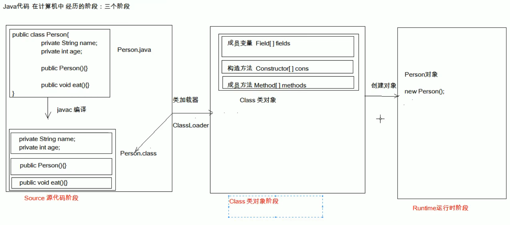

# Static 关键字

一旦用了static关键字，那么这样的内容不再属于自己，而是属于类的，所以凡是本类的对象，都共享同一份。                                                       

# 继承

继承主要解决的问题就是：共性抽取。

继承是多态的前提，如果没有继承，就没有多态。

继承关系当中的特点：

1. 子类可以拥有父类的“内容”
2. 子类还可以拥有自己专有的内容

在父子类的继承的关系当中，创建子类对象，访问成员方法的规则：

​    创建的对像是谁，就优先使用谁，如果没有则向上找

注意事项：

  无论是成员方法还是成员变量，如果没有都是向上找父类，绝对不会向下找子类的。

# 重写（Override）

概念： 在继承关系当中，方法的名称一样，参数列表也一样

注意：

1. 重写（Override）：方法的名称一样，参数列表（也一样）。覆盖，覆盖重写。
2. 重载（Overload）：方法的名称一样，参数列表（不一样）。

方法的覆盖重写特点：创建的是子类对象，则优先用子类方法

## 方法覆盖重写的注意事项：

1. 必须保证父子类之间方法的方法名称相同，参数列表也相同
   @Override: 写在方法前面，用来检测是不是有效的正确覆盖重写
   这个注解就算不写，只要满足要求，也是正确的方法覆盖重写。
2. 子类方法的返回值必须(小于等于)分类方法的返回值范围。
   java.lang.Object类是所有类的公共最高父类（祖宗类）
3. 子类方法的权限必须（大于等于）父类方法的权限修饰符
   小扩展知识：public > protected > (default) > private
   备注：（default）不是不是关键字default，而是什么都不写，留空。

## 继承关系中，父子类构造方法的访问特点：

1. 子类构造方法当中有一个默认隐含的“super()”调用，所以一定是先调用的父类构造，后执行的子类构造。

2. 子类构造可以通过super关键字来调用父类重载构造。

3. super 的父类构造调用，必须是子类构造方法的第一个语句。不能一个子类构造调用多次super构造。

总结：

子类必须调用父类构造方法，不写则赠送super()：写了则用写的只当的super调用，super只能有一个，还必须是第一个。


### super关键字的用法有三种：

1. 在子类的成员中，访问父类的成员变量。
2. 在子类的成员方法中，访问父类的成员方法。
3. 在子类的构造方法中，访问父类的构造方法。


### super关键字用来访问父类内容，而this关键字用来访问本类内容。用法也有三种：

1. 在本类的成员方法中，访问本类的成员变量
2. 在本类的成员方法中，访问本类的另一个成员方法
3. 在本类的成员方法中，访问本类的另一个构造方法

在第三种用法当中要注意：

A.  this(...)调用也必须是构造方法的第一个语句，唯一一个。

B.  super和this两种构造调用，不能同时使用。

# Java语言的特点

## Java语言是单继承的。

一个类的直接父类只能有唯一一个。

class A{}

class B extends A {} // 正确

class C{}

class D extends A,C{}//错误

## Java语言可以多级继承

class A {}

class B extends A {}//正确

class C extends B {}//正确


一个子类的的直接父类是唯一的，但是一个父类可以又有很多个子类。

class A{}

class  B extends A {}

class C extends A {}

# 抽象

## 定义

如果父类当中的方法不确定如何进行{}方法体实现，那么这就应该是一个抽象方法。

抽象方法就是加上abstract关键字，然后去掉大括号，直接分号结束。
抽象类：抽象方法所在的类，必须是抽象类才行。在class之前写上abstract即可。

## 如何使用抽象类和抽象方法：

1. 不能直接创建new抽象类对象
2. 必须使用一个子类来继承抽象父类
3. 子类必须覆盖重写父类当中的所有的抽象方法
覆盖重写（实现）：子类去掉抽象方法的abstract关键字，然后补上方法体大括号。
4. 创建子类对象进行使用


## 注意事项：

1. 抽象类不能创建对象，如果创建，编译无法通过而报错。只能创建其非抽象子类的对象

   > 理解：假设创建了抽象类的对象，调用抽象的方法，而抽象方法没有具体的方法体，没有意义
   
2. 抽象类中，可以有构造方法，是供子类创建方法时，初始化父类成员使用的

   > 理解： 子类的构造方法中，有默认的super()，需要访问父类构造方法

3. 抽象类中，不一定包含抽象方法，但是有抽象方法的类必定是抽象类

   > 理解： 未包含抽象方法的抽象类，目的就是不想让调用者创建该类对象，通常用于某些特殊的类结构设计

4. 抽象类的子类，必须重写抽象父类中所有的抽象方法，否则，编译无法通过而报错时。除非该子类也是抽象类

   > 理解： 假设不重写所有抽象方法，则类中可能包含抽象方法。那么创建对象后，调用抽象的方法，没有任何意义


# 接口

接口就是一种公共的规范标准。接口是一种引用数据类型，最重要的内容就是其中的抽象方法。

只要符合规范标准，就可以大家通用。

如何定义一个接口的格式：

Public interface 接口名称{

​    //接口内容

}

## 接口可包含的内容：


如果是Java7，那么接口中可以包含的内容有：
1. 常量
2. 抽象方法

如果是Java8，还可以额外包含有：
3. 默认方法
4. 静态方法

如果是Java9， 还可以额外包含有：
5. 私有方法


## 接口使用步骤：

1. 接口不能直接使用，必须有一个"实现类"来实现一个接口。
格式：
public class 实现类名称 implements 接口名称 {
        // ...
}
2. 接口的实现类必须覆盖重写(实现)接口中所有的抽象方法。
实现：去掉abstract关键字，加上方法体大括号
3. 创建实现类的对象，进行使用。

## 注意事项：

如果实现类并没有覆盖重写接口中所有的抽象方法，那么这个实现类自己就必须是抽象类。


## 接口的默认用法

1. 接口的默认方法，可以通过接口实现类对象，直接调用。
2. 接口的默认方法，也可以被接口实现类进行覆盖重写

### 默认用法的使用：

从Java 8 开始，接口里允许定义默认方法。
格式：
public default 返回值类型 方法名称(参数列表){
    方法体
}
备注：接口当中的默认方法，可以解决接口升级的问题

## 接口的静态方法

从java 8开始，接口当中允许定义静态方法
格式：
public static 返回值类型 方法名称(参数列表){
    方法体
}

### 静态的注意事项

1. 提示：就是将abstract或者default换成static即可，带上方法体。注意：不能通过接口实现类的对象来调用接口当中的静态方法。
2. 错误写法：通过接口名称，直接调用其中的静态方法
   格式：
   接口名称.静态方法名(参数)；

## 接口的常量定义与使用

接口当中也可以定义"成员变量"，但是必须使用public static final三个关键字进行修饰
从效果上看，这其实就是接口的【常量】

格式；
public static final 数据类类型 常量名称 = 数据值
一旦使用final关键字进行修饰，说明不可改变。

### 注意事项：

1. 接口当中的常量，可以省略public static final, 注意：不写也照样是这样
2. 接口当中的常量，必须进行赋值，不能不赋值
3. 接口当中的常量，使用完全大写的字母，用下划线进行分隔。（推荐命名规则）

## 总结

在Java 9+版本中，接口的内容可以有：

1. 成员变量其实是常量，格式：

   ```java
   [public] [static] [final] 数据类型 常量名称 = 数据值
   ```

   1. 常量必须进行赋值，而且一旦赋值不能改变
   2. 常量名称完全大写，用下划线进行分隔

2. 接口中最重要的就是抽象方法，格式：

   ```java
   [public] [abstract] 返回值类型 方法名称(参数列表)
   ```

   注意：实现类必须覆盖重写接口所有的抽象方法，除非实现类是抽象类

3. 从Java 8开始，接口里允许默认方法，格式：

   ```java
   [public] default 返回值类型 方法名称(参数列表){方法体}
   ```

   注意：默认方法也可以被覆盖重写

4. 从Java 8开始，接口里允许定义静态方法，格式：

   ```java
   [public] static 返回值类型 方法名称(参数列表){方法体}
   ```

   注意：应该通过接口名称进行调用，不能通过实现类对象调用接口静态方法

5. 从Java 9开始，接口允许定义私有方法，格式：

   ```java
   普通私有方法： private 返回值类型，方法名称(参数列表){方法体}
   静态私有方法： private static 返回值类型，方法名称(参数列表){方法体}
   ```

   注意：private的方法只有接口自己才能调用，不能被实现类或别人使用


## 接口使用时的冲突问题

使用接口的时候。需要注意：

1. 接口是没有静态代码块或者构造方法的
2. 一个类的直接父类是唯一的，但是一个类可以同时实现多个接口

​     格式：
​     public class MyInterfaceImpl implements MyInterfaceA, MyInterfaceB {
​       //覆盖重写所有的方法
​    }

3. 如果实现类所实现的多个接口当中，存在重复的抽象方法，那么只需要覆盖重写一次即可
4. 如果实现类没有覆盖重写所有接口当中的所有抽象方法，那么实现类就必须是一个抽象类
5. 如果实现类所实现的多个接口当中，存在重复的默认方法，那么实现类就一定要都冲突的默认方法进行覆盖重写
6. 一个类如果直接父类当中的方法，和接口当中过的默认方法产生了冲突，优先使用父类当中的方法

## 接口的继承冲突问题

1. 类与类之间是单继承的。直接父类只有一个
2. 类与接口之间是多实现的。一个类可以实现多个接口
3. 接口与接口之间是多继承的

注意事项：
1. 多个父类接口当中的抽象方法如果重复，没有关系
2. 多个父类接口当中的默认方法如果重复，那么子接口必须进行默认方法的覆盖重写，【并且带着default关键字】

# 多线程

## 并发和并行

并发：指两个或多个事件在同一个时间段内发生——交替执行

并行：指两个或多个事件在同一时刻发生(同时发生)——同时执行

## 线程与进程

- 进程：是指一个内存中运行的应用程序，每个进程都有一个独立的内存空间，一个应用程序可以同时运行多个进程；进程也是程序的一次执行过程，是系统运行程序的基本单位；系统运行一个程序即是一个进程从创建，运行到消亡的过程。
- 线程：线程是进程中的一个执行单元，负责当前进程中程序的执行，一个进程中至少有一个线程。一个进程中是可以有多个线程的，这个应用程序也可以被称之为多线程程序。

简而言之：一个程序运行后至少有一个进程，一个进程中可以包含多个线程

**CPU:中央处理器，对数据进行计算，指挥电脑中软件和硬件干活(AMD and Intel)**

多线程好处：

1. 效率高
2. 多个线程之间互不影响

## 线程调度


- 分时调度

  所有线程轮流使用CPU的使用权，平均分配每个线程占用CPU的时间

- 抢占式调度

  有限让优先级高的线程使用CPU，如果线程的优先级相同，那么会随机选择一个(线程随机性)，java使用的为抢占式调度


##  创建线程类

Java使用java.lang.Thread类代表线程，所有的线程对象都必须时Thread类或其子类的实例。每个线程的作用时完成一定的任务，实际上就是执行一段程序流即一段顺序执行的代码。Java使用线程执行体来代表这段程序流。Java中通过继承Thread类来创建并启动多线程的步骤为：

1. 定义Thread类的子类，并重写该类的run()方法，该run()方法的方法体就代表了线程需要完成的任务，因此把run()方法称为线程执行体
2. 创建Thread子类的实例，即创建了线程对象
3. 调用线程对象的start()方法来启动该线程


## 多线程的创建

创建多线程程序的第一种方式：创建Thread类的子类
java.lang.Thread类：是描述线程的类，我们想要实现多线程程序，就必须继承Thread类

实现步骤：
1. 创建一个Thread类的子类
2. 在Thread类的子类中创建Thread类中的run方法，设置线程任务(开启线程要做什么？)
3. 创建Thread类的子类对象
4. 调用Thread类中的方法start方法，开启新的线程，执行run方法
    void run()使线程开始执行，Java虚拟机调用该线程的run方法
    结果是两个线程并发地运行；当前线程(main线程)和另一个线程(创建的新线程，执行其run方法)
    多次启动一个线程是非法的。特别是当线程已经结束执行后，不能重新启动

Java程序属于抢占式调度，哪个线程的优先级高，哪个线程优先执行；同一个优先级，随机选择一个执行

线程的名称：
    主线程： main
    新线程： Thread-0, Thread-1, Thread-2


# 数据结构-栈

先进后出

存储元素到集合：入/压 栈

入栈：123

出栈：321

# 数据结构-队列

先进先出

# 数据结构-数组

查询快：数组的地址是连续的，我们通过数组的首地址可以找到数组，通过数组的索引可以快速查找某一个元素

增删慢：数组的长度是固定的，我们想要增加/删除一个元素，必须创建一个新数组，把原数组的数据复制过来

# 数据结构-链表

查询慢：链表中地址不是连续的，每次查询元素，都必须从头开始查询

增删快：链表结构，增加/删除一个元素，对链表的整体结构没有影响，所以增删快


单向链表：链表中指哟一条链子，不能保证元素的顺序（存储元素和去除元素的顺序有可能不一致）
双向链表：链表中有两条链子，有一条链子是专门记录元素的顺序的，是一个有序的结构

# 数据结构-红黑树

计算机中的树(倒着的)

二叉树：分支不能超过两个

排序树/查找树：在二叉树基础上元素是有大小顺序的。左子树小，右子树大

平衡树：左子树和右子树相等(数量)

红黑树：

- 特点：趋近于平衡树，查询的速度非常快，查询的子节点最大次数和最小次数不能超过2倍
- 

# Java Web

## 1. Junit单元测试

1. 黑盒测试：不需要写代码，给输入值，看程序是否能输出期望的值
2. 白盒测试：需要写代码，关注程序具体的执行流程


## 2. 反射：框架设计的灵魂

框架：半成品软件。可以在框架的基础上进行软件开发，简化编码

反射：将类的各个组成部分封装为其他对象。这就是反射机制



好处：

- 可以在程序运行过程中，操作这些对象
- 可以解耦，提高程序的可扩展性、

结论：

  同一个字节码文件（*.class）在一次程序运行过程中，只会被加载一次，不论通过哪一种方式获取的Class对象都是同一个

### Class对象功能

- 获取功能：

  1. 获取成员变量们

     Field[] getFields()

     Field getField(String name)

     Field[] getDeclaredFields()

     Field getDeclaredField(String name)

  2. 获取构造方法们

     Constructor<?>[] getConstructors()

     ...

  3. 获取成员变量们

     Method[] getMethods()

     Method getMethod(String name, 类<?>... parameterTypes)

     ...

  4. 获取类名

     String getName()


### Field：成员变量

- 操作：

  1. 设置值

     void set(Object obj, Object value)

  2. 获取值

     get(Object obj)

  3. 忽略方法权限修饰符的安全检查

     setAccessible(true):暴力反射

### Constructor：构造方法

- 创建对象：
  1. T newInstance(Object... initargs)
  2. 如果使用空参数构造方法创建函数，操作可以简化为：Class对象的newInstance方法

### Method: 方法对象

- 执行方法：
  1. Object invoke(Object obj, Object... args)
- 获取方法名称
  1. String getName：获取方法名

## 3. 注解

注解：说明程序的。给计算机看的

注释：用文字描述程序的。给程序员看的

### 作用分类：

1. 编写文档：通过代码里标识的注解生成文档【生成doc文档】
2. 代码分析：通过代码里标识的注解对代码进行分析【使用反射】
3. 编译检查：通过代码里标识的注解让编译器能够实现基本的编译检查【Override】

### JDK预定义的注解：

- @Override	：检测被该注解标注的方法是否是继承自父类（接口）
- @Deprecated  ：该注解标注的内容，标识已过时
- @SuppressWarnings  ： 压制警告 （一般传递参数 “all”）

### 自定义注解

格式：

- 元注解

  public @interface 注解名称{}

本质： 注解本质上就是一个 接口，该接口默认继承Annotation接口

​    public interface MyAnno extends java.lang.annotation.Annotation {}

属性：接口中的抽象方法

- 要求：

  1. 属性的返回值类型

     基本数据类型

     String

     枚举

     注解

     以上类型的数组

  2. 定义了属性，要在使用时给属性赋值

     如果定义属性时，使用default关键字给属性默认初始化值，则使用注解时，可以不进行属性的赋值

### 元注解：用于描述注解的注解

- @Target：描述注解能够作用的位置
  - TYPE：可以作用与类上
  - METHOD: 可以作用在方法上
  - FIELD：可以作用于成员变量上
- @Retention：描述注解被保留的阶段
  - SOURCE
  - CLASS
  - RUNTIME：当前被描述的注解，会被保留到class字节码文件中，并被JVM读到
- @Documented：描述注解是否被抽取到api文档中 
- @Inherited：描述注解是否被子类继承

在程序使用（解析）注解：获取注解中定义的属性值

1. 获取注解定义的位置的对象（Class， Method， Field）

2. 获取指定的注解

   getAnnotation（Class）

3. 调用注解中的抽象方法获取配置的属性值

@Test ：测试方法

@Before：初始化方法：用于资源申请，所有测试方法在执行之前都会先执行该方法

@After：释放资源方法：在所有测试方法执行完后，都会自动执行该方法

# MySQL数据库

## 配置

MySQL服务启动

1. 手动

2. cmd --> services.msc 打开服务的窗口

3. 使用管理员打开cmd

   net start mysql：启动mysql的服务

   net stop mysql:  关闭mysql的服务

4. MySQL登录

   1. mysql -uroot -p密码
   2. mysql -hip(地址) -uroot -p连接目标的密码

5. MySQL退出

   1. exit

   2. quit

6. MySQL目录结构

   1. MySQL安装目录

      配置文件my.ini

   2. MySQL数据目录

      - 数据库：文件夹
      - 表：文件
      - 数据：

## SQL： Structured Query Language

1. SQL通用语法

   1. SQL语句可以多行或者单行书写，以分号结尾
   2. 可使用空格和缩进来增强语句的可读性
   3. MySQL数据库的SQL语句不区分大小写，关键字建议大写
   4. 3中注释
      - 单行注释：-- 注释内容  或  # 注释
      - 多行： /* 注释*/

2. SQL分类

   1. DDL（Data Definition Language）数据库定义语言

      用来定义数据库对象：数据库，表，列等。关键字：create， drop， alter等

   2. DML（Data Manipulation Language）数据操作语言

      用来对数据库中表的数据进行增删改。关键字：insert， delete，update等

   3. DQL（Data Query Language）数据查询语言

      用来查询数据库中表的记录（数据）。关键字：select，where等

   4. DCL（Data Control Language）数据库控制语言（了解）

      用来定义数据库的方法问权限和安全级别，及创建用户。关键字：GRANT， REVOKE等

## DDL：操作数据库，表

1. 操作数据库：CRUD

   1. C（Create）：创建

      - 创建数据库：

        create database 数据库名称；

      - 创建数据库，判断是否存在：

        create database if not exists 数据库名称；

      - 创建数据库，指定字符集为gbk；

        create database 数据库名称 character set gbk;

      - 创建数据库，判断数据库是否存在，并制定字符集为gbk：

        create database if not exists 数据库名称 character set gbk;

   2. R（Retrieve）：查询

      - 查询所有数据库的名称

        show databases;

      - 查询某个数据库的字符集：查询某个数据库的创建信息

        show create database 数据库名称；

   3. U（Update) ： 修改

      - 修改数据库的字符集

        alter database 数据库名称 character set 字符集名称；

   4. D（Delete）：删除

      - 删除数据库

        drop database 数据库名称；

      - 删除数据库前判断数据库是否存在：

        drop database if not exists 数据库名称

   5. 使用数据库

      - 查询当前正在使用的数据库名称

        select database();

      - 使用数据库

        use 数据库名称；
   
2. 操作表

   1. C（create）：创建

      - 语法：

        create table 表名（

        ​    列名1 数据类型1，

        ​    列名2 数据类型2，

        ​    ....

        ​    列名n 数据类型n

        ）；

      - 数据类型：

        1. int：整数类型

           age int，

        2. double：小数类型

           score double（5，2）；

        3. date：日期类型，只包含年月日， yyyy-MM-dd

        4. datetime：日期，包含年月日时分秒 yyyy-MM-dd HH:mm:ss

        5. timestamp：时间错类型，包含年月日时分秒 yyyy-MM-dd HH:mm:ss

           如果将来不给这个字段赋值，或赋值为null，则默认使用当前的系统时间，来自动赋值

        6. varchar：字符串

           name varchar(20):姓名最大20字符

      - 举例：

         create table student(

        id int,name varchar(32),

        age int,  

        score double(4,1), 

        birthday date, 

        insert_time timestamp

        );

   2. R（Retrieve）：查询

      - 查询某个数据库中所有的表名称

        show tables;

      - 查询表结构

        desc 表名；

   3. U（Update）：修改

   4. D（Delete）：删除


